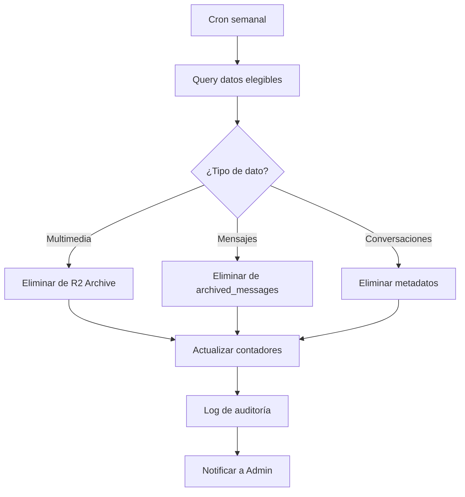

# 1.3.14.4 Purga Programada

> Eliminación permanente cuando se cumple la retención.

---

## Proceso de Purga



---

## Criterios de Elegibilidad

```sql
-- Multimedia para purga (>30 meses desde creación)
SELECT file_key, created_at 
FROM archived_media
WHERE created_at < NOW() - INTERVAL '30 months';

-- Mensajes para purga (>72 meses desde creación)
SELECT id, conversation_id, created_at
FROM archived_messages
WHERE created_at < NOW() - INTERVAL '72 months';

-- Conversaciones completamente purgadas
SELECT id 
FROM archived_conversations
WHERE scheduled_deletion < NOW()
  AND NOT EXISTS (
    SELECT 1 FROM archived_messages m 
    WHERE m.conversation_id = archived_conversations.original_conversation_id
  );
```

---

## Cron Job de Purga

```typescript
// jobs/purge-archived-data.ts
import { CronJob } from 'cron';

export const purgeArchivedDataJob = new CronJob(
  '0 2 * * 0', // Domingos 2:00 AM
  async () => {
    console.log('[Purge] Iniciando purga programada...');
    
    // 1. Purgar multimedia antigua
    const mediaToDelete = await db
      .select({ key: archivedMedia.fileKey })
      .from(archivedMedia)
      .where(lt(archivedMedia.createdAt, subMonths(new Date(), 30)));
    
    for (const file of mediaToDelete) {
      await r2.delete(`archive/${file.key}`);
      await db.delete(archivedMedia).where(eq(archivedMedia.fileKey, file.key));
    }
    console.log(`[Purge] Multimedia eliminada: ${mediaToDelete.length}`);
    
    // 2. Purgar mensajes antiguos
    const deletedMessages = await db
      .delete(archivedMessages)
      .where(lt(archivedMessages.createdAt, subMonths(new Date(), 72)))
      .returning({ id: archivedMessages.id });
    console.log(`[Purge] Mensajes eliminados: ${deletedMessages.length}`);
    
    // 3. Purgar conversaciones vacías
    const emptyConversations = await db.execute(sql`
      DELETE FROM archived_conversations ac
      WHERE ac.scheduled_deletion < NOW()
        AND NOT EXISTS (
          SELECT 1 FROM archived_messages m 
          WHERE m.conversation_id = ac.original_conversation_id
        )
      RETURNING ac.id
    `);
    console.log(`[Purge] Conversaciones eliminadas: ${emptyConversations.length}`);
    
    // 4. Log y notificación
    await logPurgeReport({
      media: mediaToDelete.length,
      messages: deletedMessages.length,
      conversations: emptyConversations.length,
      date: new Date(),
    });
    
    await notifyAdmin('purge_completed', {
      subject: 'Purga semanal completada',
      body: `Media: ${mediaToDelete.length}, Mensajes: ${deletedMessages.length}`,
    });
  }
);
```

---

## Seguridad

| Control | Descripción |
|---------|-------------|
| **Solo sistema** | Purga automática no requiere intervención |
| **Log inmutable** | Todo se registra en tabla de auditoría |
| **Backup pre-purga** | Snapshot antes de cada ejecución |
| **Rollback 24h** | Backup disponible 24 horas |

---

## Reporte de Purga

```
┌─────────────────────────────────────────────────────────────────┐
│  📊 REPORTE DE PURGA — 12 Enero 2026                            │
├─────────────────────────────────────────────────────────────────┤
│                                                                 │
│  RESUMEN                                                        │
│  ─────────────────────────────────────────────────              │
│  Archivos multimedia eliminados:    1,234                       │
│  Mensajes eliminados:               45,678                      │
│  Conversaciones eliminadas:         890                         │
│  Espacio liberado:                  2.3 GB                      │
│                                                                 │
│  DETALLE POR TIPO                                               │
│  ─────────────────────────────────────────────────              │
│  │ Tipo            │ Cantidad │ Espacio  │ Antigüedad │         │
│  ├─────────────────┼──────────┼──────────┼────────────│         │
│  │ Fotos           │    890   │  1.8 GB  │ 30+ meses  │         │
│  │ Notas de voz    │    234   │  0.3 GB  │ 30+ meses  │         │
│  │ PDFs            │    110   │  0.2 GB  │ 72+ meses  │         │
│                                                                 │
│  PRÓXIMA PURGA: 19 Enero 2026, 2:00 AM                          │
│                                                                 │
└─────────────────────────────────────────────────────────────────┘
```

---

## Navegación

| ⬆️ Padre | [[Proyecto OnlyCarNLD/Datos/1.3.14 archivado_chats]] |
|----------|---------------------------|
| ⬅️ Hermano anterior | [[Proyecto OnlyCarNLD/Datos/1.3.14.3 archivado_manual]] |
| ➡️ Hermano siguiente | [[Proyecto OnlyCarNLD/Datos/1.3.14.5 cumplimiento_legal]] |

---
