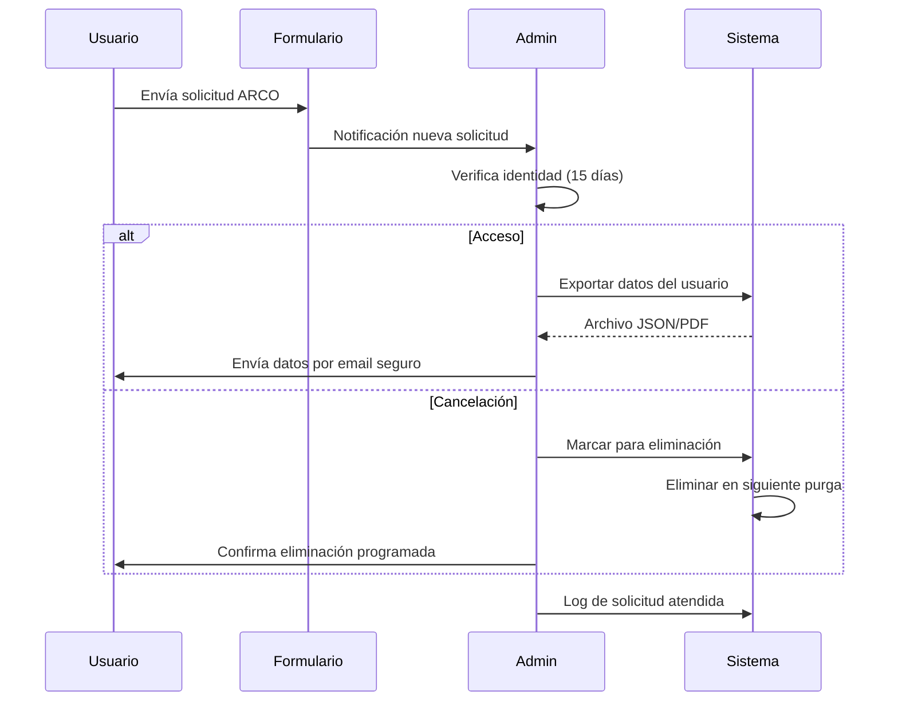

# 1.3.14.5 Cumplimiento Legal

> Cumplir con regulaciones de protección de datos.

---

## Marco Legal Aplicable

| Regulación | Jurisdicción | Aplica |
|------------|--------------|--------|
| **LFPDPPP** | México | ✅ Obligatorio |
| **GDPR** | Unión Europea | ⚠️ Si hay usuarios UE |
| **CCPA** | California, USA | ⚠️ Si hay usuarios CA |

---

## LFPDPPP — Obligaciones

### Artículos Relevantes

| Artículo | Requisito | Implementación |
|----------|-----------|----------------|
| Art. 10 | Consentimiento informado | Aviso de privacidad |
| Art. 16 | Aviso de privacidad | `/privacidad` público |
| Art. 22 | Derechos ARCO | Formulario + proceso |
| Art. 37 | Conservación necesaria | Política de retención |
| Art. 38 | Eliminación cuando cese finalidad | Purga programada |

### Derechos ARCO

| Derecho | Descripción | Plazo |
|---------|-------------|-------|
| **A**cceso | Ver qué datos tenemos | 20 días |
| **R**ectificación | Corregir datos incorrectos | 15 días |
| **C**ancelación | Eliminar datos | 15 días |
| **O**posición | No usar datos para X | 15 días |

---

## Proceso de Solicitud ARCO



---

## Formulario ARCO

```
┌─────────────────────────────────────────────────────────────────┐
│  🔒 SOLICITUD DE DERECHOS ARCO                                   │
├─────────────────────────────────────────────────────────────────┤
│                                                                 │
│  En cumplimiento con la LFPDPPP, puedes ejercer tus derechos    │
│  de Acceso, Rectificación, Cancelación y Oposición.             │
│                                                                 │
│  TIPO DE SOLICITUD                                              │
│  ─────────────────────────────────────────────────              │
│  ○ Acceso — Quiero saber qué datos tienen de mí                 │
│  ○ Rectificación — Quiero corregir mis datos                    │
│  ○ Cancelación — Quiero eliminar mis datos                      │
│  ○ Oposición — No quiero que usen mis datos para X              │
│                                                                 │
│  TUS DATOS (para verificar identidad)                           │
│  ─────────────────────────────────────────────────              │
│  Nombre completo:  [                                       ]    │
│  Email registrado: [                                       ]    │
│  Teléfono:         [                                       ]    │
│                                                                 │
│  DETALLE DE SOLICITUD                                           │
│  ─────────────────────────────────────────────────              │
│  [                                                         ]    │
│  [                                                         ]    │
│                                                                 │
│  📎 Adjuntar identificación oficial (INE/Pasaporte)             │
│                                                                 │
│  [ Enviar solicitud ]                                           │
│                                                                 │
│  ⓘ Responderemos en un máximo de 20 días hábiles.              │
│                                                                 │
└─────────────────────────────────────────────────────────────────┘
```

---

## Logs de Acceso

Todo acceso a datos archivados debe registrarse:

```sql
CREATE TABLE archive_access_logs (
  id UUID PRIMARY KEY DEFAULT gen_random_uuid(),
  
  -- Quién accedió
  accessed_by UUID REFERENCES users(id),
  accessed_by_role VARCHAR(50),
  
  -- Qué accedió
  resource_type VARCHAR(50), -- 'conversation', 'message', 'media'
  resource_id UUID,
  
  -- Cómo accedió
  action VARCHAR(20), -- 'view', 'export', 'delete'
  ip_address INET,
  user_agent TEXT,
  
  -- Cuándo
  accessed_at TIMESTAMPTZ DEFAULT now(),
  
  -- Contexto
  reason VARCHAR(200), -- 'arco_request', 'support', 'audit'
  arco_request_id UUID REFERENCES arco_requests(id)
);

-- Índices para auditoría
CREATE INDEX idx_access_by_user ON archive_access_logs(accessed_by);
CREATE INDEX idx_access_by_date ON archive_access_logs(accessed_at);
CREATE INDEX idx_access_by_resource ON archive_access_logs(resource_type, resource_id);
```

---

## Auditoría

### Reporte de Accesos Mensual

```
┌─────────────────────────────────────────────────────────────────┐
│  📋 REPORTE DE ACCESOS A ARCHIVO — Enero 2026                   │
├─────────────────────────────────────────────────────────────────┤
│                                                                 │
│  RESUMEN                                                        │
│  ─────────────────────────────────────────────────              │
│  Total accesos:           45                                    │
│  Usuarios únicos:         3                                     │
│  Solicitudes ARCO:        2                                     │
│                                                                 │
│  POR TIPO DE ACCIÓN                                             │
│  ─────────────────────────────────────────────────              │
│  view:    38 (84%)                                              │
│  export:   5 (11%)                                              │
│  delete:   2 (5%)                                               │
│                                                                 │
│  POR USUARIO                                                    │
│  ─────────────────────────────────────────────────              │
│  admin@onlycar.mx:         30                                   │
│  soporte@onlycar.mx:       12                                   │
│  legal@onlycar.mx:          3                                   │
│                                                                 │
└─────────────────────────────────────────────────────────────────┘
```

---

## Navegación

| ⬆️ Padre | [[Proyecto OnlyCarNLD/Datos/1.3.14 archivado_chats]] |
|----------|---------------------------|
| ⬅️ Hermano anterior | [[Proyecto OnlyCarNLD/Datos/1.3.14.4 purga_programada]] |

---

## Related

| Módulo | Relación |
|--------|----------|
| [[Proyecto OnlyCarNLD/Datos/5.4. cumplimiento_legal_fiscal]] | Aviso de privacidad integral |
| [[Proyecto OnlyCarNLD/Datos/4.1.5 Constraints_Legales]] | Restricciones legales del sistema |

