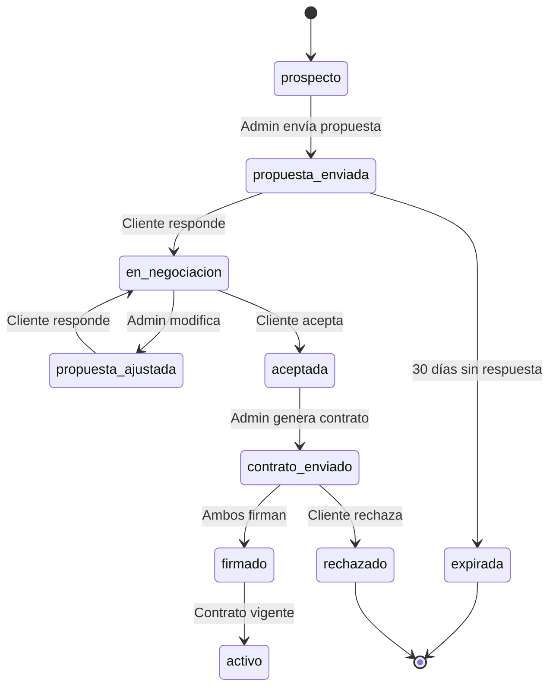

# 1.3.2.2 Flujos de Negociación

Máquina de estados para negociaciones B2B.

---

## FSM: Negociación B2B



---

## Estados

| Estado | Descripción | Acciones |
|--------|-------------|----------|
| `prospecto` | Cliente identificado | Enviar propuesta |
| `propuesta_enviada` | Esperando respuesta | Ver, seguimiento |
| `en_negociacion` | Intercambio activo | Responder, ajustar |
| `propuesta_ajustada` | Nueva versión | Esperar respuesta |
| `aceptada` | Cliente aceptó | Generar contrato |
| `contrato_enviado` | Pendiente firma | Rastrear firma |
| `firmado` | Firma completada | Activar servicios |
| `activo` | Relación comercial | Gestionar cuenta |
| `expirada` | Sin respuesta | Archivar, relanzar |
| `rechazado` | Cliente declinó | Archivar |

---

## Transiciones Automáticas

| Trigger | De | A | Condición |
|---------|----|----|-----------| 
| Timer 30 días | propuesta_enviada | expirada | Sin respuesta |
| Webhook Mifiel | contrato_enviado | firmado | Todas las firmas |
| Timer 7 días | contrato_enviado | recordatorio | Sin firma |

---

## Historial

```sql
CREATE TABLE negociacion_historial (
  id UUID PRIMARY KEY,
  conversacion_id UUID REFERENCES conversations(id),
  estado_anterior VARCHAR(50),
  estado_nuevo VARCHAR(50),
  trigger VARCHAR(100),
  actor_id UUID,
  metadata JSONB,
  created_at TIMESTAMPTZ DEFAULT now()
);
```

---

## Navegación

| ⬆️ Padre             | [[Proyecto OnlyCarNLD/Datos/1.3.2 chat_admin_cliente]]        |
| -------------------- | ----------------------------------- |
| ⬅️ Hermano anterior  | [[Proyecto OnlyCarNLD/Datos/1.3.2.1 cards_admin_cliente]]     |
| ➡️ Hermano siguiente | [[Proyecto OnlyCarNLD/Datos/1.3.2.3 notificaciones_admin]]    |

---
