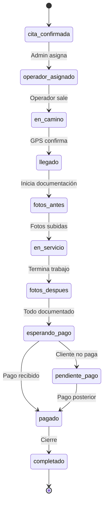

# 1.3.3.3 Flujo de Servicio en Chat

FSM del canal Operador-Cliente durante servicio.

---

## FSM: Servicio Activo



---

## Estados y Mensajes Automáticos

| Estado | Mensaje al Cliente | CARD |
|--------|-------------------|------|
| `operador_asignado` | "Carlos atenderá tu servicio" | — |
| `en_camino` | "Carlos está en camino 🚗" | Ubicación |
| `llegado` | "Carlos ha llegado" | — |
| `fotos_antes` | — | — |
| `en_servicio` | "Servicio en progreso" | — |
| `fotos_despues` | "¡Servicio completado!" | Documentación |
| `esperando_pago` | "Revisa el resultado" | Pago |
| `pagado` | "¡Gracias por tu pago!" | Confirmación |
| `completado` | "¿Cómo fue tu experiencia?" | Calificación |

---

## Acciones por Estado

### en_camino

| Actor    | Acciones Disponibles                          |
| -------- | --------------------------------------------- |
| Operador | Ver ruta, Compartir ubicación, Mensaje rápido |
| Cliente  | Ver ubicación, Enviar instrucciones           |

### llegado

| Actor | Acciones Disponibles |
|-------|---------------------|
| Operador | Confirmar llegada, Tomar fotos ANTES |
| Cliente | Confirmar recepción |

### en_servicio

| Actor | Acciones Disponibles |
|-------|---------------------|
| Operador | Preguntar al cliente, Notas internas |
| Cliente | Enviar instrucciones adicionales |

### fotos_despues

| Actor | Acciones Disponibles |
|-------|---------------------|
| Operador | Subir fotos, Agregar comentario, Finalizar |

---

## Implementación

```typescript
// Hook: cambio de estado
const onEstadoServicioCambia = async (
  servicioId: string, 
  nuevoEstado: string
) => {
  const conversacionId = await getConversacionServicio(servicioId);
  
  const mensajesAuto: Record<string, string> = {
    en_camino: 'Carlos está en camino 🚗',
    llegado: 'Carlos ha llegado a tu ubicación',
    fotos_despues: '¡Servicio completado! Revisa el resultado',
    pagado: '¡Gracias por tu pago! 💰',
    completado: '¿Cómo fue tu experiencia?'
  };
  
  if (mensajesAuto[nuevoEstado]) {
    await enviarMensajeSistema(conversacionId, mensajesAuto[nuevoEstado]);
  }
  
  // CARDs específicos
  if (nuevoEstado === 'en_camino') {
    await enviarCardUbicacion(conversacionId, servicioId);
  } else if (nuevoEstado === 'fotos_despues') {
    await enviarCardDocumentacion(conversacionId, servicioId);
  } else if (nuevoEstado === 'esperando_pago') {
    await enviarCardPago(conversacionId, servicioId);
  } else if (nuevoEstado === 'completado') {
    await enviarCardCalificacion(conversacionId, servicioId);
  }
};
```

---

## Archivado

| Condición | Acción |
|-----------|--------|
| 24h después de `completado` | Chat se archiva |
| Cliente accede después | Puede ver historial (solo lectura) |
| Disputa abierta | Chat reactivo temporalmente |

---

## Navegación

| ⬆️ Padre             | [[Proyecto OnlyCarNLD/Datos/1.3.3 chat_operador_cliente]]       |
| -------------------- | ------------------------------------- |
| ⬅️ Hermano anterior  | [[Proyecto OnlyCarNLD/Datos/1.3.3.2 documentacion_fotografica]] |

---
