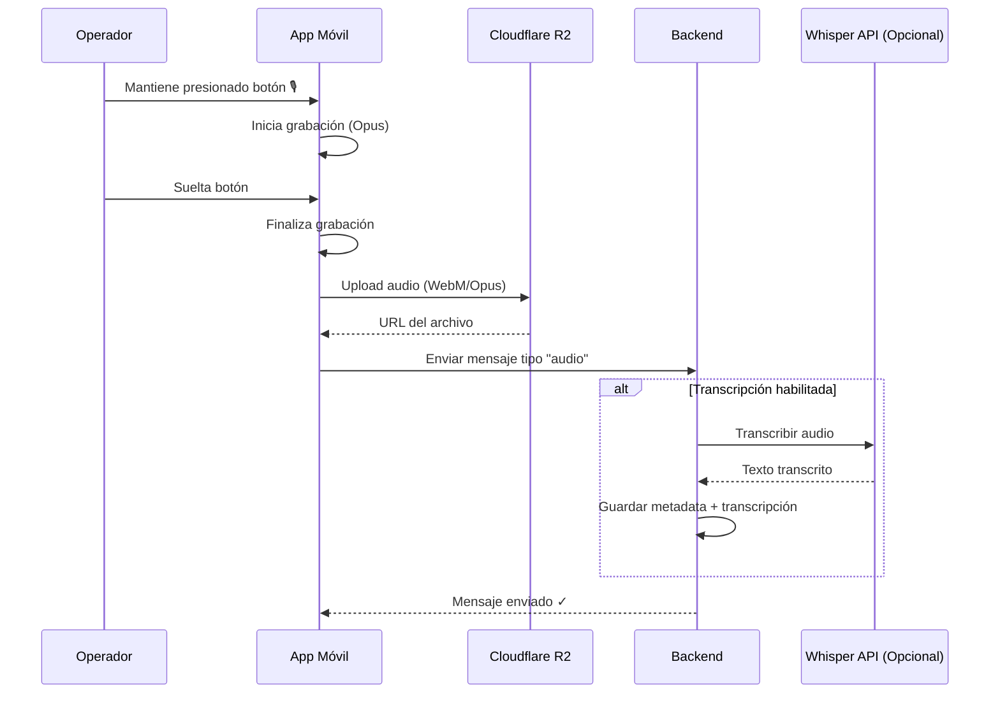

# 1.3.4.1 Mensajes de Audio

> **Propósito:** Permitir comunicación por voz entre operadores y clientes, especialmente cuando teclear no es práctico (conduciendo, manos ocupadas).

---

## 1. Justificación de Negocio

Los operadores de OnlyCar pasan la mayor parte de su día en movimiento. Responder mensajes de texto mientras conducen es:
- **Peligroso:** Distracción al volante.
- **Ilegal:** En México, usar el celular manejando es infracción.
- **Lento:** Requiere detenerse.

**Solución:** Implementar notas de voz con un patrón "Hold-to-Record" que permite grabar un mensaje con una sola mano mientras se detiene brevemente.

---

## 2. Diagrama de Flujo



---

## 3. Especificaciones Técnicas

### 3.1 Formato de Audio
| Parámetro | Valor | Justificación |
|-----------|-------|---------------|
| **Códec** | Opus | Mejor compresión para voz |
| **Contenedor** | WebM | Compatible con todos los navegadores modernos |
| **Bitrate** | 24 kbps | Calidad de voz clara, tamaño mínimo |
| **Sample Rate** | 16 kHz | Óptimo para voz humana |
| **Duración Máxima** | 60 segundos | Evitar abusos, forzar concisión |

### 3.2 Almacenamiento
- **Ubicación:** Cloudflare R2 (mismo bucket que imágenes).
- **Ruta:** `/audio/{conversation_id}/{message_id}.webm`
- **Retención:** Igual que mensajes de texto (indefinida para B2B, 1 año para B2C).

---

## 4. Estructura JSON

```json
{
  "type": "audio",
  "content": {
    "url": "https://r2.onlycar.mx/audio/conv123/msg456.webm",
    "duration_seconds": 12,
    "waveform": [0.2, 0.5, 0.8, 0.4, 0.3, ...],
    "transcription": "Voy llegando en 5 minutos, estaciona el carro afuera",
    "transcription_status": "completed"
  }
}
```

---

## 5. Componente de UI

### 5.1 Botón de Grabación

```text
┌────────────────────────────────────────────────────────────────┐
│  📎  Aa  Escribe un mensaje...              [🎙️]       ➤      │
└────────────────────────────────────────────────────────────────┘

Estado: Grabando (Hold)
┌────────────────────────────────────────────────────────────────┐
│  🔴 GRABANDO... 0:08            [CANCELAR]      [Soltar ✓]    │
│  ▁▂▅▆▃▁▂▅▇▅▃▁▂▄▆▃▂▁                                            │
└────────────────────────────────────────────────────────────────┘
```

### 5.2 Mensaje de Audio (Reproductor)

```text
┌─────────────────────────────────────────────────────────────┐
│  🔊  ▓▓▓▓▓▓▓▓░░░░░░░░░░░░  0:12 / 0:24                      │
│                                                             │
│  "Voy llegando en 5 minutos..."  (transcripción)            │
│                                                    14:28 ✓✓ │
└─────────────────────────────────────────────────────────────┘
```

---

## 6. Playback Configurable

El usuario puede ajustar la velocidad de reproducción:
- **1x:** Normal (default).
- **1.5x:** Rápido.
- **2x:** Muy rápido (para usuarios avanzados).

Esto permite consumir audios largos más rápidamente.

---

## 7. Transcripción (Opcional)

Utiliza Whisper API (OpenAI) para generar texto a partir del audio.

**Beneficios:**
- Accesibilidad para usuarios con dificultades auditivas.
- Búsqueda en historial de mensajes.
- Referencia rápida sin reproducir.

**Costos:**
- ~$0.006 por minuto de audio.
- Habilitar solo para mensajes > 10 segundos y bajo demanda.

---

## Navegación

| Elemento | Enlace |
|----------|--------|
| ⬆️ Padre | [[Proyecto OnlyCarNLD/Datos/1.3.4 tipos_mensajes]] |
| 🔗 Relacionado | [[Proyecto OnlyCarNLD/Datos/1.3.12 upload_multimedia]] |
