# 1.3.5.1 Push Notifications

> **Propósito:** Documentar la implementación técnica de notificaciones push para web y mobile, asegurando entrega confiable incluso con la app cerrada.

---

## 1. Arquitectura de Push

```mermaid
flowchart TD
    subgraph Cliente[📱 Dispositivo Usuario]
        Usuario[👤 Usuario]
        App[App OnlyCar]
        SW[Service Worker]
    end
    
    subgraph Backend[🖥️ Servidor]
        API[API Nuxt]
        DB[(Supabase - Subscriptions)]
    end
    
    subgraph Externo[☁️ Servicios]
        FCM[Firebase Cloud Messaging]
        APNS[Apple Push Notification]
    end
    
    App -->|1: Solicita permiso| Usuario
    Usuario -->|2: Acepta| App
    App -->|3: Genera subscription| SW
    SW -->|4: Envía subscription| API
    API -->|5: Guarda| DB
    
    API -->|6: Trigger evento| FCM
    API -->|6b: Trigger evento| APNS
    FCM -->|7: Entrega push| SW
    APNS -->|7b: Entrega push| SW
    SW -->|8: Muestra notificación| Usuario

```



---

## 2. Flujo de Subscription

### 2.1 Solicitud de Permiso

```typescript
// composables/usePushNotifications.ts
export const usePushNotifications = () => {
  const isSupported = computed(() => 
    'PushManager' in window && 'serviceWorker' in navigator
  );
  
  const permission = ref<NotificationPermission>('default');
  
  const requestPermission = async (): Promise<boolean> => {
    if (!isSupported.value) {
      console.warn('Push not supported in this browser');
      return false;
    }
    
    const result = await Notification.requestPermission();
    permission.value = result;
    
    if (result === 'granted') {
      await subscribeToServer();
      return true;
    }
    
    return false;
  };
  
  return { isSupported, permission, requestPermission };
};
```

### 2.2 Registro de Service Worker

```typescript
// public/sw.js
self.addEventListener('push', (event) => {
  const data = event.data?.json() ?? {};
  
  const options = {
    body: data.body,
    icon: '/icons/icon-192.png',
    badge: '/icons/badge-72.png',
    vibrate: [200, 100, 200],
    data: {
      url: data.url || '/',
      messageId: data.messageId
    },
    actions: data.actions || []
  };
  
  event.waitUntil(
    self.registration.showNotification(data.title, options)
  );
});

self.addEventListener('notificationclick', (event) => {
  event.notification.close();
  
  const url = event.notification.data.url;
  event.waitUntil(
    clients.openWindow(url)
  );
});
```

---

## 3. VAPID Keys (Configuración)

### ¿Qué es VAPID?
Voluntary Application Server Identification. Permite al servidor identificarse ante el servicio de push sin necesidad de cuenta en FCM/APNS.

### Generación de Keys

```bash
# Generar par de llaves VAPID
npx web-push generate-vapid-keys
```

### Almacenamiento Seguro

```env
# .env (NUNCA en repositorio)
VAPID_PUBLIC_KEY=BFRhT9u3kQ...
VAPID_PRIVATE_KEY=Hj8xP2qL...
VAPID_SUBJECT=mailto:admin@onlycar.mx
```

---

## 4. Modelo de Datos

```sql
CREATE TABLE push_subscriptions (
  id UUID PRIMARY KEY DEFAULT gen_random_uuid(),
  user_id UUID REFERENCES users(id) ON DELETE CASCADE,
  
  -- Subscription data from browser
  endpoint TEXT NOT NULL,
  p256dh TEXT NOT NULL,  -- Public key
  auth TEXT NOT NULL,    -- Auth secret
  
  -- Metadata
  device_type TEXT,      -- 'web', 'android', 'ios'
  user_agent TEXT,
  
  -- Status
  is_active BOOLEAN DEFAULT true,
  last_used_at TIMESTAMPTZ,
  created_at TIMESTAMPTZ DEFAULT now(),
  
  UNIQUE(user_id, endpoint)
);

-- Índice para búsqueda rápida por usuario
CREATE INDEX idx_push_subscriptions_user ON push_subscriptions(user_id) 
  WHERE is_active = true;
```

---

## 5. Envío de Push (Backend)

```typescript
// server/utils/sendPush.ts
import webPush from 'web-push';

webPush.setVapidDetails(
  process.env.VAPID_SUBJECT,
  process.env.VAPID_PUBLIC_KEY,
  process.env.VAPID_PRIVATE_KEY
);

export async function sendPushToUser(userId: string, payload: PushPayload) {
  const supabase = useSupabaseClient();
  
  // Obtener todas las subscriptions activas del usuario
  const { data: subscriptions } = await supabase
    .from('push_subscriptions')
    .select('*')
    .eq('user_id', userId)
    .eq('is_active', true);
  
  const results = await Promise.allSettled(
    subscriptions.map(sub => 
      webPush.sendNotification(
        {
          endpoint: sub.endpoint,
          keys: { p256dh: sub.p256dh, auth: sub.auth }
        },
        JSON.stringify(payload)
      )
    )
  );
  
  // Marcar subscriptions fallidas como inactivas
  for (let i = 0; i < results.length; i++) {
    if (results[i].status === 'rejected') {
      await supabase
        .from('push_subscriptions')
        .update({ is_active: false })
        .eq('id', subscriptions[i].id);
    }
  }
}
```

---

## 6. Manejo de Errores

| Error | Causa | Acción |
|-------|-------|--------|
| `410 Gone` | Subscription expirada | Marcar inactiva, pedir re-subscription |
| `401 Unauthorized` | VAPID key incorrecta | Verificar configuración |
| `429 Too Many` | Rate limit | Implementar backoff exponencial |
| `Blocked by user` | Usuario bloqueó notificaciones | Mostrar UI para re-habilitar |

---

## Navegación

| Elemento | Enlace |
|----------|--------|
| ⬆️ Padre | [[Proyecto OnlyCarNLD/Datos/1.3.5 notificaciones]] |
| ➡️ Siguiente | [[Proyecto OnlyCarNLD/Datos/1.3.5.2 email_transaccional]] |
