# 1.3.5.2 Email Transaccional

> **Propósito:** Enviar emails críticos del negocio (no marketing) con alta deliverability y tracking.

---

## 1. Proveedor: Resend

### Justificación de Elección

| Criterio | Resend | SendGrid | Ventaja |
|----------|--------|----------|---------|
| **Developer Experience** | Excelente | Buena | Resend |
| **Pricing** | $20/3k emails/mes | $15/40k emails | SendGrid (volumen) |
| **Templates** | React Email | Handlebars | Resend (moderno) |
| **API simplicity** | 5 líneas | 15+ líneas | Resend |
| **Deliverability** | 98%+ | 95%+ | Resend |

**Decisión:** Resend para MVP por simplicidad. Migrar a SendGrid si volumen > 50k/mes.

---

## 2. Arquitectura

```mermaid
flowchart LR
    subgraph App[App OnlyCar]
        Event[Evento Trigger]
        API[API Route]
    end
    
    subgraph Resend[Resend Service]
        Send[Send API]
        Track[Tracking]
    end
    
    subgraph User[Usuario]
        Inbox[📧 Email]
    end
    
    Event -->|"service_completed"| API
    API -->|"POST /emails"| Send
    Send -->|"Entrega"| Inbox
    Inbox -->|"Open/Click"| Track
    Track -->|"Webhook"| API
```



---

## 3. Tipos de Email Transaccional

| Evento | Asunto | Prioridad | Attachments |
|--------|--------|-----------|-------------|
| **Servicio Completado** | ✅ Tu servicio está listo | Alta | Factura PDF |
| **Pago Recibido** | 💰 Confirmación de pago | Alta | Recibo |
| **Contrato Pendiente** | 📝 Contrato listo para firma | Alta | Contrato PDF |
| **Contrato Firmado** | ✅ Contrato firmado | Media | Copia firmada |
| **Cuenta Creada** | 👋 Bienvenido a OnlyCar | Media | - |
| **Reset Password** | 🔐 Restablecer contraseña | Alta | - |

---

## 4. Implementación con Resend

### 4.1 Configuración

```typescript
// server/utils/resend.ts
import { Resend } from 'resend';

const resend = new Resend(process.env.RESEND_API_KEY);

export { resend };
```

### 4.2 Envío de Email

```typescript
// server/api/emails/service-completed.post.ts
import { resend } from '~/server/utils/resend';
import { ServiceCompletedEmail } from '~/emails/ServiceCompleted';
import { render } from '@react-email/render';

export default defineEventHandler(async (event) => {
  const { to, customerName, serviceName, operatorName, photoUrl, paymentLink } = 
    await readBody(event);
  
  const html = render(ServiceCompletedEmail({
    customerName,
    serviceName,
    operatorName,
    photoUrl,
    paymentLink
  }));
  
  const { data, error } = await resend.emails.send({
    from: 'OnlyCar <servicios@onlycar.mx>',
    to: [to],
    subject: '✅ Tu servicio de limpieza está listo',
    html,
    tags: [
      { name: 'type', value: 'service_completed' },
      { name: 'service_id', value: serviceName }
    ]
  });
  
  if (error) {
    throw createError({ statusCode: 500, message: error.message });
  }
  
  return { id: data.id };
});
```

---

## 5. Templates con React Email

```tsx
// emails/ServiceCompleted.tsx
import {
  Body,
  Button,
  Container,
  Head,
  Html,
  Img,
  Preview,
  Section,
  Text
} from '@react-email/components';

interface Props {
  customerName: string;
  serviceName: string;
  operatorName: string;
  photoUrl?: string;
  paymentLink: string;
}

export const ServiceCompletedEmail = ({
  customerName,
  serviceName,
  operatorName,
  photoUrl,
  paymentLink
}: Props) => (
  <Html>
    <Head />
    <Preview>Tu servicio de {serviceName} está listo</Preview>
    <Body style={main}>
      <Container style={container}>
        
        
        <Text style={heading}>¡Hola {customerName}!</Text>
        
        <Text style={paragraph}>
          Tu servicio de <strong>{serviceName}</strong> ha sido completado
          por {operatorName}.
        </Text>
        
        {photoUrl && (
          
        )}
        
        <Section style={buttonSection}>
          <Button style={button} href={paymentLink}>
            💳 Pagar Ahora
          </Button>
        </Section>
        
        <Text style={footer}>
          Gracias por preferirnos,<br />
          Equipo OnlyCar
        </Text>
      </Container>
    </Body>
  </Html>
);
```

---

## 6. Dominio Verificado

Para máxima deliverability, configurar DNS:

```
# Registros DNS para onlycar.mx
mail._domainkey.onlycar.mx  TXT  v=DKIM1; k=rsa; p=MIGf...
_dmarc.onlycar.mx           TXT  v=DMARC1; p=quarantine; rua=...
onlycar.mx                  TXT  v=spf1 include:resend.com ~all
```

---

## 7. Tracking y Webhooks

Resend envía webhooks para:
- `email.sent` - Email enviado al servidor SMTP
- `email.delivered` - Email entregado al inbox
- `email.opened` - Email abierto (tracking pixel)
- `email.clicked` - Link clickeado
- `email.bounced` - Rebotado (email inválido)
- `email.complained` - Marcado como spam

---

## Navegación

| Elemento | Enlace |
|----------|--------|
| ⬆️ Padre | [[Proyecto OnlyCarNLD/Datos/1.3.5 notificaciones]] |
| ⬅️ Anterior | [[Proyecto OnlyCarNLD/Datos/1.3.5.1 push_notifications]] |
| ➡️ Siguiente | [[Proyecto OnlyCarNLD/Datos/1.3.5.3 sms_verificacion]] |
