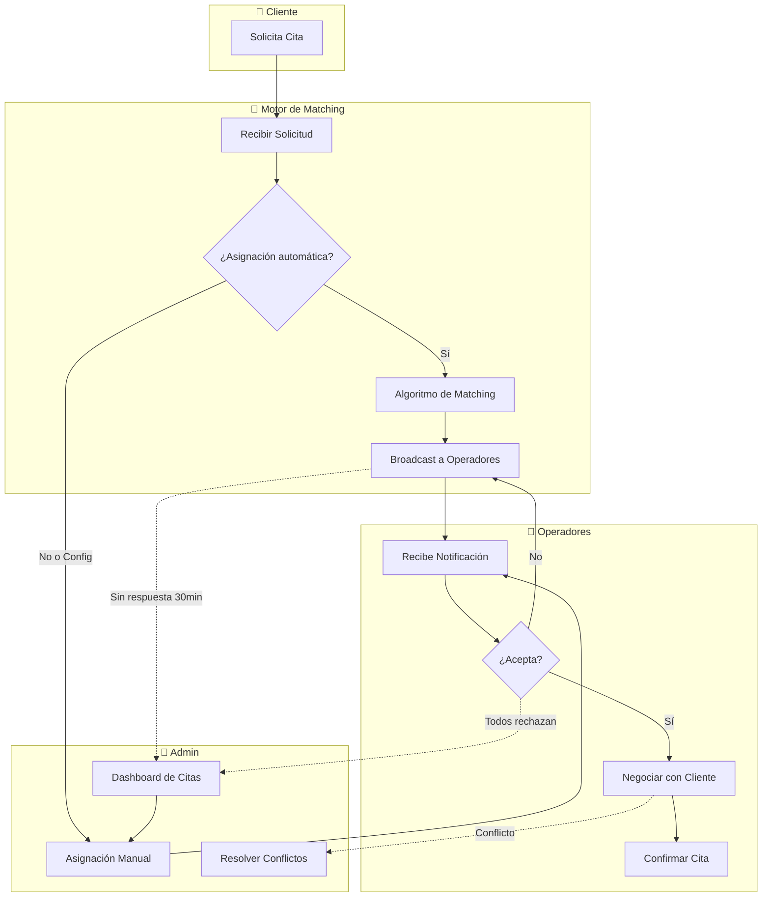

# 1.3.6.1 Asignación de Citas

Sistema híbrido de asignación: **Automática por defecto** + Manual por Admin.

---

## Filosofía de Diseño

> [!IMPORTANT]
> **Modelo Uber/Didi Adaptado para Servicios de Limpieza Vehicular**
> 
> - **Broadcast a operadores cercanos** con agenda disponible
> - **Operador acepta** si le conviene (horario, ubicación, carga)
> - **Negociación directa** operador ↔ cliente en chat
> - **Admin interviene solo** si no hay match o hay problemas

---

## Comparación: Uber vs OnlyCar

| Aspecto | Uber/Didi | OnlyCar |
|---------|-----------|------------|
| Servicio | Viaje inmediato | Cita agendada (1h-7d) |
| Duración | 10-60 min | 30-120 min |
| Ubicación | Punto A→B | Solo punto A |
| Precio | Dinámico | Fijo por paquete |
| Asignación | Automática pura | Híbrida (auto + manual) |
| Negociación | No hay | Sí, por chat |
| Flexibilidad | Baja | **Alta** ⭐ |

---

## Arquitectura del Sistema



---

## Flujo Principal: Asignación Automática

```
┌─────────────────────────────────────────────────────────────────┐
│  1. CLIENTE SOLICITA CITA                                       │
├─────────────────────────────────────────────────────────────────┤
│                                                                 │
│   📅 Fecha: 17 Enero 2025                                       │
│   ⏰ Hora preferida: 10:00 AM (flexible ±2h)                    │
│   📍 Ubicación: Col. Centro, Nuevo Laredo                       │
│   🚗 Servicio: Lavado Express ($299)                            │
│   👤 Tipo: B2C Individual                                       │
│                                                                 │
│   [ Solicitar Cita ]                                            │
│                                                                 │
└──────────────────────────┬──────────────────────────────────────┘
                           │
                           ▼
┌─────────────────────────────────────────────────────────────────┐
│  2. MOTOR DE MATCHING                                           │
├─────────────────────────────────────────────────────────────────┤
│                                                                 │
│   CRITERIOS DE BÚSQUEDA:                                        │
│   ────────────────────────────────────────────────────────────  │
│   ✓ Operadores activos en zona "Centro"                         │
│   ✓ Con espacio en agenda 17 Ene 08:00-12:00                    │
│   ✓ Rating ≥ 4.0                                                │
│   ✓ Capacitados para "Lavado Express"                           │
│                                                                 │
│   OPERADORES ELEGIBLES:                                         │
│   ┌─────────────────────────────────────────────────────────┐   │
│   │ 1. Carlos M.  ⭐4.8  📍2.1km  🕐 Libre 09:00-13:00      │   │
│   │ 2. Pedro R.   ⭐4.5  📍3.4km  🕐 Libre 10:30-14:00      │   │
│   │ 3. María G.   ⭐4.6  📍4.8km  🕐 Libre 08:00-12:00      │   │
│   └─────────────────────────────────────────────────────────┘   │
│                                                                 │
└──────────────────────────┬──────────────────────────────────────┘
                           │
                           ▼
┌─────────────────────────────────────────────────────────────────┐
│  3. BROADCAST A OPERADORES                                      │
├─────────────────────────────────────────────────────────────────┤
│                                                                 │
│   Push notification a TODOS los elegibles simultáneamente:      │
│                                                                 │
│   📲 "Nueva solicitud de servicio"                              │
│   ┌─────────────────────────────────────────────────────────┐   │
│   │  🚗 LAVADO EXPRESS                                      │   │
│   │  📅 17 Ene • ⏰ ~10:00 AM (flexible)                    │   │
│   │  📍 Col. Centro • 2.1 km de ti                          │   │
│   │  💰 $299 (tu comisión: $239)                            │   │
│   │                                                         │   │
│   │  ┌─────────────┐  ┌─────────────┐  ┌─────────────┐      │   │
│   │  │ ✅ Aceptar  │  │ ⏭️ Pasar    │  │ ❌ Bloquear │      │   │
│   │  └─────────────┘  └─────────────┘  └─────────────┘      │   │
│   │                                                         │   │
│   │  Expira en 5 minutos                                    │   │
│   └─────────────────────────────────────────────────────────┘   │
│                                                                 │
│   ⏱️ PRIMER operador en aceptar gana la asignación              │
│   (modelo "first-come-first-served")                            │
│                                                                 │
└──────────────────────────┬──────────────────────────────────────┘
                           │
                           ▼
┌─────────────────────────────────────────────────────────────────┐
│  4. OPERADOR ACEPTA → NEGOCIACIÓN                               │
├─────────────────────────────────────────────────────────────────┤
│                                                                 │
│   Carlos M. aceptó → Se abre chat con cliente                   │
│                                                                 │
│   ┌─────────────────────────────────────────────────────────┐   │
│   │  Chat: Carlos M. ↔ Juan García                          │   │
│   │  ───────────────────────────────────────────────────    │   │
│   │                                                         │   │
│   │  🤖 Sistema: "Se ha asignado a Carlos M. para tu         │   │
│   │     servicio. Coordinen los detalles finales."          │   │
│   │                                                         │   │
│   │  Carlos: "Hola Juan! Puedo a las 10:30,                 │   │
│   │          ¿te funciona?"                                 │   │
│   │                                                         │   │
│   │  Juan: "Sí, perfecto! Es en el estacionamiento          │   │
│   │        del edificio azul"                               │   │
│   │                                                         │   │
│   │  Carlos: "Entendido, ahí te veo 👍"                     │   │
│   │                                                         │   │
│   │  [ Confirmar cita: 17 Ene 10:30 ]                       │   │
│   │                                                         │   │
│   └─────────────────────────────────────────────────────────┘   │
│                                                                 │
└──────────────────────────┬──────────────────────────────────────┘
                           │
                           ▼
┌─────────────────────────────────────────────────────────────────┐
│  5. CITA CONFIRMADA                                             │
├─────────────────────────────────────────────────────────────────┤
│                                                                 │
│   ✅ Servicio agendado                                          │
│   Cliente: Juan García                                          │
│   Operador: Carlos M.                                           │
│   Fecha: 17 Ene 2025, 10:30 AM                                  │
│   Servicio: Lavado Express ($299)                               │
│                                                                 │
│   → Agregar a agenda de Carlos                                  │
│   → Notificar a Juan                                            │
│   → Programar recordatorios                                     │
│                                                                 │
└─────────────────────────────────────────────────────────────────┘
```

---

## Modos de Asignación

| Modo | Descripción | Cuándo Usar |
|------|-------------|-------------|
| **Automático** | Broadcast → First-come-first-served | Default B2C |
| **Preferencia** | Broadcast solo a operador favorito | Cliente Premium |
| **Manual Admin** | Admin selecciona operador | B2B/Corporate+, conflictos |
| **Reasignación** | Broadcast excluyendo operadores previos | Cancelación/rechazo |

---

## Reglas

| Regla | Descripción |
|-------|-------------|
| **ASG-001** | Broadcast expira en 5 minutos |
| **ASG-002** | Primer operador en aceptar gana |
| **ASG-003** | Operador tiene 24h para negociar detalles |
| **ASG-004** | Si nadie acepta en 30 min → escalar a Admin |
| **ASG-005** | Cliente puede elegir operador preferido |
| **ASG-006** | Operador puede bloquear cliente problemático |
| **ASG-007** | Admin puede forzar asignación |
| **ASG-008** | Historial de rechazos afecta score |

---

## Tecnología

| Componente | Implementación |
|------------|----------------|
| Motor matching | Nuxt composable + Supabase RPC |
| Broadcast | Push Notifications + Supabase Realtime |
| Chat | Supabase Realtime (ya existe) |
| Agenda | Tabla `disponibilidad_operador` |
| Geofencing | PostGIS o cálculo Haversine |

---

## Estructura de Hijos

| ID                                                 | Nombre              | Descripción         | Nietos | Estado |
| -------------------------------------------------- | ------------------- | ------------------- | ------ | ------ |
| [[Proyecto OnlyCarNLD/Datos/1.3.6.1.1 algoritmo_matching\|1.3.6.1.1]]        | Algoritmo Matching  | Lógica de selección | 0      | ✅      |
| [[Proyecto OnlyCarNLD/Datos/1.3.6.1.2 disponibilidad_operadores\|1.3.6.1.2]] | Disponibilidad      | Agenda operadores   | 0      | ✅      |
| [[Proyecto OnlyCarNLD/Datos/1.3.6.1.3 zona_cobertura\|1.3.6.1.3]]            | Zonas Cobertura     | Áreas geográficas   | 0      | ✅      |
| [[Proyecto OnlyCarNLD/Datos/1.3.6.1.4 broadcast_solicitud\|1.3.6.1.4]]       | Broadcast           | Push a operadores   | 0 | ✅      |
| [[Proyecto OnlyCarNLD/Datos/1.3.6.1.5 aceptacion_rechazo\|1.3.6.1.5]]        | Aceptación/Rechazo  | Respuesta operador  | 0      | ✅      |
| [[Proyecto OnlyCarNLD/Datos/1.3.6.1.6 negociacion_horario\|1.3.6.1.6]]       | Negociación         | Chat cliente-op     | 0      | ✅      |
| [[Proyecto OnlyCarNLD/Datos/1.3.6.1.7 fallback_manual\|1.3.6.1.7]]           | Fallback Manual     | Intervención Admin  | 0      | ✅      |
| [[Proyecto OnlyCarNLD/Datos/1.3.6.1.8 prioridades_ranking\|1.3.6.1.8]]       | Prioridades/Ranking | Score operadores    | 0      | ✅      |
| [[Proyecto OnlyCarNLD/Datos/1.3.6.1.9 configuracion_operador\|1.3.6.1.9]]    | Config. Operador    | Preferencias        | 0      | ✅      |
| [[Proyecto OnlyCarNLD/Datos/1.3.6.1.10 metricas_asignacion\|1.3.6.1.10]]     | Métricas            | KPIs asignación     | 0      | ✅      |
| [[Proyecto OnlyCarNLD/Datos/1.3.6.1.11 preferencias_servicios\|1.3.6.1.11]]  | Pref. Servicios     | Servicios disponib. | 0 | ✅      |
| [[Proyecto OnlyCarNLD/Datos/1.3.6.1.12 sistema_ciudades\|1.3.6.1.12]]        | Sistema Ciudades    | Multi-ciudad        | 0 | ✅      |
| [[Proyecto OnlyCarNLD/Datos/1.3.6.1.13 inventario_herramientas\|1.3.6.1.13]] | Inventario          | Equipo de trabajo   | 0 | ✅      |
| [[Proyecto OnlyCarNLD/Datos/1.3.6.1.14 matching_alternativo\|1.3.6.1.14]]    | Matching Alt.       | Sin operador disp.  | 0 | ✅      |
| [[Proyecto OnlyCarNLD/Datos/1.3.6.1.15 control_expansion\|1.3.6.1.15]]       | Control Expansión   | Nuevas ciudades     | 0 | ✅      |

---

## Navegación

| ⬆️ Padre             | [[Proyecto OnlyCarNLD/Datos/1.3.6 chat_admin_operador]]     |
| -------------------- | --------------------------------- |
| ➡️ Hermano siguiente | [[Proyecto OnlyCarNLD/Datos/1.3.6.2 coordinacion_rutas]]    |

---
