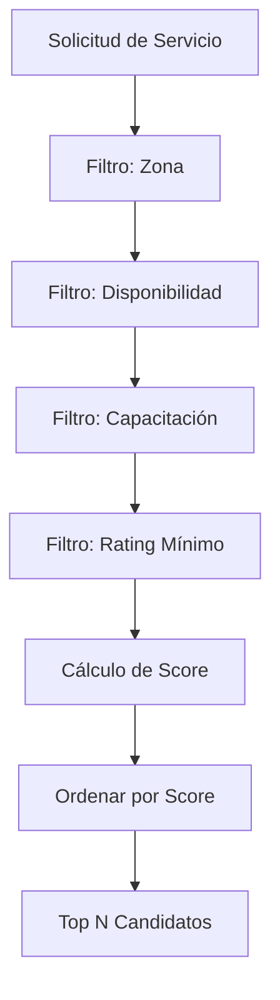

# 1.3.6.1.1 Algoritmo de Matching

Motor de emparejamiento solicitud ↔ operadores elegibles.

---

## Objetivo

Encontrar los **mejores operadores candidatos** para una solicitud de servicio, ordenados por idoneidad.

---

## Pipeline de Matching



---

## Filtros Secuenciales

### 1. Filtro de Zona

```sql
-- Operadores cuya zona de cobertura incluye la ubicación del cliente
SELECT o.id
FROM operadores o
JOIN zonas_operador zo ON o.id = zo.operador_id
WHERE ST_Contains(zo.poligono, ST_MakePoint($lng, $lat))
   OR calcular_distancia(zo.centro_lat, zo.centro_lng, $lat, $lng) < zo.radio_km * 1000;
```

### 2. Filtro de Disponibilidad

```sql
-- Operadores con espacio en agenda durante el rango solicitado
SELECT o.id
FROM operadores o
WHERE o.estado = 'activo'
  AND NOT EXISTS (
    SELECT 1 FROM citas c
    WHERE c.operador_id = o.id
    AND c.estado IN ('confirmada', 'en_progreso')
    AND c.fecha = $fecha
    AND (
      (c.hora_inicio <= $hora_fin AND c.hora_fin >= $hora_inicio)
    )
  );
```

### 3. Filtro de Capacitación

```sql
-- Operadores certificados para el servicio solicitado
SELECT o.id
FROM operadores o
JOIN capacitaciones_operador co ON o.id = co.operador_id
WHERE co.servicio_id = $servicio_id
  AND co.vigente = true;
```

### 4. Filtro de Rating Mínimo

```sql
-- Operadores con rating >= umbral (configurable)
SELECT o.id
FROM operadores o
WHERE o.rating_promedio >= $rating_minimo;  -- Default: 4.0
```

---

## Cálculo de Score

```typescript
interface ScoreFactors {
  distancia: number;       // 0-100, menor distancia = mayor score
  disponibilidad: number;  // 0-100, más holgura en agenda = mayor score
  rating: number;          // 0-100, mayor rating = mayor score
  historial: number;       // 0-100, más servicios exitosos = mayor score
  preferencia: number;     // 0-100, cliente lo ha elegido antes = mayor score
}

const calcularScore = (operador: Operador, solicitud: Solicitud): number => {
  const weights = {
    distancia: 0.30,       // 30%
    disponibilidad: 0.25,  // 25%
    rating: 0.20,          // 20%
    historial: 0.15,       // 15%
    preferencia: 0.10      // 10%
  };
  
  const scores: ScoreFactors = {
    distancia: calcularScoreDistancia(operador.distancia_km),
    disponibilidad: calcularScoreDisponibilidad(operador.agenda, solicitud.fecha),
    rating: normalizar(operador.rating, 1, 5),
    historial: normalizar(operador.servicios_exitosos, 0, 100),
    preferencia: operador.fue_favorito_cliente ? 100 : 0
  };
  
  return Object.keys(weights).reduce((total, key) => {
    return total + (weights[key] * scores[key]);
  }, 0);
};

// Helpers
const calcularScoreDistancia = (km: number): number => {
  // 0 km = 100, 10+ km = 0
  return Math.max(0, 100 - (km * 10));
};

const calcularScoreDisponibilidad = (agenda: Cita[], fecha: Date): number => {
  const citasDelDia = agenda.filter(c => isSameDay(c.fecha, fecha)).length;
  // 0 citas = 100, 8+ citas = 0
  return Math.max(0, 100 - (citasDelDia * 12.5));
};

const normalizar = (valor: number, min: number, max: number): number => {
  return ((valor - min) / (max - min)) * 100;
};
```

---

## Función SQL Completa

```sql
CREATE OR REPLACE FUNCTION buscar_operadores_elegibles(
  p_lat DECIMAL,
  p_lng DECIMAL,
  p_fecha DATE,
  p_hora_inicio TIME,
  p_hora_fin TIME,
  p_servicio_id UUID,
  p_cliente_id UUID,
  p_limite INT DEFAULT 5
)
RETURNS TABLE (
  operador_id UUID,
  nombre TEXT,
  rating DECIMAL,
  distancia_km DECIMAL,
  score DECIMAL
) AS $$
BEGIN
  RETURN QUERY
  WITH operadores_filtrados AS (
    SELECT 
      o.id,
      o.nombre,
      o.rating_promedio as rating,
      calcular_distancia(o.lat_base, o.lng_base, p_lat, p_lng) / 1000 as distancia_km,
      -- Verificar si cliente lo ha usado antes
      EXISTS (
        SELECT 1 FROM citas c2 
        WHERE c2.operador_id = o.id 
        AND c2.cliente_id = p_cliente_id
        AND c2.estado = 'completada'
      ) as fue_favorito
    FROM operadores o
    -- Filtro: Activo
    WHERE o.estado = 'activo'
    -- Filtro: Capacitado
    AND EXISTS (
      SELECT 1 FROM capacitaciones_operador co
      WHERE co.operador_id = o.id
      AND co.servicio_id = p_servicio_id
      AND co.vigente = true
    )
    -- Filtro: Zona (dentro de 15 km)
    AND calcular_distancia(o.lat_base, o.lng_base, p_lat, p_lng) < 15000
    -- Filtro: Sin conflicto de horario
    AND NOT EXISTS (
      SELECT 1 FROM citas c
      WHERE c.operador_id = o.id
      AND c.fecha = p_fecha
      AND c.estado NOT IN ('cancelada', 'rechazada')
      AND c.hora_inicio < p_hora_fin
      AND c.hora_fin > p_hora_inicio
    )
    -- Filtro: Rating mínimo
    AND o.rating_promedio >= 4.0
    -- Filtro: No ha bloqueado a este cliente
    AND NOT EXISTS (
      SELECT 1 FROM bloqueos_operador bo
      WHERE bo.operador_id = o.id
      AND bo.cliente_id = p_cliente_id
    )
  )
  SELECT 
    of.id,
    of.nombre,
    of.rating,
    of.distancia_km,
    -- Score compuesto
    (
      (100 - LEAST(of.distancia_km * 10, 100)) * 0.30 +  -- Distancia
      of.rating * 20 * 0.20 +                             -- Rating (1-5 → 0-100)
      CASE WHEN of.fue_favorito THEN 100 ELSE 0 END * 0.10  -- Preferencia
    )::DECIMAL as score
  FROM operadores_filtrados of
  ORDER BY score DESC
  LIMIT p_limite;
END;
$$ LANGUAGE plpgsql;
```

---

## Uso desde Composable

```typescript
// composables/useServiceMatching.ts
export const useServiceMatching = () => {
  const supabase = useSupabaseClient();
  
  const findEligibleOperators = async (solicitud: SolicitudServicio) => {
    const { data, error } = await supabase.rpc('buscar_operadores_elegibles', {
      p_lat: solicitud.ubicacion.lat,
      p_lng: solicitud.ubicacion.lng,
      p_fecha: solicitud.fecha,
      p_hora_inicio: solicitud.horaInicio,
      p_hora_fin: solicitud.horaFin,
      p_servicio_id: solicitud.servicioId,
      p_cliente_id: solicitud.clienteId,
      p_limite: 5
    });
    
    if (error) throw error;
    return data;
  };
  
  return { findEligibleOperators };
};
```

---

## Ajuste de Pesos por Contexto

| Contexto | Distancia | Disponibilidad | Rating | Historial | Preferencia |
|----------|-----------|----------------|--------|-----------|-------------|
| **B2C Normal** | 30% | 25% | 20% | 15% | 10% |
| **Corporate+** | 20% | 20% | 25% | 20% | **15%** |
| **Urgente** | **40%** | 30% | 15% | 10% | 5% |
| **Servicio Premium** | 15% | 20% | **35%** | 20% | 10% |

---

## Navegación

| ⬆️ Padre             | [[Proyecto OnlyCarNLD/Datos/1.3.6.1 asignacion_citas]]           |
| -------------------- | -------------------------------------- |
| ➡️ Hermano siguiente | [[Proyecto OnlyCarNLD/Datos/1.3.6.1.2 disponibilidad_operadores]]|

---
