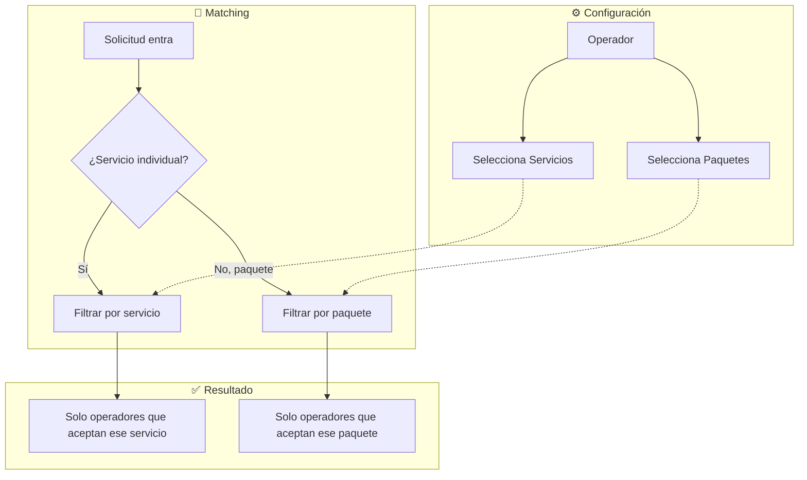

# 1.3.6.1.11 Preferencias de Servicios

Sistema para que operadores elijan qué servicios y paquetes realizan.

---

## Filosofía

> [!IMPORTANT]
> **El operador decide qué servicios acepta.**
> - Habilita/deshabilita servicios individuales
> - Habilita/deshabilita paquetes
> - Algoritmo respeta estas preferencias
> - NO recibe broadcasts de servicios no habilitados

---

## Beneficios

| Beneficio | Descripción |
|-----------|-------------|
| **Operador feliz** | Solo recibe trabajos que le gustan |
| **Menos rechazos** | No rechaza por "no sé hacer eso" |
| **Mejor calidad** | Hace lo que sabe hacer bien |
| **Métricas precisas** | Tasa de aceptación más real |

---

## Arquitectura



---

## UI: Panel de Preferencias

```
┌─────────────────────────────────────────────────────────────────┐
│  🛠️ MIS SERVICIOS                                               │
├─────────────────────────────────────────────────────────────────┤
│                                                                 │
│  Selecciona los servicios que estás dispuesto a realizar:       │
│                                                                 │
│  SERVICIOS INDIVIDUALES                                         │
│  ─────────────────────────────────────────────────────────────  │
│  [✓] Lavado Express                    $290   ⏱️ 30 min         │
│  [✓] Lavado Completo                   $399   ⏱️ 45 min         │
│  [✓] Aspirado Interior                 $168   ⏱️ 25 min         │
│  [ ] Encerado                          $299   ⏱️ 40 min         │
│       ⚠️ Requiere capacitación adicional                        │
│  [✓] Desinfección                      $149   ⏱️ 15 min         │
│  [ ] Pulido de Faros                   $430   ⏱️ 35 min         │
│                                                                 │
│  PAQUETES                                                       │
│  ─────────────────────────────────────────────────────────────  │
│  [✓] Paquete Básico                    $599                     │
│      └─ Lavado Completo + Aspirado                              │
│  [✓] Paquete Premium                   $899                     │
│      └─ Lavado + Aspirado + Desinfección                        │
│  [ ] Paquete VIP                       $1,499                   │
│      └─ Todo + Encerado + Pulido                                │
│       ⚠️ Requiere servicios no habilitados                      │
│                                                                 │
│  ℹ️ Mínimo 1 servicio o paquete habilitado.                     │
│                                                                 │
│  [ Guardar preferencias ]                                       │
│                                                                 │
└─────────────────────────────────────────────────────────────────┘
```

---

## Reglas

| Regla       | Descripción                                          |
| ----------- | ---------------------------------------------------- |
| **PRF-001** | Operador debe habilitar mínimo 1 servicio o paquete  |
| **PRF-002** | Paquete requiere todos sus servicios habilitados     |
| **PRF-003** | Servicio con capacitación requerida → Admin habilita |
| **PRF-004** | Cambios surten efecto inmediato                      |
| **PRF-005** | Historial de cambios para auditoría                  |

---

## Estructura de Hijos

| ID                                                    | Nombre           | Descripción      | Estado |
| ----------------------------------------------------- | ---------------- | ---------------- | ------ |
| [[Proyecto OnlyCarNLD/Datos/1.3.6.1.11.1 servicios_individuales\|1.3.6.1.11.1]] | Servicios Indiv. | Selección unidad | ✅      |
| [[Proyecto OnlyCarNLD/Datos/1.3.6.1.11.2 paquetes_aceptados\|1.3.6.1.11.2]]     | Paquetes         | Combo servicios  | ✅      |
| [[Proyecto OnlyCarNLD/Datos/1.3.6.1.11.3 integracion_matching\|1.3.6.1.11.3]]   | Integración      | Con matching     | ✅      |

---

## Navegación

| ⬆️ Padre             | [[Proyecto OnlyCarNLD/Datos/1.3.6.1 asignacion_citas]]          |
| -------------------- | ------------------------------------- |
| ⬅️ Hermano anterior  | [[Proyecto OnlyCarNLD/Datos/1.3.6.1.10 metricas_asignacion]]    |
| ➡️ Hermano siguiente | [[Proyecto OnlyCarNLD/Datos/1.3.6.1.12 sistema_ciudades]]       |

---
