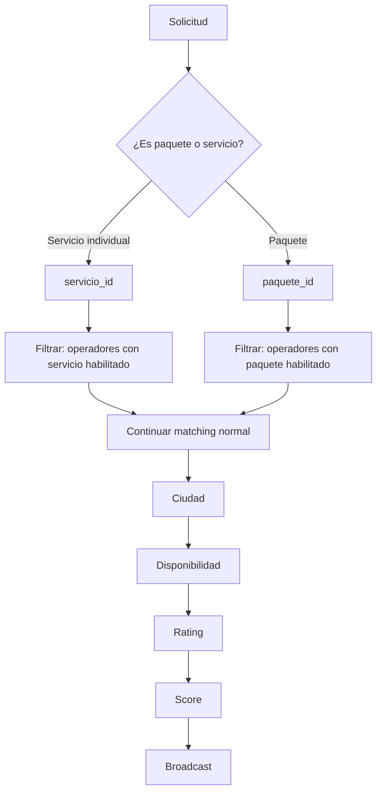

# 1.3.6.1.11.3 Integración con Matching

Cómo las preferencias afectan el matching.

---

## Flujo Actualizado



---

## Función SQL Actualizada

```sql
-- VERSIÓN FINAL con todos los filtros
CREATE OR REPLACE FUNCTION buscar_operadores_elegibles_v4(
  p_cliente_id UUID,
  p_lat DECIMAL,
  p_lng DECIMAL,
  p_fecha DATE,
  p_hora_inicio TIME,
  p_hora_fin TIME,
  p_servicio_id UUID,       -- NULL si es paquete
  p_paquete_id UUID,        -- NULL si es servicio individual
  p_limite INT DEFAULT 5
)
RETURNS TABLE (
  operador_id UUID,
  nombre TEXT,
  rating DECIMAL,
  distancia_km DECIMAL,
  score DECIMAL
) AS $$
DECLARE
  v_ciudad_cliente UUID;
BEGIN
  -- Obtener ciudad del cliente
  SELECT ciudad_id INTO v_ciudad_cliente
  FROM clientes WHERE id = p_cliente_id;

  RETURN QUERY
  SELECT 
    o.id,
    o.nombre,
    o.rating_promedio,
    calcular_distancia(o.lat_base, o.lng_base, p_lat, p_lng) / 1000,
    -- Score
    (100 - LEAST(calcular_distancia(o.lat_base, o.lng_base, p_lat, p_lng) / 1000 * 10, 100)) * 0.30 +
    o.rating_promedio * 20 * 0.20
  FROM operadores o
  
  -- ═══════════════════════════════════════════════════════════════
  -- FILTRO 1: CIUDAD
  -- ═══════════════════════════════════════════════════════════════
  WHERE o.ciudad_id = v_ciudad_cliente
  
  -- ═══════════════════════════════════════════════════════════════
  -- FILTRO 2: SERVICIO O PAQUETE HABILITADO (NUEVO)
  -- ═══════════════════════════════════════════════════════════════
  AND (
    -- Si es servicio individual
    (p_servicio_id IS NOT NULL AND EXISTS (
      SELECT 1 FROM servicios_operador so
      WHERE so.operador_id = o.id
        AND so.servicio_id = p_servicio_id
        AND so.habilitado = true
    ))
    OR
    -- Si es paquete
    (p_paquete_id IS NOT NULL AND EXISTS (
      SELECT 1 FROM paquetes_operador po
      WHERE po.operador_id = o.id
        AND po.paquete_id = p_paquete_id
        AND po.habilitado = true
    ))
  )
  
  -- FILTRO 3: Activo
  AND o.estado = 'activo'
  
  -- FILTRO 4: Sin conflicto de horario
  AND NOT EXISTS (
    SELECT 1 FROM citas c
    WHERE c.operador_id = o.id
      AND c.fecha = p_fecha
      AND c.estado NOT IN ('cancelada', 'rechazada')
      AND c.hora_inicio < p_hora_fin
      AND c.hora_fin > p_hora_inicio
  )
  
  -- FILTRO 5: Rating mínimo
  AND o.rating_promedio >= 4.0
  
  -- FILTRO 6: No ha bloqueado al cliente
  AND NOT EXISTS (
    SELECT 1 FROM bloqueos_operador bo
    WHERE bo.operador_id = o.id AND bo.cliente_id = p_cliente_id
  )
  
  ORDER BY score DESC
  LIMIT p_limite;
END;
$$ LANGUAGE plpgsql;
```

---

## Uso desde Composable

```typescript
// composables/useServiceMatching.ts (actualizado)
export const useServiceMatching = () => {
  const supabase = useSupabaseClient();
  
  const findEligibleOperators = async (solicitud: SolicitudServicio) => {
    const { data, error } = await supabase.rpc('buscar_operadores_elegibles_v4', {
      p_cliente_id: solicitud.clienteId,
      p_lat: solicitud.ubicacion.lat,
      p_lng: solicitud.ubicacion.lng,
      p_fecha: solicitud.fecha,
      p_hora_inicio: solicitud.horaInicio,
      p_hora_fin: solicitud.horaFin,
      p_servicio_id: solicitud.tipo === 'servicio' ? solicitud.servicioId : null,
      p_paquete_id: solicitud.tipo === 'paquete' ? solicitud.paqueteId : null,
      p_limite: 5
    });
    
    if (error) throw error;
    return data;
  };
  
  return { findEligibleOperators };
};
```

---

## Score Adicional: Afinidad con Servicio

```typescript
// Bonus si operador "le gusta" este servicio (muchos completados)
const calcularAfinidadServicio = async (operadorId: string, servicioId: string) => {
  const { data } = await supabase
    .from('citas')
    .select('id', { count: 'exact', head: true })
    .eq('operador_id', operadorId)
    .eq('servicio_id', servicioId)
    .eq('estado', 'completada');
  
  const completados = data?.count || 0;
  
  // 0 completados = 0 bonus
  // 10+ completados = 10 puntos bonus
  return Math.min(10, completados);
};
```

---

## Manejo: 0 Operadores con Servicio

```
┌─────────────────────────────────────────────────────────────────┐
│  ⚠️ ESCALACIÓN: SIN OPERADORES PARA SERVICIO                    │
├─────────────────────────────────────────────────────────────────┤
│                                                                 │
│  Solicitud: #12345                                              │
│  Cliente: Juan García                                           │
│  Ciudad: Nuevo Laredo                                           │
│  Servicio: Pulido de Faros                                      │
│                                                                 │
│  PROBLEMA: Ningún operador en Nuevo Laredo tiene                │
│            habilitado "Pulido de Faros".                        │
│                                                                 │
│  OPCIONES:                                                      │
│                                                                 │
│  1. [ Contactar cliente ]                                       │
│     Ofrecer servicio alternativo                                │
│                                                                 │
│  2. [ Habilitar operador ]                                      │
│     Verificar capacitación de algún operador                    │
│                                                                 │
│  3. [ Cancelar solicitud ]                                      │
│                                                                 │
└─────────────────────────────────────────────────────────────────┘
```

---

## Métricas de Preferencias

```sql
-- Vista: Servicios más/menos populares entre operadores
CREATE VIEW v_servicios_popularidad AS
SELECT
  s.nombre as servicio,
  COUNT(*) FILTER (WHERE so.habilitado = true) as operadores_habilitados,
  COUNT(*) as operadores_total,
  ROUND(COUNT(*) FILTER (WHERE so.habilitado) * 100.0 / COUNT(*), 1) as porcentaje_habilitado
FROM servicios s
LEFT JOIN servicios_operador so ON s.id = so.servicio_id
GROUP BY s.id, s.nombre
ORDER BY porcentaje_habilitado DESC;

-- Ejemplo resultado:
-- | Servicio           | Habilitados | Total | %    |
-- | Lavado Express     | 45          | 50    | 90%  |
-- | Encerado           | 12          | 50    | 24%  |
-- | Pulido de Faros    | 8           | 50    | 16%  |
```

---

## Navegación

| ⬆️ Padre            | [[Proyecto OnlyCarNLD/Datos/1.3.6.1.11 preferencias_servicios]]   |
| ------------------- | --------------------------------------- |
| ⬅️ Hermano anterior | [[Proyecto OnlyCarNLD/Datos/1.3.6.1.11.2 paquetes_aceptados]]     |

---
