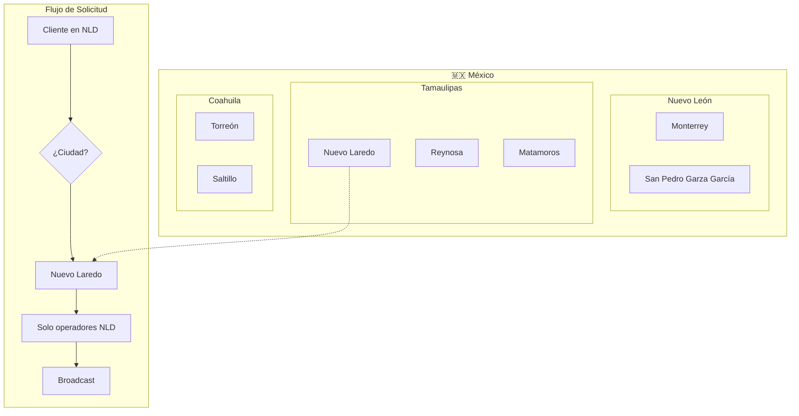

# 1.3.6.1.12 Sistema de Ciudades

Arquitectura multi-ciudad escalable para operación nacional.

---

## Filosofía

> [!IMPORTANT]
> **Principio de Localidad Estricta**
> 
> - Operador pertenece a **UNA** ciudad
> - Cliente pertenece a **UNA** ciudad
> - Solicitud → Solo operadores de **ESA MISMA** ciudad
> - **NUNCA** operadores de ciudades vecinas o cercanas

---

## Arquitectura



---

## Comparación: Zonas vs Ciudades

| Concepto | Zonas (antes) | Ciudades (nuevo) |
|----------|---------------|------------------|
| **Propósito** | División interna | Filtro principal |
| **Pertenencia** | Operador en N zonas | Operador en 1 ciudad |
| **Overlap** | Zonas pueden traslaparse | Ciudades NO |
| **Tarifa** | Tarifa extra por zona | N/A para ciudad |
| **Obligatoriedad** | Opcional | OBLIGATORIO |

> [!TIP]
> Las **zonas** (Centro, Norte, Sur) siguen existiendo DENTRO de una ciudad para tarifas adicionales y preferencias. La **ciudad** es el filtro macro obligatorio.

---

## Flujo de Matching Actualizado

```
ANTES:
  Zona → Disponibilidad → Capacitación → Rating → Broadcast

AHORA:
  CIUDAD → Zona → Disponibilidad → Servicios Preferidos → Rating → Broadcast
    ↑
    └─ NUEVO: Filtro más restrictivo, primero
```

---

## Escalabilidad

```
┌─────────────────────────────────────────────────────────────────┐
│  CRECIMIENTO PROYECTADO                                         │
├─────────────────────────────────────────────────────────────────┤
│                                                                 │
│  FASE 1 (Actual):                                               │
│  • 1 ciudad: Nuevo Laredo, Tamaulipas                           │
│  • N operadores registrados en NLD                              │
│                                                                 │
│  FASE 2 (6 meses):                                              │
│  • +3 ciudades: Reynosa, Matamoros, Laredo TX (especial)        │
│  • Operadores independientes por ciudad                         │
│                                                                 │
│  FASE 3 (1 año):                                                │
│  • +10 ciudades: Monterrey, Saltillo, Torreón, etc.             │
│  • Sistema de admins regionales                                 │
│                                                                 │
│  FASE 4 (2 años):                                               │
│  • Nacional: 50+ ciudades                                       │
│  • Franquicias por ciudad                                       │
│                                                                 │
└─────────────────────────────────────────────────────────────────┘
```

---

## Zonas vs Ciudades

| Concepto | Zonas | Ciudades |
|----------|-------|----------|
| **Propósito** | División interna | Filtro principal |
| **Pertenencia** | Operador en N zonas | Operador en 1 ciudad |
| **Overlap** | Pueden traslaparse | NO |
| **Obligatoriedad** | Opcional | OBLIGATORIO |

---

## Estructura de Hijos

| ID                                                        | Nombre     | Descripción | Estado |
| --------------------------------------------------------- | ---------- | ----------- | ------ |
| [[Proyecto OnlyCarNLD/Datos/1.3.6.1.12.1 modelo_ciudades\|1.3.6.1.12.1]]            | Modelo     | BD ciudades | ✅      |
| [[Proyecto OnlyCarNLD/Datos/1.3.6.1.12.2 asignacion_operador_ciudad\|1.3.6.1.12.2]] | Asignación | Op→Ciudad   | ✅      |
| [[Proyecto OnlyCarNLD/Datos/1.3.6.1.12.3 filtro_solicitud_ciudad\|1.3.6.1.12.3]]    | Filtro     | En matching | ✅      |

---

## Navegación

| ⬆️ Padre             | [[Proyecto OnlyCarNLD/Datos/1.3.6.1 asignacion_citas]]            |
| -------------------- | --------------------------------------- |
| ⬅️ Hermano anterior  | [[Proyecto OnlyCarNLD/Datos/1.3.6.1.11 preferencias_servicios]]   |
| ➡️ Hermano siguiente | [[Proyecto OnlyCarNLD/Datos/1.3.6.1.13 inventario_herramientas]]  |

---
