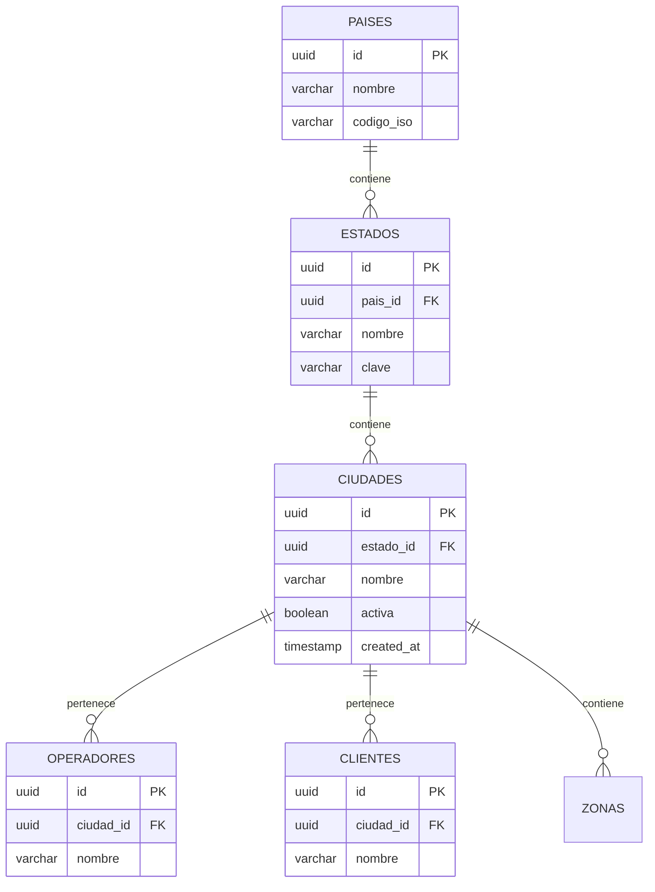

# 1.3.6.1.12.1 Modelo de Ciudades

Schema de base de datos para ciudades.

---

## Diagrama ER



---

## Schema SQL

### Tabla: paises

```sql
CREATE TABLE paises (
  id UUID PRIMARY KEY DEFAULT gen_random_uuid(),
  nombre VARCHAR(100) NOT NULL,
  codigo_iso CHAR(2) NOT NULL UNIQUE,  -- MX, US, etc.
  activo BOOLEAN DEFAULT true,
  created_at TIMESTAMPTZ DEFAULT now()
);

-- Seed inicial
INSERT INTO paises (nombre, codigo_iso) VALUES
  ('México', 'MX');
```

### Tabla: estados

```sql
CREATE TABLE estados (
  id UUID PRIMARY KEY DEFAULT gen_random_uuid(),
  pais_id UUID NOT NULL REFERENCES paises(id),
  nombre VARCHAR(100) NOT NULL,
  clave CHAR(3) NOT NULL,  -- NLE, TAM, COA, etc.
  activo BOOLEAN DEFAULT true,
  created_at TIMESTAMPTZ DEFAULT now(),
  
  UNIQUE (pais_id, clave)
);

-- Índices
CREATE INDEX idx_estados_pais ON estados(pais_id);

-- Seed inicial (estados donde operaremos primero)
INSERT INTO estados (pais_id, nombre, clave) VALUES
  ((SELECT id FROM paises WHERE codigo_iso = 'MX'), 'Tamaulipas', 'TAM'),
  ((SELECT id FROM paises WHERE codigo_iso = 'MX'), 'Nuevo León', 'NLE'),
  ((SELECT id FROM paises WHERE codigo_iso = 'MX'), 'Coahuila', 'COA');
```

### Tabla: ciudades

```sql
CREATE TABLE ciudades (
  id UUID PRIMARY KEY DEFAULT gen_random_uuid(),
  estado_id UUID NOT NULL REFERENCES estados(id),
  nombre VARCHAR(100) NOT NULL,
  nombre_display VARCHAR(150),  -- "Nuevo Laredo, Tamaulipas"
  activa BOOLEAN DEFAULT true,
  -- Coordenadas aproximadas del centro (para mapa)
  centro_lat DECIMAL(10, 8),
  centro_lng DECIMAL(11, 8),
  -- Configuración
  zona_horaria VARCHAR(50) DEFAULT 'America/Monterrey',
  moneda VARCHAR(3) DEFAULT 'MXN',
  -- Metadata
  created_at TIMESTAMPTZ DEFAULT now(),
  updated_at TIMESTAMPTZ DEFAULT now(),
  
  UNIQUE (estado_id, nombre)
);

-- Índices
CREATE INDEX idx_ciudades_estado ON ciudades(estado_id);
CREATE INDEX idx_ciudades_activa ON ciudades(activa) WHERE activa = true;

-- Trigger para nombre_display
CREATE OR REPLACE FUNCTION set_ciudad_nombre_display()
RETURNS TRIGGER AS $$
BEGIN
  NEW.nombre_display := NEW.nombre || ', ' || (
    SELECT e.nombre FROM estados e WHERE e.id = NEW.estado_id
  );
  RETURN NEW;
END;
$$ LANGUAGE plpgsql;

CREATE TRIGGER trg_ciudad_nombre_display
BEFORE INSERT OR UPDATE ON ciudades
FOR EACH ROW EXECUTE FUNCTION set_ciudad_nombre_display();

-- Seed inicial
INSERT INTO ciudades (estado_id, nombre, centro_lat, centro_lng) VALUES
  ((SELECT id FROM estados WHERE clave = 'TAM'), 'Nuevo Laredo', 27.4767, -99.5067);
```

---

## Modificación a Operadores

```sql
-- Agregar columna ciudad_id a operadores
ALTER TABLE operadores 
ADD COLUMN ciudad_id UUID REFERENCES ciudades(id);

-- Hacer obligatoria después de migrar datos existentes
-- ALTER TABLE operadores ALTER COLUMN ciudad_id SET NOT NULL;

-- Índice para búsqueda por ciudad
CREATE INDEX idx_operadores_ciudad ON operadores(ciudad_id);

-- Migrar operadores existentes a Nuevo Laredo
UPDATE operadores
SET ciudad_id = (SELECT id FROM ciudades WHERE nombre = 'Nuevo Laredo')
WHERE ciudad_id IS NULL;
```

---

## Modificación a Clientes

```sql
-- Agregar columna ciudad_id a clientes
ALTER TABLE clientes 
ADD COLUMN ciudad_id UUID REFERENCES ciudades(id);

-- Para clientes nuevos: detectar por ubicación o selección manual
-- Para existentes: default a Nuevo Laredo
UPDATE clientes
SET ciudad_id = (SELECT id FROM ciudades WHERE nombre = 'Nuevo Laredo')
WHERE ciudad_id IS NULL;

CREATE INDEX idx_clientes_ciudad ON clientes(ciudad_id);
```

---

## Vista: Ciudades con Conteo

```sql
CREATE VIEW v_ciudades_stats AS
SELECT
  c.id,
  c.nombre,
  c.nombre_display,
  c.activa,
  e.nombre as estado_nombre,
  e.clave as estado_clave,
  (SELECT COUNT(*) FROM operadores o WHERE o.ciudad_id = c.id) as total_operadores,
  (SELECT COUNT(*) FROM clientes cl WHERE cl.ciudad_id = c.id) as total_clientes,
  (SELECT COUNT(*) FROM solicitudes s 
   JOIN clientes cl2 ON s.cliente_id = cl2.id 
   WHERE cl2.ciudad_id = c.id 
   AND s.created_at > NOW() - INTERVAL '30 days') as solicitudes_mes
FROM ciudades c
JOIN estados e ON c.estado_id = e.id
ORDER BY total_operadores DESC;
```

---

## Composable: useCities

```typescript
// composables/useCities.ts
interface Ciudad {
  id: string;
  nombre: string;
  nombre_display: string;
  activa: boolean;
  estado_nombre: string;
  estado_clave: string;
}

export const useCities = () => {
  const supabase = useSupabaseClient();
  
  const getCiudadesActivas = async (): Promise<Ciudad[]> => {
    const { data, error } = await supabase
      .from('ciudades')
      .select(`
        id, nombre, nombre_display, activa,
        estados (nombre, clave)
      `)
      .eq('activa', true)
      .order('nombre');
    
    return data?.map(c => ({
      ...c,
      estado_nombre: c.estados.nombre,
      estado_clave: c.estados.clave
    })) || [];
  };
  
  const getCiudadById = async (id: string) => {
    const { data } = await supabase
      .from('ciudades')
      .select('*, estados (*)')
      .eq('id', id)
      .single();
    return data;
  };
  
  const getEstadosConCiudades = async () => {
    const { data } = await supabase
      .from('estados')
      .select(`
        id, nombre, clave,
        ciudades (id, nombre, activa)
      `)
      .eq('activo', true)
      .order('nombre');
    return data;
  };
  
  return {
    getCiudadesActivas,
    getCiudadById,
    getEstadosConCiudades
  };
};
```

---

## RLS Policies

```sql
-- Ciudades: lectura pública
CREATE POLICY "Ciudades visibles para todos"
ON ciudades FOR SELECT
USING (true);

-- Ciudades: solo admin puede modificar
CREATE POLICY "Solo admin modifica ciudades"
ON ciudades FOR ALL
USING (auth.jwt() ->> 'role' = 'admin');

-- Estados: lectura pública
CREATE POLICY "Estados visibles para todos"
ON estados FOR SELECT
USING (true);
```

---

## Navegación

| ⬆️ Padre             | [[Proyecto OnlyCarNLD/Datos/1.3.6.1.12 sistema_ciudades]]               |
| -------------------- | --------------------------------------------- |
| ➡️ Hermano siguiente | [[Proyecto OnlyCarNLD/Datos/1.3.6.1.12.2 asignacion_operador_ciudad]]   |

---
