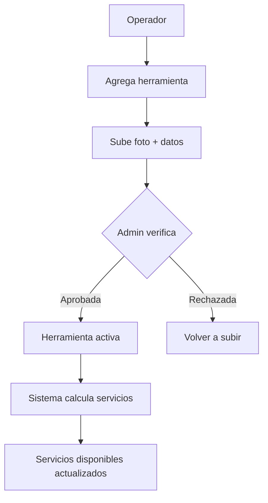

# 1.3.6.1.12.3 Filtro Solicitud Ciudad

Lógica para filtrar operadores por ciudad.

---

## Filosofía

> [!IMPORTANT]
> **El operador debe comprobar que PUEDE hacer lo que dice.**
> 
> - Documenta TODAS sus herramientas con foto
> - Admin verifica cada herramienta
> - Sistema calcula qué servicios puede ofrecer
> - No puede habilitar servicios sin el equipo necesario

---

## Flujo Principal



---

## Arquitectura

```
┌─────────────────────────────────────────────────────────────────┐
│  INVENTARIO DE HERRAMIENTAS                                     │
├─────────────────────────────────────────────────────────────────┤
│                                                                 │
│  CATÁLOGO DE HERRAMIENTAS                                       │
│  ─────────────────────────────────────────────────────────────  │
│  Define qué herramientas existen y cuáles requiere cada         │
│  servicio.                                                      │
│                                                                 │
│  REGISTRO DE EQUIPO                                             │
│  ─────────────────────────────────────────────────────────────  │
│  Operador documenta su equipo con foto, marca, modelo.          │
│  Admin verifica cada herramienta.                               │
│                                                                 │
│  VALIDACIÓN DE SERVICIOS                                        │
│  ─────────────────────────────────────────────────────────────  │
│  Sistema calcula automáticamente qué servicios puede            │
│  habilitar el operador según su equipo.                         │
│                                                                 │
└─────────────────────────────────────────────────────────────────┘
```

---

## Ejemplo de Flujo

```
1. Carlos registra: Hidrolavadora Kärcher K5
   - Sube foto del equipo
   - Especifica: Marca Kärcher, Modelo K5, 145 bar

2. Admin verifica:
   - Revisa foto ✓
   - Confirma que es lo que dice ✓
   - Aprueba ✓

3. Sistema calcula:
   - Hidrolavadora detectada → "Lavado Express" HABILITADO
   - Hidrolavadora detectada → "Lavado Completo" HABILITADO
   - Falta Pulidora → "Pulido de Faros" BLOQUEADO
```

---

## Reglas

| Regla | Descripción |
|-------|-------------|
| **HER-001** | Foto OBLIGATORIA para cada herramienta |
| **HER-002** | Admin debe verificar CADA herramienta |
| **HER-003** | Herramienta rechazada puede re-subirse |
| **HER-004** | Baja de herramienta → recalcular servicios |
| **HER-005** | Servicio se bloquea si falta herramienta requerida |
| **HER-006** | Operador ve qué herramientas le faltan para cada servicio |

---

## Navegación

| ⬆️ Padre            | [[Proyecto OnlyCarNLD/Datos/1.3.6.1.12 sistema_ciudades]]            |
| ------------------- | ------------------------------------------ |
| ⬅️ Hermano anterior | [[Proyecto OnlyCarNLD/Datos/1.3.6.1.12.2 asignacion_operador_ciudad]]|

---
