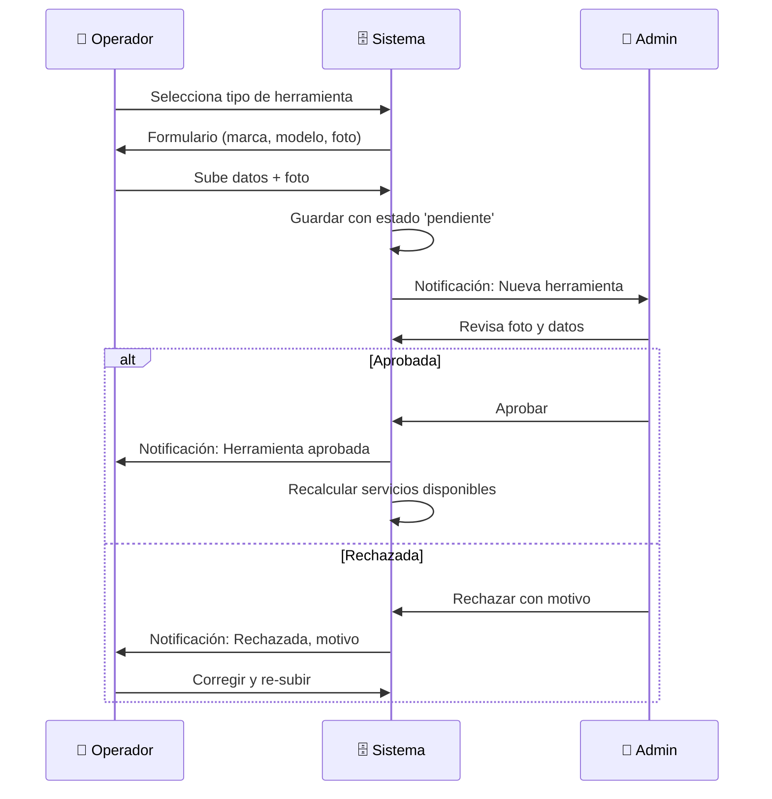

# 1.3.6.1.13.2 Registro de Equipo

Flujo para documentar herramientas del operador.

---

## Flujo de Registro



---

## Modelo de Datos

### Tabla: herramientas_operador

```sql
CREATE TABLE herramientas_operador (
  id UUID PRIMARY KEY DEFAULT gen_random_uuid(),
  operador_id UUID NOT NULL REFERENCES operadores(id),
  tipo_herramienta_id UUID NOT NULL REFERENCES tipos_herramientas(id),
  
  -- Especificaciones
  marca VARCHAR(100),
  modelo VARCHAR(100),
  especificaciones TEXT,  -- JSON con detalles adicionales
  
  -- Foto (obligatoria)
  foto_url TEXT NOT NULL,
  foto_verificada BOOLEAN DEFAULT false,
  
  -- Estado
  estado VARCHAR(20) DEFAULT 'pendiente',  -- pendiente, aprobada, rechazada, baja
  motivo_rechazo TEXT,
  
  -- Verificación
  verificada_por UUID REFERENCES users(id),
  verificada_at TIMESTAMPTZ,
  
  -- Timestamps
  created_at TIMESTAMPTZ DEFAULT now(),
  updated_at TIMESTAMPTZ DEFAULT now()
);

-- Índices
CREATE INDEX idx_herramientas_operador ON herramientas_operador(operador_id);
CREATE INDEX idx_herramientas_estado ON herramientas_operador(estado);
CREATE INDEX idx_herramientas_pendientes ON herramientas_operador(estado) 
  WHERE estado = 'pendiente';
```

---

## UI: Agregar Herramienta (Operador)

```
┌─────────────────────────────────────────────────────────────────┐
│  ➕ AGREGAR HERRAMIENTA                                         │
├─────────────────────────────────────────────────────────────────┤
│                                                                 │
│  Categoría: [ 🚿 Lavado ▼ ]                                     │
│                                                                 │
│  Tipo: [ Hidrolavadora ▼ ]                                      │
│                                                                 │
│  Marca: [ Kärcher          ]                                    │
│                                                                 │
│  Modelo: [ K5 Premium      ]                                    │
│                                                                 │
│  Especificaciones adicionales:                                  │
│  ┌─────────────────────────────────────────────────────────┐    │
│  │ 145 bar de presión, 500 L/h                             │    │
│  └─────────────────────────────────────────────────────────┘    │
│                                                                 │
│  📸 FOTO DE LA HERRAMIENTA (obligatoria):                       │
│  ┌─────────────────────────────────────────────────────────┐    │
│  │                                                         │    │
│  │           [ 📷 Tomar foto ]                             │    │
│  │                                                         │    │
│  │   La foto debe mostrar claramente el equipo.            │    │
│  │   Incluir marca/modelo visible si es posible.           │    │
│  │                                                         │    │
│  └─────────────────────────────────────────────────────────┘    │
│                                                                 │
│  ⚠️ Un administrador verificará esta herramienta antes de       │
│     habilitarse en tu perfil.                                   │
│                                                                 │
│  [ Cancelar ]                        [ Enviar a verificación ]  │
│                                                                 │
└─────────────────────────────────────────────────────────────────┘
```

---

## UI: Mi Equipo (Operador)

```
┌─────────────────────────────────────────────────────────────────┐
│  🧰 MI EQUIPO DE TRABAJO                                        │
├─────────────────────────────────────────────────────────────────┤
│                                                                 │
│  🚿 LAVADO                                                      │
│  ┌─────────────────────────────────────────────────────────┐    │
│  │ ✅ Hidrolavadora          │ Kärcher K5      │ [📷] [🗑️] │    │
│  │ ✅ Cubetas (2)            │ -               │ [📷] [🗑️] │    │
│  │ ✅ Guante de lavado       │ Chemical Guys   │ [📷] [🗑️] │    │
│  │ ✅ Shampoo automotriz     │ Meguiar's Gold  │ [📷] [🗑️] │    │
│  └─────────────────────────────────────────────────────────┘    │
│                                                                 │
│  🧹 LIMPIEZA INTERIOR                                           │
│  ┌─────────────────────────────────────────────────────────┐    │
│  │ ✅ Aspiradora             │ Shop-Vac 16Gal │ [📷] [🗑️]  │    │
│  │ ⏳ Microfibras (5)        │ En verificación│ [📷]       │    │
│  │ ❌ Set de brochas         │ Rechazada      │ [🔄]       │    │
│  │    └─ Motivo: Foto borrosa, no se ve el producto        │    │
│  └─────────────────────────────────────────────────────────┘    │
│                                                                 │
│  ✨ ACABADOS                                                    │
│  ┌─────────────────────────────────────────────────────────┐    │
│  │ ➕ Sin herramientas registradas                         │    │
│  │    [ Agregar herramienta ]                              │    │
│  └─────────────────────────────────────────────────────────┘    │
│                                                                 │
│  [ + Agregar herramienta ]                                      │
│                                                                 │
└─────────────────────────────────────────────────────────────────┘
```

---

## Composable: useOperatorEquipment

```typescript
// composables/useOperatorEquipment.ts
interface Herramienta {
  id: string;
  tipo_id: string;
  tipo_nombre: string;
  categoria: string;
  marca: string;
  modelo: string;
  foto_url: string;
  estado: 'pendiente' | 'aprobada' | 'rechazada' | 'baja';
  motivo_rechazo?: string;
}

export const useOperatorEquipment = () => {
  const supabase = useSupabaseClient();
  const user = useSupabaseUser();
  
  const herramientas = ref<Herramienta[]>([]);
  const isLoading = ref(true);
  
  const fetchEquipment = async () => {
    isLoading.value = true;
    const { data } = await supabase
      .from('herramientas_operador')
      .select(`
        id, marca, modelo, foto_url, estado, motivo_rechazo,
        tipos_herramientas (
          id, nombre,
          categorias_herramientas (nombre)
        )
      `)
      .eq('operador_id', user.value?.id)
      .neq('estado', 'baja')
      .order('created_at', { ascending: false });
    
    herramientas.value = data?.map(h => ({
      id: h.id,
      tipo_id: h.tipos_herramientas.id,
      tipo_nombre: h.tipos_herramientas.nombre,
      categoria: h.tipos_herramientas.categorias_herramientas.nombre,
      marca: h.marca,
      modelo: h.modelo,
      foto_url: h.foto_url,
      estado: h.estado,
      motivo_rechazo: h.motivo_rechazo
    })) || [];
    
    isLoading.value = false;
  };
  
  const addEquipment = async (herramienta: {
    tipo_id: string;
    marca: string;
    modelo: string;
    especificaciones?: string;
    foto: File;
  }) => {
    // 1. Subir foto a R2
    const fotoUrl = await uploadToolPhoto(herramienta.foto);
    
    // 2. Crear registro
    const { data, error } = await supabase
      .from('herramientas_operador')
      .insert({
        operador_id: user.value?.id,
        tipo_herramienta_id: herramienta.tipo_id,
        marca: herramienta.marca,
        modelo: herramienta.modelo,
        especificaciones: herramienta.especificaciones,
        foto_url: fotoUrl,
        estado: 'pendiente'
      })
      .select()
      .single();
    
    if (!error) {
      toast.success('Herramienta enviada a verificación');
      await fetchEquipment();
    }
    
    return { data, error };
  };
  
  const removeEquipment = async (herramientaId: string) => {
    await supabase
      .from('herramientas_operador')
      .update({ estado: 'baja', updated_at: new Date() })
      .eq('id', herramientaId);
    
    // Recalcular servicios
    await supabase.rpc('recalcular_servicios_operador', {
      p_operador_id: user.value?.id
    });
    
    toast.success('Herramienta dada de baja');
    await fetchEquipment();
  };
  
  onMounted(fetchEquipment);
  
  return {
    herramientas,
    isLoading,
    addEquipment,
    removeEquipment,
    refetch: fetchEquipment
  };
};
```

---

## UI Admin: Verificar Herramientas

```
┌─────────────────────────────────────────────────────────────────┐
│  🔍 ADMIN: HERRAMIENTAS PENDIENTES (3)                          │
├─────────────────────────────────────────────────────────────────┤
│                                                                 │
│  ┌─────────────────────────────────────────────────────────┐    │
│  │ Carlos M.        │ Microfibras (5) │ hace 2 horas       │    │
│  │                                                         │    │
│  │  ┌─────────────┐  Marca: Chemical Guys                  │    │
│  │  │   [FOTO]    │  Modelo: -                             │    │
│  │  │             │                                        │    │
│  │  └─────────────┘                                        │    │
│  │                                                         │    │
│  │  [ ✅ Aprobar ]  [ ❌ Rechazar ]                        │    │
│  └─────────────────────────────────────────────────────────┘    │
│                                                                 │
│  ┌─────────────────────────────────────────────────────────┐    │
│  │ Pedro R.         │ Pulidora orbital │ hace 5 horas      │    │
│  │  ...                                                    │    │
│  └─────────────────────────────────────────────────────────┘    │
│                                                                 │
└─────────────────────────────────────────────────────────────────┘
```

---

## Navegación

| ⬆️ Padre             | [[Proyecto OnlyCarNLD/Datos/1.3.6.1.13 inventario_herramientas]]    |
| -------------------- | ----------------------------------------- |
| ⬅️ Hermano anterior  | [[Proyecto OnlyCarNLD/Datos/1.3.6.1.13.1 catalogo_herramientas]]    |
| ➡️ Hermano siguiente | [[Proyecto OnlyCarNLD/Datos/1.3.6.1.13.3 validacion_servicios]]     |

---
