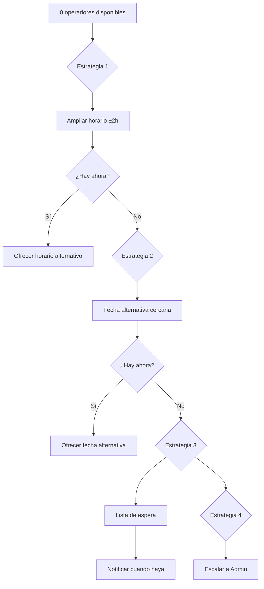

# 1.3.6.1.14 Matching Alternativo

Sistema de búsqueda de alternativas cuando no hay operadores disponibles.

---

## Problema

```
┌─────────────────────────────────────────────────────────────────┐
│  Cliente solicita: Lavado Express                               │
│  Fecha: mañana 10:00 AM                                         │
│  Ciudad: Nuevo Laredo                                           │
│                                                                 │
│  Resultado matching: 0 operadores disponibles                   │
│                                                                 │
│  ❌ Sin solución = Cliente abandonado                           │
└─────────────────────────────────────────────────────────────────┘
```

---

## Solución: Estrategias Alternativas



---

## Orden de Prioridad

| Orden | Estrategia | Descripción |
|-------|------------|-------------|
| 1 | **Ampliar horario** | Buscar en horarios cercanos (±2h) |
| 2 | **Fecha alternativa** | Buscar en los próximos 3 días |
| 3 | **Lista de espera** | Cola con notificación (24h default) |
| 4 | **Escalar admin** | Para casos urgentes o B2B |

---

## Flujo para el Cliente

```
┌─────────────────────────────────────────────────────────────────┐
│  😔 NO HAY OPERADORES DISPONIBLES                               │
├─────────────────────────────────────────────────────────────────┤
│                                                                 │
│  Lo sentimos, no encontramos operadores para:                   │
│  📅 Mañana 10:00 AM • Lavado Express                            │
│                                                                 │
│  OPCIONES:                                                      │
│  ─────────────────────────────────────────────────────────────  │
│                                                                 │
│  ⏰ HORARIO ALTERNATIVO                                         │
│  ┌─────────────────────────────────────────────────────────┐    │
│  │ Mañana 12:00 PM - Carlos M. disponible                  │    │
│  │ [ Elegir este horario ]                                 │    │
│  └─────────────────────────────────────────────────────────┘    │
│                                                                 │
│  📅 OTRA FECHA                                                  │
│  ┌─────────────────────────────────────────────────────────┐    │
│  │ Pasado mañana 10:00 AM - Pedro R. disponible            │    │
│  │ [ Elegir esta fecha ]                                   │    │
│  └─────────────────────────────────────────────────────────┘    │
│                                                                 │
│  📋 LISTA DE ESPERA                                             │
│  ┌─────────────────────────────────────────────────────────┐    │
│  │ Te avisamos cuando haya disponibilidad                  │    │
│  │ Máximo espera: 24 horas                                 │    │
│  │ [ Entrar en lista de espera ]                           │    │
│  └─────────────────────────────────────────────────────────┘    │
│                                                                 │
│  [ Cancelar solicitud ]                                         │
│                                                                 │
└─────────────────────────────────────────────────────────────────┘
```

---

## Reglas

| Regla | Descripción |
|-------|-------------|
| **ALT-001** | Primero intentar horario alternativo |
| **ALT-002** | Máximo ±2 horas de diferencia |
| **ALT-003** | Máximo 3 días de diferencia en fecha |
| **ALT-004** | Lista de espera expira en 24h (configurable) |
| **ALT-005** | Escalar a admin si es B2B o urgente |

---

## Estructura de Hijos

| ID                                                  | Nombre       | Descripción     | Estado |
| --------------------------------------------------- | ------------ | --------------- | ------ |
| [[Proyecto OnlyCarNLD/Datos/1.3.6.1.14.1 estrategias_busqueda\|1.3.6.1.14.1]] | Estrategias  | Lógica búsqueda | ✅      |
| [[Proyecto OnlyCarNLD/Datos/1.3.6.1.14.2 lista_espera\|1.3.6.1.14.2]]         | Lista Espera | Cola de espera  | ✅      |
| [[Proyecto OnlyCarNLD/Datos/1.3.6.1.14.3 notificacion_cliente\|1.3.6.1.14.3]] | Notificación | Avisos cliente  | ✅      |

---

## Navegación

| ⬆️ Padre             | [[Proyecto OnlyCarNLD/Datos/1.3.6.1 asignacion_citas]]            |
| -------------------- | --------------------------------------- |
| ⬅️ Hermano anterior  | [[Proyecto OnlyCarNLD/Datos/1.3.6.1.13 inventario_herramientas]]  |
| ➡️ Hermano siguiente | [[Proyecto OnlyCarNLD/Datos/1.3.6.1.15 control_expansion]]        |

---
