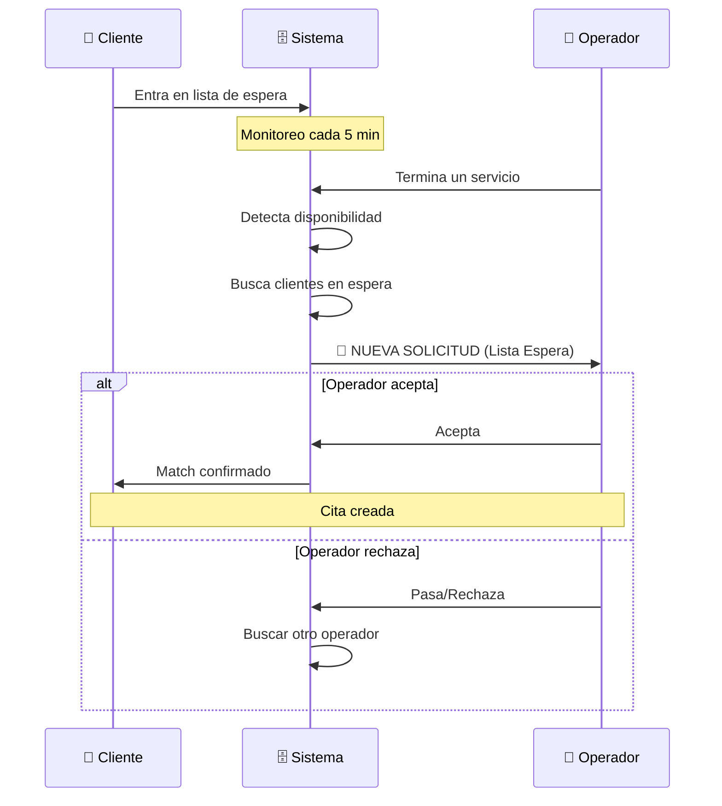
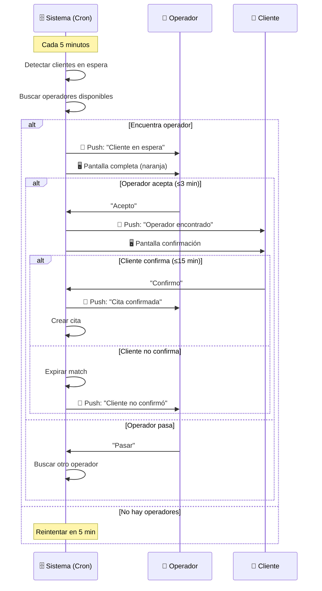

# 1.3.6.1.14.2 Lista de Espera

Sistema de cola para clientes sin disponibilidad.

---

## Concepto

```
┌─────────────────────────────────────────────────────────────────┐
│  LISTA DE ESPERA                                                │
├─────────────────────────────────────────────────────────────────┤
│                                                                 │
│  1. Cliente solicita servicio                                   │
│  2. No hay operadores disponibles                               │
│  3. Cliente entra en lista de espera (max 24h default)          │
│  4. Sistema monitorea disponibilidad                            │
│  5. Cuando hay match → NOTIFICAR CLIENTE                        │
│  6. Cliente tiene 15 min para confirmar                         │
│  7. Si no confirma → siguiente en cola o expirar                │
│                                                                 │
└─────────────────────────────────────────────────────────────────┘
```

---

## Modelo de Datos

```sql
CREATE TABLE lista_espera (
  id UUID PRIMARY KEY DEFAULT gen_random_uuid(),
  solicitud_id UUID NOT NULL REFERENCES solicitudes(id),
  cliente_id UUID NOT NULL REFERENCES clientes(id),
  
  -- Parámetros de búsqueda
  ciudad_id UUID NOT NULL REFERENCES ciudades(id),
  servicio_id UUID REFERENCES servicios(id),
  paquete_id UUID REFERENCES paquetes(id),
  fecha_deseada DATE NOT NULL,
  hora_deseada TIME NOT NULL,
  flexibilidad_horas INT DEFAULT 2,  -- ±2 horas aceptables
  flexibilidad_dias INT DEFAULT 1,   -- +1 día aceptable
  
  -- Estado
  estado VARCHAR(20) DEFAULT 'esperando',  -- esperando, match_encontrado, confirmado, expirado
  
  -- Configuración
  tiempo_espera_horas INT DEFAULT 24,  -- Configurable
  
  -- Match encontrado
  operador_encontrado_id UUID REFERENCES operadores(id),
  hora_match TIME,
  fecha_match DATE,
  notificado_at TIMESTAMPTZ,
  
  -- Timestamps
  created_at TIMESTAMPTZ DEFAULT now(),
  expires_at TIMESTAMPTZ,
  updated_at TIMESTAMPTZ DEFAULT now()
);

-- Índices
CREATE INDEX idx_lista_espera_estado ON lista_espera(estado) WHERE estado = 'esperando';
CREATE INDEX idx_lista_espera_ciudad ON lista_espera(ciudad_id);
CREATE INDEX idx_lista_espera_expira ON lista_espera(expires_at);

-- Trigger para auto-calcular expires_at
CREATE OR REPLACE FUNCTION set_lista_espera_expira()
RETURNS TRIGGER AS $$
BEGIN
  NEW.expires_at := NEW.created_at + (NEW.tiempo_espera_horas || ' hours')::INTERVAL;
  RETURN NEW;
END;
$$ LANGUAGE plpgsql;

CREATE TRIGGER trg_lista_espera_expira
BEFORE INSERT ON lista_espera
FOR EACH ROW EXECUTE FUNCTION set_lista_espera_expira();
```

---

## Verificación Periódica (Cron)

```typescript
// server/cron/verificar-lista-espera.ts
// Ejecutar cada 5 minutos
export default defineScheduledHandler(async () => {
  const supabase = createServerSupabaseClient();
  
  // 1. Expirar entradas vencidas
  await supabase
    .from('lista_espera')
    .update({ estado: 'expirado', updated_at: new Date() })
    .eq('estado', 'esperando')
    .lt('expires_at', new Date().toISOString());
  
  // 2. Buscar matches para entradas activas
  const { data: enEspera } = await supabase
    .from('lista_espera')
    .select('*')
    .eq('estado', 'esperando')
    .gte('expires_at', new Date().toISOString());
  
  for (const entrada of enEspera || []) {
    // Buscar operadores considerando flexibilidad
    const { data: operadores } = await supabase.rpc('buscar_operadores_flexible', {
      p_ciudad_id: entrada.ciudad_id,
      p_servicio_id: entrada.servicio_id,
      p_paquete_id: entrada.paquete_id,
      p_fecha: entrada.fecha_deseada,
      p_hora: entrada.hora_deseada,
      p_flex_horas: entrada.flexibilidad_horas,
      p_flex_dias: entrada.flexibilidad_dias
    });
    
    if (operadores?.length > 0) {
      const match = operadores[0];
      
      // Actualizar entrada
      await supabase
        .from('lista_espera')
        .update({
          estado: 'match_encontrado',
          operador_encontrado_id: match.operador_id,
          hora_match: match.hora,
          fecha_match: match.fecha,
          notificado_at: new Date()
        })
        .eq('id', entrada.id);
      
      // Notificar al cliente
      await notifyClient(entrada.cliente_id, {
        type: 'DISPONIBILIDAD_ENCONTRADA',
        title: '🎉 ¡Encontramos disponibilidad!',
        body: `${match.operador_nombre} está disponible para tu servicio.`,
        data: {
          lista_espera_id: entrada.id,
          operador: match.operador_nombre,
          fecha: match.fecha,
          hora: match.hora
        }
      });
    }
  }
});
```

---

## UI: Entrar en Lista

```
┌─────────────────────────────────────────────────────────────────┐
│  📋 ENTRAR EN LISTA DE ESPERA                                   │
├─────────────────────────────────────────────────────────────────┤
│                                                                 │
│  Tu solicitud: Lavado Express                                   │
│  Fecha deseada: Mañana 10:00 AM                                 │
│                                                                 │
│  FLEXIBILIDAD (opcional):                                       │
│  ─────────────────────────────────────────────────────────────  │
│                                                                 │
│  Acepto ±[ 2 ▼ ] horas del horario solicitado                   │
│  Acepto hasta [ 1 ▼ ] día(s) después                            │
│                                                                 │
│  TIEMPO DE ESPERA:                                              │
│  ─────────────────────────────────────────────────────────────  │
│                                                                 │
│  Máximo esperar: [ 24 horas ▼ ]                                 │
│                                                                 │
│  ℹ️ Te notificaremos inmediatamente cuando haya                 │
│     disponibilidad. Tendrás 15 minutos para confirmar.          │
│                                                                 │
│  [ Cancelar ]                  [ Entrar en lista de espera ]    │
│                                                                 │
└─────────────────────────────────────────────────────────────────┘
```

---

## UI: Notificación de Match (Cliente)

```
┌─────────────────────────────────────────────────────────────────┐
│  🎉 ¡ENCONTRAMOS DISPONIBILIDAD!                                │
├─────────────────────────────────────────────────────────────────┤
│                                                                 │
│  Buenas noticias, Juan!                                         │
│                                                                 │
│  Carlos M. está disponible para tu servicio:                    │
│                                                                 │
│  📅 Mañana 11:30 AM                                             │
│  🚗 Lavado Express - $290                                       │
│  👷 Carlos M. ⭐ 4.8                                            │
│                                                                 │
│  ⏱️ Confirma en los próximos 15 minutos                         │
│                                                                 │
│  [ Cancelar ]                         [ ✅ CONFIRMAR CITA ]     │
│                                                                 │
└─────────────────────────────────────────────────────────────────┘
```

---

## Flujo del Operador en Lista de Espera

> [!IMPORTANT]
> **El operador NO sabe que hay clientes esperando.**
> 
> El sistema detecta automáticamente cuando un operador queda libre
> y lo "matchea" con un cliente en espera. El operador recibe una
> solicitud como cualquier otra, pero marcada como "LISTA DE ESPERA".



---

## UI: Notificación al Operador (Push)

```
┌─────────────────────────────────────────────────────────────────┐
│  PUSH NOTIFICATION                                              │
├─────────────────────────────────────────────────────────────────┤
│                                                                 │
│  🎯 CLIENTE EN ESPERA                                           │
│                                                                 │
│  Un cliente ha estado esperando por este servicio.              │
│  Lavado Express • $290 → Tu comisión: $168                      │
│  Mañana 11:30 AM                                                │
│                                                                 │
│  [ VER DETALLES ]                                               │
│                                                                 │
└─────────────────────────────────────────────────────────────────┘
```

---

## UI: Pantalla Completa Operador (Lista de Espera)

```
┌─────────────────────────────────────────────────────────────────┐
│                                                                 │
│                    [FONDO DEGRADADO NARANJA]                    │
│                                                                 │
│                         🎯                                      │
│                                                                 │
│                  CLIENTE EN ESPERA                              │
│                                                                 │
│  ━━━━━━━━━━━━━━━━━━━━━━━━━━━━━━━━━━━━━━━━━━━━━━━━━━━━━━━━━━━━━  │
│                                                                 │
│              ⏳ Ha esperado 4 horas por este servicio           │
│                                                                 │
│              LAVADO EXPRESS                                     │
│              $290 → Tu comisión: $168                           │
│                                                                 │
│              📅 Mañana 11:30 AM                                 │
│              📍 Col. Centro • 2.1 km                            │
│                                                                 │
│              👤 Juan García                                     │
│              ⭐ 4.9 (Cliente frecuente)                         │
│                                                                 │
│  ━━━━━━━━━━━━━━━━━━━━━━━━━━━━━━━━━━━━━━━━━━━━━━━━━━━━━━━━━━━━━  │
│                                                                 │
│              ⏱️ Responde en 4:32                                │
│                                                                 │
│   ┌─────────────────────────────────────────────────────────┐   │
│   │                                                         │   │
│   │   ┌─────────────────┐     ┌─────────────────┐           │   │
│   │   │                 │     │                 │           │   │
│   │   │   ✅ ACEPTAR    │     │   ⏭️ PASAR      │           │   │
│   │   │                 │     │                 │           │   │
│   │   └─────────────────┘     └─────────────────┘           │   │
│   │                                                         │   │
│   └─────────────────────────────────────────────────────────┘   │
│                                                                 │
└─────────────────────────────────────────────────────────────────┘
```

---

## Diferencias: Solicitud Normal vs Lista de Espera

| Aspecto | Solicitud Normal | Lista de Espera |
|---------|------------------|-----------------|
| Color UI | Amarillo | **Naranja** (más urgente) |
| Mensaje | "Nueva Solicitud" | "Cliente en Espera" |
| Info extra | - | Tiempo esperando |
| Prioridad | Normal | **Alta** (cliente ya esperó) |
| Timeout | 5 min | **3 min** (más rápido) |

---

## Lógica: Notificar Operador de Lista de Espera

```typescript
// server/services/waitlistOperatorNotification.ts
const notifyOperatorForWaitlist = async (
  operadorId: string,
  listaEsperaId: string
) => {
  const supabase = createServerSupabaseClient();
  
  // 1. Obtener datos de la lista de espera
  const { data: entrada } = await supabase
    .from('lista_espera')
    .select(`
      *,
      clientes (id, nombre, rating_promedio),
      servicios (nombre, precio),
      paquetes (nombre, precio)
    `)
    .eq('id', listaEsperaId)
    .single();
  
  // 2. Calcular tiempo esperando
  const horasEsperando = Math.floor(
    (Date.now() - new Date(entrada.created_at).getTime()) / (1000 * 60 * 60)
  );
  
  // 3. Obtener FCM token del operador
  const { data: operador } = await supabase
    .from('operadores')
    .select('fcm_token, nombre')
    .eq('id', operadorId)
    .single();
  
  // 4. Calcular comisión
  const servicio = entrada.servicios || entrada.paquetes;
  const precio = servicio?.precio || 0;
  const comision = await getComisionPorNivel(operadorId, precio);
  // Modelo híbrido: 43-76% según nivel operador
  // Ver: 3.1.8 sistema_remuneracion
  
  // 5. Enviar push notification
  await sendPushNotification({
    token: operador.fcm_token,
    notification: {
      title: '🎯 CLIENTE EN ESPERA',
      body: `Ha esperado ${horasEsperando}h por ${servicio.nombre}. $${comision} para ti.`
    },
    data: {
      type: 'WAITLIST_REQUEST',
      lista_espera_id: listaEsperaId,
      cliente_nombre: entrada.clientes.nombre,
      cliente_rating: entrada.clientes.rating_promedio,
      servicio_nombre: servicio.nombre,
      precio: precio.toString(),
      comision: comision.toString(),
      fecha: entrada.fecha_match,
      hora: entrada.hora_match,
      horas_esperando: horasEsperando.toString()
    },
    android: {
      priority: 'high',
      notification: {
        channelId: 'service_requests',
        color: '#FF6B00' // Naranja para diferenciar
      }
    }
  });
  
  // 6. Crear broadcast_operador para tracking
  await supabase.from('broadcast_operadores').insert({
    broadcast_id: listaEsperaId, // Usar ID de lista espera
    operador_id: operadorId,
    estado: 'enviado',
    tipo: 'lista_espera'
  });
};
```

---

## Composable Operador: useWaitlistRequest

```typescript
// composables/useWaitlistRequest.ts (Operador)
export const useWaitlistRequest = () => {
  const supabase = useSupabaseClient();
  const user = useSupabaseUser();
  
  const acceptWaitlistRequest = async (listaEsperaId: string) => {
    // 1. Verificar que sigue disponible
    const { data: entrada } = await supabase
      .from('lista_espera')
      .select('*')
      .eq('id', listaEsperaId)
      .eq('estado', 'match_encontrado')
      .single();
    
    if (!entrada) {
      toast.error('Este cliente ya fue atendido por otro operador');
      return false;
    }
    
    // 2. Actualizar estado
    const { error } = await supabase
      .from('lista_espera')
      .update({
        operador_encontrado_id: user.value?.id,
        estado: 'operador_aceptado'
      })
      .eq('id', listaEsperaId)
      .eq('estado', 'match_encontrado'); // Race condition check
    
    if (error) {
      toast.error('No se pudo aceptar. Intenta de nuevo.');
      return false;
    }
    
    // 3. Notificar al cliente que el operador aceptó
    await notifyClientWaitlistAccepted(listaEsperaId);
    
    // 4. Actualizar broadcast
    await supabase
      .from('broadcast_operadores')
      .update({ estado: 'aceptado' })
      .eq('broadcast_id', listaEsperaId)
      .eq('operador_id', user.value?.id);
    
    toast.success('¡Esperando confirmación del cliente!');
    return true;
  };
  
  const skipWaitlistRequest = async (listaEsperaId: string, motivo?: string) => {
    // Marcar como pasado y buscar otro operador
    await supabase
      .from('broadcast_operadores')
      .update({ estado: 'pasado', motivo })
      .eq('broadcast_id', listaEsperaId)
      .eq('operador_id', user.value?.id);
    
    // Sistema buscará otro operador automáticamente
    toast.info('Solicitud pasada');
  };
  
  return { acceptWaitlistRequest, skipWaitlistRequest };
};
```

---

## Flujo Completo: Match de Lista de Espera



---

## Estados del Match (Vista Operador)

| Estado | Descripción | Acción Operador |
|--------|-------------|-----------------|
| `enviado` | Push enviado | Esperando respuesta |
| `aceptado` | Operador aceptó | Esperando cliente |
| `pasado` | Operador pasó | Fin |
| `expirado` | No respondió en 3 min | Fin |
| `confirmado` | Cliente confirmó | Cita creada ✅ |
| `cliente_no_confirmo` | Cliente no confirmó | Liberado |

---

## UI: Cita Confirmada (Operador)

```
┌─────────────────────────────────────────────────────────────────┐
│  ✅ ¡CITA CONFIRMADA!                                           │
├─────────────────────────────────────────────────────────────────┤
│                                                                 │
│  El cliente Juan ha confirmado la cita.                         │
│                                                                 │
│  📅 Mañana, 17 Ene • 11:30 AM                                   │
│  🚗 Lavado Express                                              │
│  💰 Tu comisión: $168                                           │
│                                                                 │
│  📍 Col. Centro, Calle Principal #123                           │
│     [ 🗺️ Ver en mapa ]                                          │
│                                                                 │
│  👤 Juan García • ⭐ 4.9                                        │
│     📱 +52 867 123 4567                                         │
│     [ 💬 Enviar mensaje ]                                       │
│                                                                 │
│  ℹ️ Este cliente esperó 4 horas para encontrar disponibilidad.  │
│     ¡Brinda un excelente servicio!                              │
│                                                                 │
│  [ Ver mi agenda ]                                              │
│                                                                 │
└─────────────────────────────────────────────────────────────────┘
```

---

## Composable: useWaitlist (Cliente)

```typescript
// composables/useWaitlist.ts
export const useWaitlist = () => {
  const supabase = useSupabaseClient();
  const user = useSupabaseUser();
  
  const joinWaitlist = async (params: {
    solicitudId: string;
    ciudadId: string;
    servicioId?: string;
    paqueteId?: string;
    fecha: string;
    hora: string;
    flexHoras?: number;
    flexDias?: number;
    tiempoEspera?: number;
  }) => {
    const { data, error } = await supabase
      .from('lista_espera')
      .insert({
        solicitud_id: params.solicitudId,
        cliente_id: user.value?.id,
        ciudad_id: params.ciudadId,
        servicio_id: params.servicioId,
        paquete_id: params.paqueteId,
        fecha_deseada: params.fecha,
        hora_deseada: params.hora,
        flexibilidad_horas: params.flexHoras || 2,
        flexibilidad_dias: params.flexDias || 1,
        tiempo_espera_horas: params.tiempoEspera || 24
      })
      .select()
      .single();
    
    if (!error) {
      toast.success('Estás en la lista de espera. Te notificaremos pronto.');
    }
    
    return { data, error };
  };
  
  const confirmMatch = async (listaEsperaId: string) => {
    // Obtener info del match
    const { data: entrada } = await supabase
      .from('lista_espera')
      .select('*, solicitudes(*)')
      .eq('id', listaEsperaId)
      .single();
    
    if (entrada?.estado !== 'match_encontrado') {
      toast.error('Esta oferta ya no está disponible');
      return false;
    }
    
    // Crear cita con el operador encontrado
    await supabase.from('citas').insert({
      solicitud_id: entrada.solicitud_id,
      operador_id: entrada.operador_encontrado_id,
      cliente_id: entrada.cliente_id,
      fecha: entrada.fecha_match,
      hora_inicio: entrada.hora_match,
      estado: 'confirmada'
    });
    
    // Actualizar lista de espera
    await supabase
      .from('lista_espera')
      .update({ estado: 'confirmado' })
      .eq('id', listaEsperaId);
    
    toast.success('¡Cita confirmada!');
    return true;
  };
  
  const cancelWaitlist = async (listaEsperaId: string) => {
    await supabase
      .from('lista_espera')
      .update({ estado: 'cancelado' })
      .eq('id', listaEsperaId);
  };
  
  return { joinWaitlist, confirmMatch, cancelWaitlist };
};
```

---

## Navegación

| ⬆️ Padre             | [[Proyecto OnlyCarNLD/Datos/1.3.6.1.14 matching_alternativo]]     |
| -------------------- | --------------------------------------- |
| ⬅️ Hermano anterior  | [[Proyecto OnlyCarNLD/Datos/1.3.6.1.14.1 estrategias_busqueda]]   |
| ➡️ Hermano siguiente | [[Proyecto OnlyCarNLD/Datos/1.3.6.1.14.3 notificacion_cliente]]   |

---
