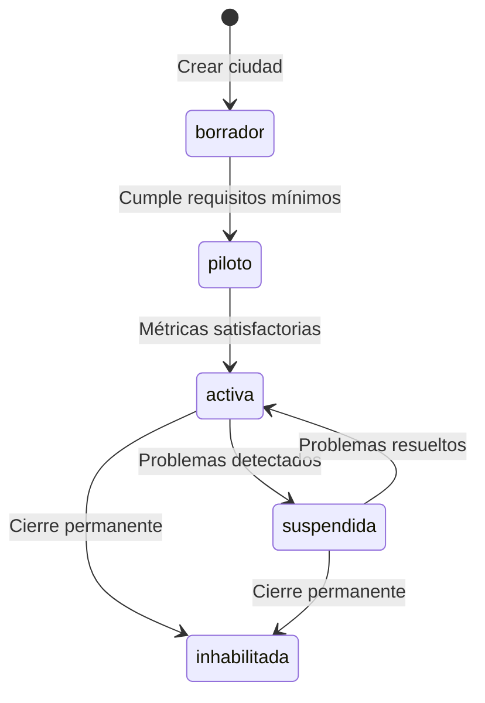

# 1.3.6.1.15 Control de Expansión

Sistema de habilitación controlada de ciudades para crecimiento ordenado.

---

## Filosofía

> [!IMPORTANT]
> **Crecer sin control = Problemas**
> 
> - Operadores sin soporte
> - Bugs no detectados
> - Mala experiencia de usuario
> - Reputación dañada
> 
> **Solución:** Habilitar ciudades de forma progresiva y controlada.

---

## Estados de Ciudad



| Estado | Descripción | Acepta clientes |
|--------|-------------|-----------------|
| `borrador` | En configuración | ❌ No |
| `piloto` | Pruebas con pocos operadores | ⚠️ Limitado |
| `activa` | Abierta al público | ✅ Sí |
| `suspendida` | Pausada temporalmente | ❌ No |
| `inhabilitada` | Cerrada permanente | ❌ No |

---

## Requisitos para Activar (Piloto → Activa)

```
┌─────────────────────────────────────────────────────────────────┐
│  CHECKLIST DE ACTIVACIÓN                                        │
├─────────────────────────────────────────────────────────────────┤
│                                                                 │
│  OPERADORES                                                     │
│  [✓] Mínimo 2 operadores verificados                            │
│  [✓] Herramientas verificadas para servicios básicos            │
│                                                                 │
│  ZONAS                                                          │
│  [✓] Al menos 1 zona definida                                   │
│  [✓] Cobertura mínima del área urbana                           │
│                                                                 │
│  ADMINISTRACIÓN                                                 │
│  [✓] Admin regional asignado                                    │
│  [ ] Soporte local configurado                                  │
│                                                                 │
│  PRUEBAS                                                        │
│  [✓] Al menos 5 servicios piloto completados                   │
│  [✓] Rating promedio ≥ 4.0                                      │
│  [✓] 0 quejas no resueltas                                      │
│                                                                 │
│  ESTADO ACTUAL: 7/8 requisitos cumplidos                        │
│  [ Activar ciudad ] ← Deshabilitado                             │
│                                                                 │
└─────────────────────────────────────────────────────────────────┘
```

---


## Reglas

| Regla | Descripción |
|-------|-------------|
| **EXP-001** | Ciudad inicia en estado `borrador` |
| **EXP-002** | Mínimo 2 operadores para pasar a `piloto` |
| **EXP-003** | Requisitos completos para pasar a `activa` |
| **EXP-004** | Solo admin puede cambiar estado de ciudad |
| **EXP-005** | Historial de cambios de estado obligatorio |
| **EXP-006** | Suspensión temporal no afecta citas existentes |

---

## Estructura de Hijos

| ID                                                   | Nombre     | Descripción    | Estado |
| ---------------------------------------------------- | ---------- | -------------- | ------ |
| [[Proyecto OnlyCarNLD/Datos/1.3.6.1.15.1 estados_ciudad\|1.3.6.1.15.1]]        | Estados    | FSM ciudades   | ✅      |
| [[Proyecto OnlyCarNLD/Datos/1.3.6.1.15.2 requisitos_activacion\|1.3.6.1.15.2]] | Requisitos | Checklist      | ✅      |
| [[Proyecto OnlyCarNLD/Datos/1.3.6.1.15.3 dashboard_expansion\|1.3.6.1.15.3]]   | Dashboard  | Vista admin    | ✅      |
| [[Proyecto OnlyCarNLD/Datos/1.3.6.1.15.4 habilitacion_nacional\|1.3.6.1.15.4]] | Nacional   | Expansión país | ✅      |

---

## Navegación

| ⬆️ Padre             | [[Proyecto OnlyCarNLD/Datos/1.3.6.1 asignacion_citas]]           |
| -------------------- | -------------------------------------- |
| ⬅️ Hermano anterior  | [[Proyecto OnlyCarNLD/Datos/1.3.6.1.14 matching_alternativo]]    |

---
