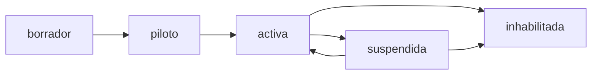

# 1.3.6.1.15.1 Estados de Ciudad

Ciclo de vida y transiciones de estado.

---

## Definición de Estados

### 1. Borrador

```sql
estado = 'borrador'
```

- Ciudad recién creada
- En proceso de configuración
- No acepta solicitudes de clientes
- No visible para clientes en app
- Operadores pueden registrarse (pendientes)

### 2. Piloto

```sql
estado = 'piloto'
```

- Pruebas con operadores limitados
- Clientes pueden solicitar por invitación
- Monitoreo intensivo
- Admin valida cada servicio
- Máximo 50 solicitudes/semana

### 3. Activa

```sql
estado = 'activa'
```

- Abierta al público general
- Clientes pueden solicitar libremente
- Operadores reciben broadcasts normales
- Monitoreo estándar

### 4. Suspendida

```sql
estado = 'suspendida'
```

- Pausada temporalmente por problemas
- Citas existentes se mantienen
- No acepta nuevas solicitudes
- Notificación a operadores y clientes
- Motivo de suspensión registrado

### 5. Inhabilitada

```sql
estado = 'inhabilitada'
```

- Cerrada permanentemente
- Operadores desvinculados o movidos
- Clientes notificados de cierre
- Datos archivados
- No reversible sin intervención técnica

---

## Modelo de Datos

```sql
-- Agregar columna de estado a ciudades
ALTER TABLE ciudades ADD COLUMN estado VARCHAR(20) DEFAULT 'borrador';
ALTER TABLE ciudades ADD COLUMN estado_anterior VARCHAR(20);
ALTER TABLE ciudades ADD COLUMN max_solicitudes_semana INT;  -- NULL = sin límite

-- Crear tipos enum (opcional pero recomendado)
CREATE TYPE estado_ciudad AS ENUM (
  'borrador', 'piloto', 'activa', 'suspendida', 'inhabilitada'
);

-- Tabla de historial de cambios de estado
CREATE TABLE ciudades_estado_log (
  id UUID PRIMARY KEY DEFAULT gen_random_uuid(),
  ciudad_id UUID NOT NULL REFERENCES ciudades(id),
  estado_anterior VARCHAR(20),
  estado_nuevo VARCHAR(20) NOT NULL,
  motivo TEXT,
  cambiado_por UUID REFERENCES users(id),
  created_at TIMESTAMPTZ DEFAULT now()
);

-- Trigger para log automático
CREATE OR REPLACE FUNCTION log_ciudad_estado_change()
RETURNS TRIGGER AS $$
BEGIN
  IF OLD.estado IS DISTINCT FROM NEW.estado THEN
    INSERT INTO ciudades_estado_log (ciudad_id, estado_anterior, estado_nuevo)
    VALUES (NEW.id, OLD.estado, NEW.estado);
    
    NEW.estado_anterior := OLD.estado;
  END IF;
  RETURN NEW;
END;
$$ LANGUAGE plpgsql;

CREATE TRIGGER trg_ciudad_estado_log
BEFORE UPDATE ON ciudades
FOR EACH ROW EXECUTE FUNCTION log_ciudad_estado_change();
```

---

## Transiciones Permitidas



```sql
-- Función para validar transición
CREATE OR REPLACE FUNCTION validar_transicion_ciudad(
  p_estado_actual VARCHAR,
  p_estado_nuevo VARCHAR
) RETURNS BOOLEAN AS $$
BEGIN
  RETURN CASE
    WHEN p_estado_actual = 'borrador' AND p_estado_nuevo = 'piloto' THEN true
    WHEN p_estado_actual = 'piloto' AND p_estado_nuevo = 'activa' THEN true
    WHEN p_estado_actual = 'activa' AND p_estado_nuevo = 'suspendida' THEN true
    WHEN p_estado_actual = 'suspendida' AND p_estado_nuevo = 'activa' THEN true
    WHEN p_estado_actual IN ('activa', 'suspendida') AND p_estado_nuevo = 'inhabilitada' THEN true
    ELSE false
  END;
END;
$$ LANGUAGE plpgsql;
```

---

## Acciones por Estado

### Al entrar en Piloto

```typescript
const activarPiloto = async (ciudadId: string) => {
  // 1. Cambiar estado
  await supabase
    .from('ciudades')
    .update({ 
      estado: 'piloto',
      max_solicitudes_semana: 50
    })
    .eq('id', ciudadId);
  
  // 2. Notificar operadores pendientes
  const { data: operadores } = await supabase
    .from('operadores')
    .select('id')
    .eq('ciudad_id', ciudadId)
    .eq('estado', 'pendiente_ciudad');
  
  for (const op of operadores || []) {
    await notifyOperator(op.id, {
      title: '🎉 ¡Tu ciudad está en piloto!',
      body: 'Ya puedes empezar a recibir solicitudes de prueba.'
    });
  }
};
```

### Al Suspender

```typescript
const suspenderCiudad = async (ciudadId: string, motivo: string) => {
  // 1. Cambiar estado
  await supabase
    .from('ciudades')
    .update({ estado: 'suspendida' })
    .eq('id', ciudadId);
  
  // 2. Log con motivo
  await supabase
    .from('ciudades_estado_log')
    .update({ motivo })
    .eq('ciudad_id', ciudadId)
    .eq('estado_nuevo', 'suspendida')
    .order('created_at', { ascending: false })
    .limit(1);
  
  // 3. Notificar a todos los operadores
  const { data: operadores } = await supabase
    .from('operadores')
    .select('id')
    .eq('ciudad_id', ciudadId);
  
  for (const op of operadores || []) {
    await notifyOperator(op.id, {
      title: '⚠️ Ciudad temporalmente suspendida',
      body: 'No recibirás nuevas solicitudes temporalmente.',
      data: { motivo }
    });
  }
};
```

---

## Validación en Matching

```sql
-- Modificar función de matching para considerar estado de ciudad
CREATE OR REPLACE FUNCTION buscar_operadores_elegibles_v5(...)
RETURNS TABLE (...) AS $$
DECLARE
  v_ciudad_cliente UUID;
  v_estado_ciudad VARCHAR;
BEGIN
  -- Obtener ciudad y validar estado
  SELECT c.id, ci.estado 
  INTO v_ciudad_cliente, v_estado_ciudad
  FROM clientes c
  JOIN ciudades ci ON c.ciudad_id = ci.id
  WHERE c.id = p_cliente_id;
  
  -- Solo ciudades piloto o activas pueden recibir solicitudes
  IF v_estado_ciudad NOT IN ('piloto', 'activa') THEN
    RAISE EXCEPTION 'Ciudad no disponible para solicitudes';
  END IF;
  
  -- Resto del matching...
END;
$$ LANGUAGE plpgsql;
```

---

## Navegación

| ⬆️ Padre             | [[Proyecto OnlyCarNLD/Datos/1.3.6.1.15 control_expansion]]          |
| -------------------- | ----------------------------------------- |
| ➡️ Hermano siguiente | [[Proyecto OnlyCarNLD/Datos/1.3.6.1.15.2 requisitos_activacion]]    |

---
