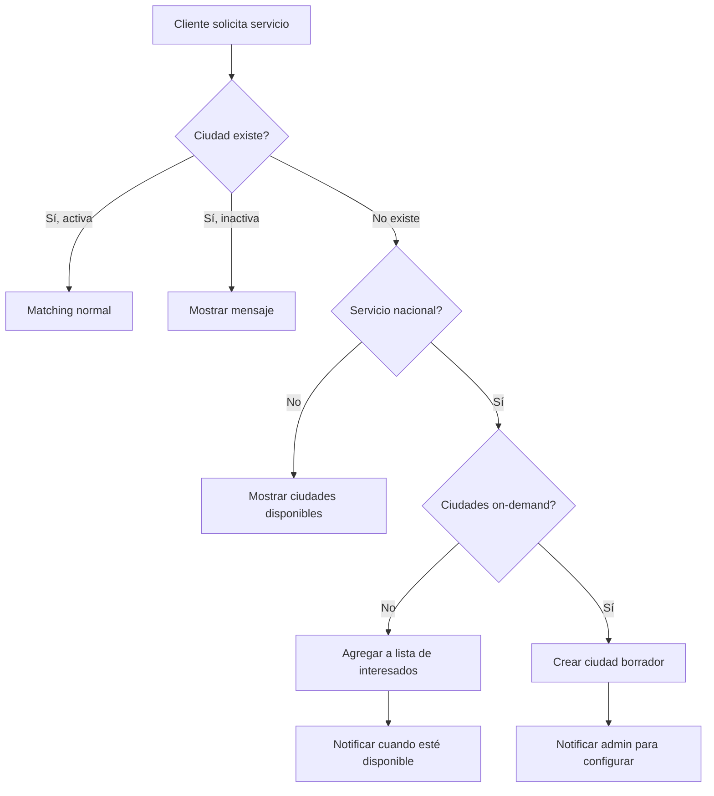

# 1.3.6.1.15.4 Habilitación Nacional

Plan para escalar a cobertura nacional.

---

## Visión a Futuro

```
┌─────────────────────────────────────────────────────────────────┐
│  🇲🇽 SERVICIO NACIONAL                                          │
├─────────────────────────────────────────────────────────────────┤
│                                                                 │
│  CUANDO ESTÉ LISTO:                                             │
│                                                                 │
│  1. Cliente en cualquier ciudad de México                       │
│  2. Sistema detecta ciudad por ubicación                        │
│  3. Si ciudad existe y está activa → matching normal            │
│  4. Si ciudad no existe → opciones:                             │
│     a) Mostrar ciudades cercanas activas                        │
│     b) Crear ciudad on-demand (piloto automático)               │
│     c) Lista de interesados para nueva ciudad                   │
│                                                                 │
└─────────────────────────────────────────────────────────────────┘
```

---

## Flag de Servicio Nacional

```sql
-- Configuración global
CREATE TABLE config_global (
  key VARCHAR(50) PRIMARY KEY,
  value JSONB,
  updated_at TIMESTAMPTZ DEFAULT now()
);

INSERT INTO config_global (key, value) VALUES
  ('servicio_nacional', '{"habilitado": false, "fecha_activacion": null}'::JSONB),
  ('ciudades_on_demand', '{"habilitado": false, "requiere_operadores": 2}'::JSONB);

-- Función para verificar
CREATE OR REPLACE FUNCTION es_servicio_nacional()
RETURNS BOOLEAN AS $$
  SELECT (value->>'habilitado')::BOOLEAN
  FROM config_global
  WHERE key = 'servicio_nacional';
$$ LANGUAGE SQL;
```

---

## Flujo: Ciudad No Existe



---

## Lista de Interesados por Ciudad

```sql
CREATE TABLE interesados_ciudad (
  id UUID PRIMARY KEY DEFAULT gen_random_uuid(),
  cliente_id UUID REFERENCES clientes(id),
  ciudad_nombre VARCHAR(100) NOT NULL,
  estado_nombre VARCHAR(100) NOT NULL,
  lat DECIMAL(10, 8),
  lng DECIMAL(11, 8),
  email VARCHAR(255),
  created_at TIMESTAMPTZ DEFAULT now()
);

-- Trigger: crear ciudad automáticamente si hay N interesados
CREATE OR REPLACE FUNCTION verificar_demanda_ciudad()
RETURNS TRIGGER AS $$
DECLARE
  v_count INT;
  v_umbral INT := 10;  -- N interesados para crear ciudad
BEGIN
  SELECT COUNT(*) INTO v_count
  FROM interesados_ciudad
  WHERE ciudad_nombre = NEW.ciudad_nombre
    AND estado_nombre = NEW.estado_nombre;
  
  IF v_count >= v_umbral THEN
    -- Crear ciudad en borrador
    INSERT INTO ciudades (nombre, estado_id, centro_lat, centro_lng)
    SELECT 
      NEW.ciudad_nombre,
      e.id,
      AVG(i.lat),
      AVG(i.lng)
    FROM estados e, interesados_ciudad i
    WHERE e.nombre = NEW.estado_nombre
      AND i.ciudad_nombre = NEW.ciudad_nombre
    GROUP BY e.id;
    
    -- Notificar admin
    PERFORM notify_admin('DEMANDA_NUEVA_CIUDAD', NEW.ciudad_nombre);
  END IF;
  
  RETURN NEW;
END;
$$ LANGUAGE plpgsql;
```

---

## UI: Registrar Interés

```
┌─────────────────────────────────────────────────────────────────┐
│  📍 SERVICIO NO DISPONIBLE EN TU UBICACIÓN                      │
├─────────────────────────────────────────────────────────────────┤
│                                                                 │
│  Aún no operamos en: Guadalajara, Jalisco                       │
│                                                                 │
│  CIUDADES CERCANAS DISPONIBLES:                                 │
│  ┌─────────────────────────────────────────────────────────┐    │
│  │ Ninguna ciudad cercana disponible                       │    │
│  └─────────────────────────────────────────────────────────┘    │
│                                                                 │
│  ¿QUIERES QUE LLEGUEMOS A TU CIUDAD?                            │
│  ┌─────────────────────────────────────────────────────────┐    │
│  │ Déjanos tu correo y te avisaremos cuando estemos        │    │
│  │ disponibles en Guadalajara.                             │    │
│  │                                                         │    │
│  │ Email: [ tu@correo.com                  ]               │    │
│  │                                                         │    │
│  │ [ Avisarme cuando esté disponible ]                     │    │
│  └─────────────────────────────────────────────────────────┘    │
│                                                                 │
│  ℹ️ Ya hay 7 personas interesadas en esta ciudad.               │
│                                                                 │
└─────────────────────────────────────────────────────────────────┘
```

---

## Dashboard: Control Nacional

```
┌─────────────────────────────────────────────────────────────────┐
│  🇲🇽 HABILITACIÓN NACIONAL                                       │
├─────────────────────────────────────────────────────────────────┤
│                                                                 │
│  ESTADO ACTUAL: [ 🔴 DESHABILITADO ]                            │
│                                                                 │
│  REQUISITOS PARA HABILITAR:                                     │
│  ┌─────────────────────────────────────────────────────────┐    │
│  │ ✅ Al menos 5 ciudades activas              │ 1/5       │    │
│  │ ❌ Rating promedio nacional ≥ 4.5           │ 4.7       │    │
│  │ ❌ 0 ciudades suspendidas                   │ 0         │    │
│  │ ❌ Sistema de soporte escalable             │ Pendiente │    │
│  │ ❌ Infraestructura probada bajo carga       │ Pendiente │    │
│  └─────────────────────────────────────────────────────────┘    │
│                                                                 │
│  DEMANDA POR CIUDAD (sin servicio):                             │
│  ┌─────────────────────────────────────────────────────────┐    │
│  │ Monterrey, NL        │ 45 interesados │ [ Priorizar ]   │    │
│  │ Guadalajara, JAL     │ 32 interesados │ [ Priorizar ]   │    │
│  │ CDMX, CDMX           │ 28 interesados │ [ Priorizar ]   │    │
│  │ Tijuana, BC          │ 15 interesados │                 │    │
│  └─────────────────────────────────────────────────────────┘    │
│                                                                 │
│  [ Habilitar servicio nacional ] ← Deshabilitado                │
│                                                                 │
└─────────────────────────────────────────────────────────────────┘
```

---

## Función: Habilitar Nacional

```typescript
// Solo cuando TODO esté listo
const habilitarServicioNacional = async () => {
  // 1. Verificar requisitos
  const requisitos = await verificarRequisitosNacional();
  if (!requisitos.todosOk) {
    throw new Error('No cumple requisitos para servicio nacional');
  }
  
  // 2. Activar flag
  await supabase
    .from('config_global')
    .update({
      value: {
        habilitado: true,
        fecha_activacion: new Date().toISOString()
      }
    })
    .eq('key', 'servicio_nacional');
  
  // 3. Notificar a todos los interesados
  const { data: interesados } = await supabase
    .from('interesados_ciudad')
    .select('email')
    .not('email', 'is', null);
  
  for (const i of interesados || []) {
    await sendEmail({
      to: i.email,
      template: 'servicio-nacional-activo'
    });
  }
  
  // 4. Log
  console.log('🇲🇽 SERVICIO NACIONAL HABILITADO');
};
```

---

## Navegación

| ⬆️ Padre            | [[Proyecto OnlyCarNLD/Datos/1.3.6.1.15 control_expansion]]       |
| ------------------- | -------------------------------------- |
| ⬅️ Hermano anterior | [[Proyecto OnlyCarNLD/Datos/1.3.6.1.15.3 dashboard_expansion]]   |

---
