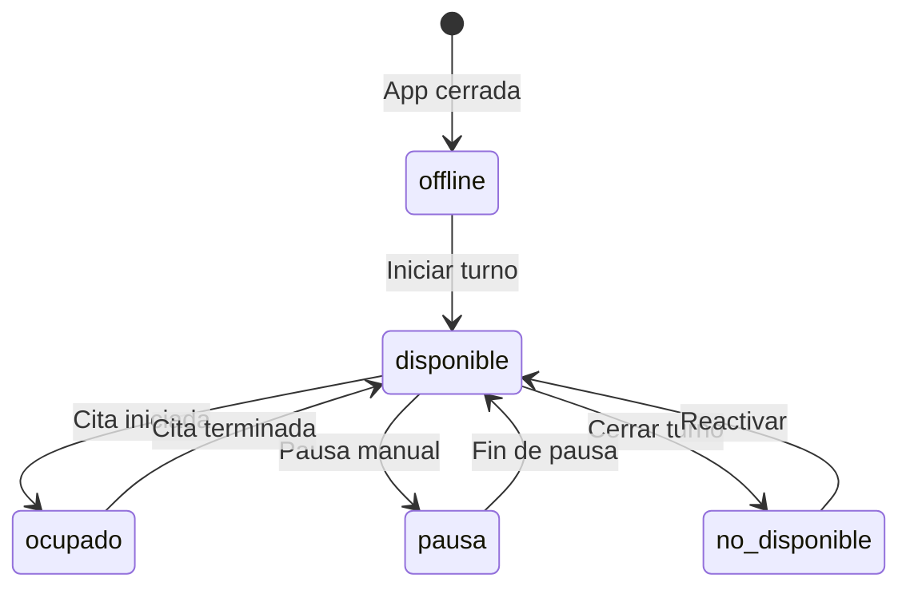

# 1.3.6.1.2 Disponibilidad de Operadores

Sistema de gestión de agenda y estados de disponibilidad.

---

## Estados del Operador

```
┌─────────────────────────────────────────────────────────────────┐
│  ESTADOS DE DISPONIBILIDAD                                      │
├─────────────────────────────────────────────────────────────────┤
│                                                                 │
│  🟢 DISPONIBLE     → Recibe broadcasts, puede aceptar citas     │
│  🟡 OCUPADO        → En servicio activo, no recibe broadcasts   │
│  🔴 NO DISPONIBLE  → Manualmente desactivado                    │
│  ⏸️ PAUSA          → Temporal (almuerzo, descanso)              │
│  🌙 OFFLINE        → Fuera de horario laboral                   │
│                                                                 │
└─────────────────────────────────────────────────────────────────┘
```

---

## Modelo de Datos

### Tabla: disponibilidad_semanal

```sql
-- Horario base semanal del operador
CREATE TABLE disponibilidad_semanal (
  id UUID PRIMARY KEY DEFAULT gen_random_uuid(),
  operador_id UUID NOT NULL REFERENCES operadores(id),
  dia_semana INT NOT NULL CHECK (dia_semana BETWEEN 0 AND 6), -- 0=Domingo
  hora_inicio TIME NOT NULL,
  hora_fin TIME NOT NULL,
  activo BOOLEAN DEFAULT true,
  created_at TIMESTAMPTZ DEFAULT now(),
  
  UNIQUE (operador_id, dia_semana)
);

-- Ejemplo: Carlos trabaja Lun-Vie 8:00-18:00
INSERT INTO disponibilidad_semanal (operador_id, dia_semana, hora_inicio, hora_fin) VALUES
  ('carlos-uuid', 1, '08:00', '18:00'),  -- Lunes
  ('carlos-uuid', 2, '08:00', '18:00'),  -- Martes
  ('carlos-uuid', 3, '08:00', '18:00'),  -- Miércoles
  ('carlos-uuid', 4, '08:00', '18:00'),  -- Jueves
  ('carlos-uuid', 5, '08:00', '18:00');  -- Viernes
```

### Tabla: bloqueos_agenda

```sql
-- Días/horas específicos bloqueados
CREATE TABLE bloqueos_agenda (
  id UUID PRIMARY KEY DEFAULT gen_random_uuid(),
  operador_id UUID NOT NULL REFERENCES operadores(id),
  fecha DATE NOT NULL,
  hora_inicio TIME,  -- NULL = todo el día
  hora_fin TIME,
  motivo VARCHAR(100),
  created_at TIMESTAMPTZ DEFAULT now()
);

-- Ejemplo: Carlos no trabaja el 25 de Diciembre
INSERT INTO bloqueos_agenda (operador_id, fecha, motivo) VALUES
  ('carlos-uuid', '2025-12-25', 'Navidad');
```

### Tabla: estado_operador_actual

```sql
-- Estado en tiempo real
CREATE TABLE estado_operador_actual (
  operador_id UUID PRIMARY KEY REFERENCES operadores(id),
  estado VARCHAR(20) NOT NULL DEFAULT 'offline',
  motivo_pausa VARCHAR(100),
  pausa_hasta TIMESTAMPTZ,
  ultima_actividad TIMESTAMPTZ DEFAULT now(),
  lat_actual DECIMAL(10, 8),
  lng_actual DECIMAL(11, 8)
);

-- Check válido de estados
ALTER TABLE estado_operador_actual 
ADD CONSTRAINT estado_valido CHECK (
  estado IN ('disponible', 'ocupado', 'no_disponible', 'pausa', 'offline')
);
```

---

## Interfaz de Operador: Mi Disponibilidad

```
┌─────────────────────────────────────────────────────────────────┐
│  📅 MI DISPONIBILIDAD                                           │
├─────────────────────────────────────────────────────────────────┤
│                                                                 │
│  ESTADO ACTUAL: 🟢 Disponible                                   │
│  ┌─────────────────────────────────────────────────────────┐    │
│  │ 🔴 No Disponible │ ⏸️ Pausa 30min │ ⏸️ Pausa 1h │       │    │
│  └─────────────────────────────────────────────────────────┘    │
│                                                                 │
│  HORARIO SEMANAL:                                               │
│  ────────────────────────────────────────────────────────────   │
│  Lun  █████████████████████░░░░░░░░  08:00 - 18:00              │
│  Mar  █████████████████████░░░░░░░░  08:00 - 18:00              │
│  Mie  █████████████████████░░░░░░░░  08:00 - 18:00              │
│  Jue  █████████████████████░░░░░░░░  08:00 - 18:00              │
│  Vie  █████████████████████░░░░░░░░  08:00 - 18:00              │
│  Sab  ░░░░░░░░░░░░░░░░░░░░░░░░░░░░░  No trabajo                 │
│  Dom  ░░░░░░░░░░░░░░░░░░░░░░░░░░░░░  No trabajo                 │
│                                                                 │
│  [ Editar horario ]                                             │
│                                                                 │
│  PRÓXIMOS BLOQUEOS:                                             │
│  ────────────────────────────────────────────────────────────   │
│  📅 25 Dic 2025 - Todo el día (Navidad)                         │
│  📅 31 Dic 2025 - 14:00-18:00 (Evento personal)                 │
│                                                                 │
│  [ + Agregar bloqueo ]                                          │
│                                                                 │
└─────────────────────────────────────────────────────────────────┘
```

---

## Composable: useOperatorAvailability

```typescript
// composables/useOperatorAvailability.ts
export const useOperatorAvailability = () => {
  const supabase = useSupabaseClient();
  const user = useSupabaseUser();
  
  const currentStatus = ref<OperatorStatus>('offline');
  const weeklySchedule = ref<WeeklySlot[]>([]);
  const blocks = ref<AgendaBlock[]>([]);
  
  // Cambiar estado
  const setStatus = async (status: OperatorStatus, pauseMinutes?: number) => {
    const update: any = { estado: status };
    
    if (status === 'pausa' && pauseMinutes) {
      update.pausa_hasta = new Date(Date.now() + pauseMinutes * 60000);
    }
    
    const { error } = await supabase
      .from('estado_operador_actual')
      .upsert({ 
        operador_id: user.value?.id,
        ...update,
        ultima_actividad: new Date()
      });
    
    if (!error) currentStatus.value = status;
  };
  
  // Verificar si está disponible en un momento dado
  const isAvailableAt = async (fecha: Date, horaInicio: string, horaFin: string) => {
    // 1. Verificar horario semanal
    const diaSemana = fecha.getDay();
    const { data: horario } = await supabase
      .from('disponibilidad_semanal')
      .select('hora_inicio, hora_fin')
      .eq('operador_id', user.value?.id)
      .eq('dia_semana', diaSemana)
      .single();
    
    if (!horario) return false;
    
    // 2. Verificar bloqueos
    const { count } = await supabase
      .from('bloqueos_agenda')
      .select('*', { count: 'exact', head: true })
      .eq('operador_id', user.value?.id)
      .eq('fecha', fecha.toISOString().split('T')[0]);
    
    if (count && count > 0) return false;
    
    // 3. Verificar citas existentes
    const { count: citasConflicto } = await supabase
      .from('citas')
      .select('*', { count: 'exact', head: true })
      .eq('operador_id', user.value?.id)
      .eq('fecha', fecha.toISOString().split('T')[0])
      .lt('hora_inicio', horaFin)
      .gt('hora_fin', horaInicio);
    
    return citasConflicto === 0;
  };
  
  // Agregar bloqueo
  const addBlock = async (block: Omit<AgendaBlock, 'id'>) => {
    const { data, error } = await supabase
      .from('bloqueos_agenda')
      .insert({
        operador_id: user.value?.id,
        ...block
      })
      .select()
      .single();
    
    if (!error && data) {
      blocks.value.push(data);
    }
  };
  
  return {
    currentStatus,
    weeklySchedule,
    blocks,
    setStatus,
    isAvailableAt,
    addBlock
  };
};
```

---

## Vista: Agenda del Día

```sql
CREATE VIEW v_agenda_operador_dia AS
SELECT 
  o.id as operador_id,
  o.nombre,
  c.id as cita_id,
  c.fecha,
  c.hora_inicio,
  c.hora_fin,
  c.estado as estado_cita,
  cl.nombre as cliente_nombre,
  s.nombre as servicio_nombre
FROM operadores o
LEFT JOIN citas c ON o.id = c.operador_id 
  AND c.fecha = CURRENT_DATE
  AND c.estado NOT IN ('cancelada', 'rechazada')
LEFT JOIN clientes cl ON c.cliente_id = cl.id
LEFT JOIN servicios s ON c.servicio_id = s.id
ORDER BY o.id, c.hora_inicio;
```

---

## Transiciones de Estado



---

## Navegación

| ⬆️ Padre             | [[Proyecto OnlyCarNLD/Datos/1.3.6.1 asignacion_citas]]       |
| -------------------- | ---------------------------------- |
| ⬅️ Hermano anterior  | [[Proyecto OnlyCarNLD/Datos/1.3.6.1.1 algoritmo_matching]]   |
| ➡️ Hermano siguiente | [[Proyecto OnlyCarNLD/Datos/1.3.6.1.3 zona_cobertura]]       |

---
