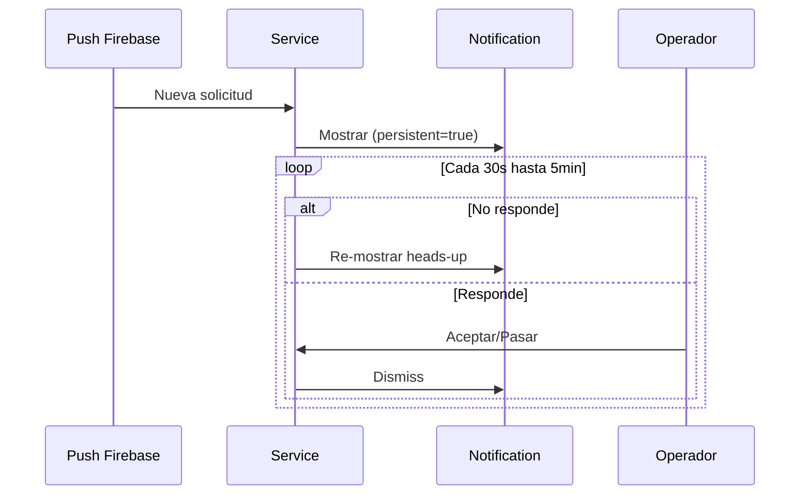

# 1.3.6.1.4.4 Persistencia de Notificación

Sistema para que las notificaciones no desaparezcan hasta ser atendidas.

---

## Problema vs Solución

| Normal | Persistente |
|--------|-------------|
| Desaparece en 3s | NO desaparece |
| Se puede deslizar | NO se puede deslizar |
| Operador no la vio | Requiere acción explícita |
| ❌ OPORTUNIDAD PERDIDA | ✅ ATENDIDA |

---

## Implementación: Foreground Service

```kotlin
val notification = NotificationCompat.Builder(this, CHANNEL_ID)
    .setOngoing(true)           // No se puede deslizar
    .setAutoCancel(false)       // No desaparece al tocar
    .setTimeoutAfter(300000)    // Expira a los 5 min
    .build()

// Iniciar como foreground
startForeground(NOTIFICATION_ID, notification)
```

---

## Reminder cada 30 segundos

```kotlin
handler.postDelayed({
    val stillActive = ServiceApi.isRequestActive(requestId)
    if (stillActive) {
        SoundManager(context).playServiceRequestSound()
        VibrationManager(context).vibrateForRequest()
        scheduleNextReminder(requestId)
    }
}, 30000)
```

---

## Diagrama de Flujo



---

## Navegación

| ⬆️ Padre             | [[Proyecto OnlyCarNLD/Datos/1.3.6.1.4 broadcast_solicitud]]    |
| -------------------- | ------------------------------------ |
| ⬅️ Hermano anterior  | [[Proyecto OnlyCarNLD/Datos/1.3.6.1.4.3 vibracion_patron]]     |

---
