# 1.3.6.1.5 Aceptación y Rechazo

Flujo de respuesta del operador a un broadcast.

---

## Acciones Disponibles

| Acción | Efecto | Consecuencia |
|--------|--------|--------------|
| **✅ Aceptar** | Gana la asignación | Abre chat con cliente |
| **⏭️ Pasar** | Ignora esta vez | Sin penalización |
| **🚫 Bloquear** | Ignora + nunca más este cliente | Afecta matching futuro |

---
## Flujo de Aceptación

```mermaid
sequenceDiagram
    participant O as 👷 Operador
    participant S as 🗄️ Sistema
    participant C as 👤 Cliente
    
    O->>S: Tap "Aceptar"
    S->>S: aceptar_broadcast() atomico
    
    alt Ya fue tomada
        S->>O: "Solicitud no disponible"
    else Éxito
        S->>S: Actualizar broadcast estado='tomada'
        S->>S: Crear entrada en citas (estado='negociando')
        S->>S: Crear canal de chat operador↔cliente
        S->>O: "¡Asignación exitosa!"
        S->>C: Push "Carlos M. atenderá tu servicio"
        O->>C: Chat abierto para coordinar
    end
```



---

## Implementación: Aceptar

```typescript
// composables/useBroadcastActions.ts
export const useBroadcastActions = () => {
  const supabase = useSupabaseClient();
  const user = useSupabaseUser();
  
  const aceptar = async (broadcastId: string) => {
    // 1. Intentar aceptar (atómico)
    const { data, error } = await supabase
      .rpc('aceptar_broadcast', {
        p_broadcast_id: broadcastId,
        p_operador_id: user.value?.id
      });
    
    if (error || !data?.success) {
      toast.error(data?.reason || 'Error al aceptar');
      return false;
    }
    
    // 2. Crear cita preliminar
    await supabase.from('citas').insert({
      solicitud_id: data.solicitud_id,
      operador_id: user.value?.id,
      estado: 'negociando',
      // Otros campos se llenan en negociación
    });
    
    // 3. Navegar a chat
    navigateTo(`/operador/chat/${data.solicitud_id}`);
    
    return true;
  };
  
  const pasar = async (broadcastId: string) => {
    // Solo registrar que pasó, sin penalización
    await supabase.from('respuestas_broadcast').insert({
      broadcast_id: broadcastId,
      operador_id: user.value?.id,
      accion: 'pasar'
    });
    
    // Cerrar UI del broadcast
    return true;
  };
  
  const bloquear = async (broadcastId: string, clienteId: string, motivo: string) => {
    // 1. Registrar bloqueo
    await supabase.from('bloqueos_operador').insert({
      operador_id: user.value?.id,
      cliente_id: clienteId,
      motivo
    });
    
    // 2. Registrar respuesta
    await supabase.from('respuestas_broadcast').insert({
      broadcast_id: broadcastId,
      operador_id: user.value?.id,
      accion: 'bloquear',
      motivo
    });
    
    return true;
  };
  
  return { aceptar, pasar, bloquear };
};
```

---

## Modal: Motivo de Bloqueo

```
┌─────────────────────────────────────────────────────────────────┐
│  🚫 BLOQUEAR CLIENTE                                            │
├─────────────────────────────────────────────────────────────────┤
│                                                                 │
│  No recibirás más solicitudes de este cliente.                  │
│                                                                 │
│  Motivo (requerido):                                            │
│  ┌─────────────────────────────────────────────────────────┐    │
│  │ ( ) Mala experiencia previa                             │    │
│  │ ( ) Ubicación muy lejana                                │    │
│  │ ( ) Cancelaciones frecuentes                            │    │
│  │ ( ) Otro: ___________________________                   │    │
│  └─────────────────────────────────────────────────────────┘    │
│                                                                 │
│  ⚠️ Esta acción es permanente. Solo Admin puede revertirla.     │
│                                                                 │
│  [ Cancelar ]              [ Bloquear cliente ]                 │
│                                                                 │
└─────────────────────────────────────────────────────────────────┘
```

---

## Tabla: Respuestas a Broadcasts

```sql
CREATE TABLE respuestas_broadcast (
  id UUID PRIMARY KEY DEFAULT gen_random_uuid(),
  broadcast_id UUID NOT NULL REFERENCES broadcasts(id),
  operador_id UUID NOT NULL REFERENCES operadores(id),
  accion VARCHAR(20) NOT NULL,  -- 'aceptar', 'pasar', 'bloquear'
  motivo TEXT,
  tiempo_respuesta_ms INT,  -- Tiempo desde broadcast hasta respuesta
  created_at TIMESTAMPTZ DEFAULT now(),
  
  UNIQUE (broadcast_id, operador_id)
);

-- Para analytics
CREATE INDEX idx_respuestas_operador ON respuestas_broadcast(operador_id);
CREATE INDEX idx_respuestas_accion ON respuestas_broadcast(accion);
```

---

## Tabla: Bloqueos

```sql
CREATE TABLE bloqueos_operador (
  id UUID PRIMARY KEY DEFAULT gen_random_uuid(),
  operador_id UUID NOT NULL REFERENCES operadores(id),
  cliente_id UUID NOT NULL REFERENCES clientes(id),
  motivo TEXT,
  created_at TIMESTAMPTZ DEFAULT now(),
  
  UNIQUE (operador_id, cliente_id)
);

-- Consultar si cliente está bloqueado
CREATE INDEX idx_bloqueos_cliente ON bloqueos_operador(cliente_id);
```

---

## Notificación al Cliente

```typescript
// Cuando operador acepta
const notificarClienteAsignacion = async (solicitudId: string, operador: Operador) => {
  const solicitud = await getSolicitud(solicitudId);
  
  await sendPushNotification(solicitud.cliente_id, {
    title: '🎉 ¡Operador asignado!',
    body: `${operador.nombre} atenderá tu servicio. Coordina los detalles en el chat.`,
    data: {
      type: 'operador_asignado',
      solicitud_id: solicitudId,
      operador_id: operador.id
    }
  });
  
  // También mensaje sistema en chat
  await enviarMensajeSistema(solicitudId, {
    texto: `${operador.nombre} ha sido asignado para tu servicio. 
            Pueden coordinar los detalles finales aquí.`,
    tipo: 'asignacion_confirmada'
  });
};
```

---

## Timeout y Expiración

```typescript
// Cron job cada minuto
const procesarBroadcastsExpirados = async () => {
  const { data: expirados } = await supabase
    .from('broadcasts')
    .select('id, solicitud_id')
    .eq('estado', 'activo')
    .lt('expira_at', new Date().toISOString());
  
  for (const broadcast of expirados || []) {
    await supabase
      .from('broadcasts')
      .update({ estado: 'expirada' })
      .eq('id', broadcast.id);
    
    // Escalar a admin o re-broadcast
    await escalarSolicitud(broadcast.solicitud_id);
  }
};
```

---

## Navegación

| ⬆️ Padre             | [[Proyecto OnlyCarNLD/Datos/1.3.6.1 asignacion_citas]]         |
| -------------------- | ------------------------------------ |
| ⬅️ Hermano anterior  | [[Proyecto OnlyCarNLD/Datos/1.3.6.1.4 broadcast_solicitud]]    |
| ➡️ Hermano siguiente | [[Proyecto OnlyCarNLD/Datos/1.3.6.1.6 negociacion_horario]]    |

---
