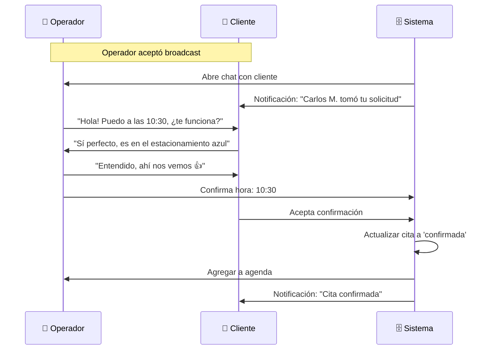

# 1.3.6.1.6 Negociación de Horario

Chat operador↔cliente para acordar detalles finales.

---

## Flujo Post-Aceptación



---

## Datos Negociables

| Dato | Quién Modifica | Restricciones |
|------|----------------|---------------|
| **Hora exacta** | Operador (propone), Cliente (acepta) | Dentro de rango flexible |
| **Instrucciones de ubicación** | Cliente | Texto libre |
| **Notas adicionales** | Ambos | Texto libre |
| **Vehículo** | Cliente | Ya definido previamente |
| ~~Servicio~~ | ❌ No | Ya definido |
| ~~Precio~~ | ❌ No | Ya definido |
| ~~Fecha~~ | ❌ No (reagendar = nueva solicitud) | — |

---

## UI: Chat de Negociación (Operador)

```
┌─────────────────────────────────────────────────────────────────┐
│  ← Juan García                                    📍 📞         │
├─────────────────────────────────────────────────────────────────┤
│                                                                 │
│  ┌─────────────────────────────────────────────────────────┐    │
│  │  📋 SOLICITUD DE SERVICIO                               │    │
│  │  ─────────────────────────────────────────────────────  │    │
│  │  🚗 Lavado Express • $299                               │    │
│  │  📅 17 Enero 2025                                       │    │
│  │  ⏰ ~10:00 AM (flexible ±2h)                            │    │
│  │  📍 Col. Centro, Blvd. Colosio #456                     │    │
│  │                                                         │    │
│  │  Estado: ⏳ Negociando                                  │    │
│  └─────────────────────────────────────────────────────────┘    │
│                                                                 │
│  🤖 Carlos M. ha sido asignado para tu servicio.                 │
│     Coordinen los detalles finales aquí.                        │
│                                                        11:30    │
│                                                                 │
│  ┌─────────────────────────────┐                                │
│  │ Hola Juan! Tengo disponible │                                │
│  │ a las 10:30, ¿te funciona?  │                                │
│  │                      11:32  │                                │
│  └─────────────────────────────┘                                │
│                                                                 │
│                              ┌─────────────────────────────┐    │
│                              │ Sí perfecto! Es en el       │    │
│                              │ estacionamiento del         │    │
│                              │ edificio azul, junto al     │    │
│                              │ Oxxo                        │    │
│                              │                      11:33  │    │
│                              └─────────────────────────────┘    │
│                                                                 │
├─────────────────────────────────────────────────────────────────┤
│                                                                 │
│  ┌─────────────────────────────────────────────────────────┐    │
│  │  ⏰ CONFIRMAR HORA FINAL                                │    │
│  │  ─────────────────────────────────────────────────────  │    │
│  │                                                         │    │
│  │  Hora acordada: [ 10:30 ▼ ]                             │    │
│  │                                                         │    │
│  │  [ Confirmar cita ]                                     │    │
│  │                                                         │    │
│  └─────────────────────────────────────────────────────────┘    │
│                                                                 │
│  📎  Aa  Escribe un mensaje...                        ➤         │
└─────────────────────────────────────────────────────────────────┘
```

---

## Composable: useNegotiation

```typescript
// composables/useNegotiation.ts
export const useNegotiation = (solicitudId: string) => {
  const supabase = useSupabaseClient();
  
  const solicitud = ref<Solicitud | null>(null);
  const cita = ref<Cita | null>(null);
  const horaAcordada = ref<string>('');
  
  // Cargar datos
  const fetchData = async () => {
    const { data } = await supabase
      .from('solicitudes')
      .select(`
        *,
        citas (*),
        clientes (nombre, telefono)
      `)
      .eq('id', solicitudId)
      .single();
    
    solicitud.value = data;
    cita.value = data?.citas?.[0];
    horaAcordada.value = solicitud.value?.hora_preferida || '';
  };
  
  // Proponer hora (solo actualiza UI, no persiste)
  const proponerHora = (hora: string) => {
    horaAcordada.value = hora;
  };
  
  // Confirmar cita
  const confirmarCita = async () => {
    if (!cita.value) return false;
    
    // 1. Actualizar cita
    const { error } = await supabase
      .from('citas')
      .update({
        hora_inicio: horaAcordada.value,
        hora_fin: calcularHoraFin(horaAcordada.value, solicitud.value!.servicio_duracion),
        estado: 'confirmada',
        confirmada_at: new Date()
      })
      .eq('id', cita.value.id);
    
    if (error) {
      toast.error('Error al confirmar');
      return false;
    }
    
    // 2. Enviar mensaje de confirmación
    await enviarMensajeSistema(solicitudId, {
      texto: `✅ Cita confirmada para el ${formatDate(solicitud.value!.fecha)} a las ${horaAcordada.value}`,
      tipo: 'cita_confirmada'
    });
    
    // 3. Notificar a cliente
    await notificarCliente(solicitud.value!.cliente_id, {
      title: '✅ Cita confirmada',
      body: `Tu servicio con ${useSupabaseUser().value?.nombre} es el ${formatDate(solicitud.value!.fecha)} a las ${horaAcordada.value}`
    });
    
    toast.success('¡Cita confirmada!');
    return true;
  };
  
  // Cancelar negociación (devuelve al pool)
  const cancelarNegociacion = async (motivo: string) => {
    await supabase
      .from('citas')
      .update({ estado: 'cancelada', motivo_cancelacion: motivo })
      .eq('id', cita.value!.id);
    
    // Re-broadcast excluyendo este operador
    await rebroadcastSolicitud(solicitudId, [useSupabaseUser().value!.id]);
  };
  
  onMounted(fetchData);
  
  return {
    solicitud,
    cita,
    horaAcordada,
    proponerHora,
    confirmarCita,
    cancelarNegociacion
  };
};
```

---

## Timeout de Negociación

```typescript
// Si pasan 24h sin confirmar, notificar
const checkNegociacionesPendientes = async () => {
  const hace24h = new Date(Date.now() - 24 * 60 * 60 * 1000);
  
  const { data } = await supabase
    .from('citas')
    .select('id, operador_id, solicitud_id')
    .eq('estado', 'negociando')
    .lt('created_at', hace24h.toISOString());
  
  for (const cita of data || []) {
    // Notificar a ambas partes
    await notificarOperador(cita.operador_id, {
      title: '⚠️ Cita sin confirmar',
      body: 'Tienes una cita pendiente de confirmación hace más de 24h'
    });
    
    // Si pasan 48h, cancelar y re-broadcast
  }
};
```

---

## Reglas de Negociación

| Regla | Descripción |
|-------|-------------|
| **NEG-001** | Hora debe estar en rango flexible del cliente |
| **NEG-002** | Máximo 24h para confirmar (alerta) |
| **NEG-003** | Máximo 48h para confirmar (auto-cancelar) |
| **NEG-004** | Servicio y precio NO son negociables |
| **NEG-005** | Solo operador puede confirmar hora final |
| **NEG-006** | Cliente puede cancelar antes de confirmar |

---

## Navegación

| ⬆️ Padre             | [[Proyecto OnlyCarNLD/Datos/1.3.6.1 asignacion_citas]]        |
| -------------------- | ----------------------------------- |
| ⬅️ Hermano anterior  | [[Proyecto OnlyCarNLD/Datos/1.3.6.1.5 aceptacion_rechazo]]    |
| ➡️ Hermano siguiente | [[Proyecto OnlyCarNLD/Datos/1.3.6.1.7 fallback_manual]]       |

---
