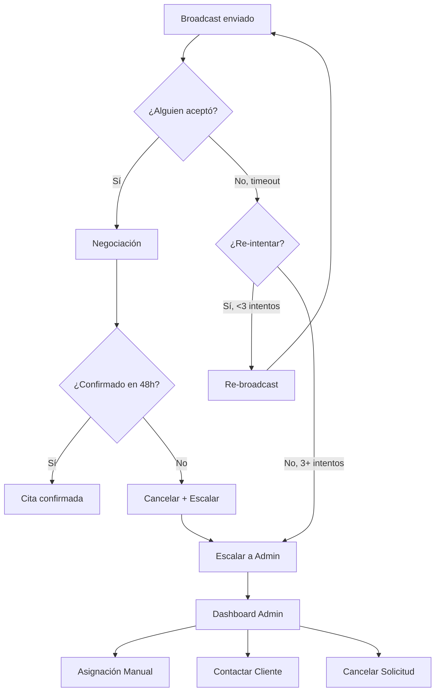

# 1.3.6.1.7 Fallback Manual

Escalación a Admin cuando la asignación automática falla.

---

## Casos de Escalación

| Caso | Trigger | Acción |
|------|---------|--------|
| **Sin respuesta** | Broadcast expira (5 min) | Re-broadcast o manual |
| **Todos rechazan** | 100% de elegibles pasan | Manual obligatorio |
| **Sin candidatos** | 0 operadores cumplen filtros | Manual + expansión zona |
| **Negociación falla** | 48h sin confirmar | Manual |
| **Cliente B2B** | Configuración de cuenta | Siempre manual |

---

## Flujo de Escalación



---

## UI: Dashboard Admin - Citas Escaladas

```
┌─────────────────────────────────────────────────────────────────┐
│  ⚠️ CITAS PENDIENTES DE ASIGNACIÓN MANUAL                       │
├─────────────────────────────────────────────────────────────────┤
│                                                                 │
│  3 citas requieren atención                                     │
│                                                                 │
│  ┌─────────────────────────────────────────────────────────┐    │
│  │ 🔴 URGENTE                              hace 2 horas    │    │
│  │ ─────────────────────────────────────────────────────   │    │
│  │ Juan García • Lavado Express • 17 Ene 10:00             │    │
│  │ Motivo: Sin respuesta después de 3 intentos             │    │
│  │ Operadores notificados: Carlos M., Pedro R., María G.   │    │
│  │                                                         │    │
│  │ [ Asignar manualmente ] [ Contactar cliente ] [ ✕ ]     │    │
│  └─────────────────────────────────────────────────────────┘    │
│                                                                 │
│  ┌─────────────────────────────────────────────────────────┐    │
│  │ 🟡 PENDIENTE                            hace 45 min     │    │
│  │ ─────────────────────────────────────────────────────   │    │
│  │ Corp XYZ • Lavado Premium • 18 Ene 09:00                │    │
│  │ Motivo: Cliente B2B requiere asignación manual          │    │
│  │                                                         │    │
│  │ [ Asignar manualmente ] [ Contactar cliente ] [ ✕ ]     │    │
│  └─────────────────────────────────────────────────────────┘    │
│                                                                 │
│  ┌─────────────────────────────────────────────────────────┐    │
│  │ 🟡 PENDIENTE                            hace 30 min     │    │
│  │ ─────────────────────────────────────────────────────   │    │
│  │ María López • Detallado • 17 Ene 16:00                  │    │
│  │ Motivo: 0 operadores disponibles (zona lejana)          │    │
│  │ Sugerencia: Expandir radio de búsqueda                  │    │
│  │                                                         │    │
│  │ [ Expandir zona ] [ Asignar ] [ Contactar ] [ ✕ ]       │    │
│  └─────────────────────────────────────────────────────────┘    │
│                                                                 │
└─────────────────────────────────────────────────────────────────┘
```

---

## Modal: Asignación Manual

```
┌─────────────────────────────────────────────────────────────────┐
│  📋 ASIGNAR MANUALMENTE                                         │
├─────────────────────────────────────────────────────────────────┤
│                                                                 │
│  Cita: Juan García • Lavado Express • 17 Ene 10:00              │
│                                                                 │
│  OPERADORES DISPONIBLES:                                        │
│  (ordenados por score, incluyendo no-elegibles)                 │
│                                                                 │
│  ┌─────────────────────────────────────────────────────────┐    │
│  │ ⚠️ Carlos M.    │ Rechazó esta solicitud │ 2.1 km       │    │
│  │    ⭐ 4.8       │ "Ya tengo 5 citas"     │              │    │
│  └─────────────────────────────────────────────────────────┘    │
│                                                                 │
│  ┌─────────────────────────────────────────────────────────┐    │
│  │ ✓ Pedro R.      │ No notificado (ocupado)│ 4.5 km       │    │
│  │    ⭐ 4.5       │ Libre desde 10:30      │              │    │
│  └─────────────────────────────────────────────────────────┘    │
│                                                                 │
│  ┌─────────────────────────────────────────────────────────┐    │
│  │ ✓ Ana T.        │ Fuera de zona (7.2 km) │ 7.2 km       │    │
│  │    ⭐ 4.9       │ Disponible             │              │    │
│  └─────────────────────────────────────────────────────────┘    │
│                                                                 │
│  Operador seleccionado: [ Pedro R. ▼ ]                          │
│                                                                 │
│  ⚠️ Asignación forzada: Operador será notificado pero           │
│     DEBE aceptar o dar explicación.                             │
│                                                                 │
│  [ Cancelar ]                    [ Asignar forzado ]            │
│                                                                 │
└─────────────────────────────────────────────────────────────────┘
```

---

## Función: Escalar Solicitud

```typescript
// server/api/solicitud/escalar.post.ts
export default defineEventHandler(async (event) => {
  const body = await readBody(event);
  const { solicitudId, motivo, intentos } = body;
  
  // 1. Marcar solicitud como escalada
  await supabase
    .from('solicitudes')
    .update({ 
      estado: 'escalada',
      motivo_escalacion: motivo,
      intentos_broadcast: intentos
    })
    .eq('id', solicitudId);
  
  // 2. Notificar a admins
  const admins = await getActiveAdmins();
  
  for (const admin of admins) {
    await sendPushNotification(admin.id, {
      title: '⚠️ Cita requiere asignación manual',
      body: motivo,
      data: { type: 'escalacion', solicitud_id: solicitudId }
    });
  }
  
  // 3. También mensaje en canal admin
  await supabase.channel('admin_alerts').send({
    type: 'broadcast',
    event: 'nueva_escalacion',
    payload: { solicitudId, motivo }
  });
  
  return { success: true };
});
```

---

## Asignación Forzada

```sql
-- Asignar sin esperar aceptación del operador
CREATE OR REPLACE FUNCTION asignar_forzado(
  p_solicitud_id UUID,
  p_operador_id UUID,
  p_admin_id UUID
)
RETURNS UUID AS $$
DECLARE
  v_cita_id UUID;
BEGIN
  -- 1. Crear cita con estado especial
  INSERT INTO citas (
    solicitud_id, operador_id, estado, 
    asignacion_forzada, asignado_por
  ) VALUES (
    p_solicitud_id, p_operador_id, 'forzada',
    true, p_admin_id
  )
  RETURNING id INTO v_cita_id;
  
  -- 2. Actualizar solicitud
  UPDATE solicitudes
  SET estado = 'asignada', operador_id = p_operador_id
  WHERE id = p_solicitud_id;
  
  -- 3. Log de auditoría
  INSERT INTO audit_log (accion, tabla, registro_id, datos, usuario_id)
  VALUES (
    'ASIGNACION_FORZADA',
    'citas',
    v_cita_id,
    jsonb_build_object('operador', p_operador_id, 'motivo', 'fallback_manual'),
    p_admin_id
  );
  
  RETURN v_cita_id;
END;
$$ LANGUAGE plpgsql;
```

---

## Notificación al Operador (Forzada)

```typescript
// Mensaje diferente para asignación forzada
const notificarAsignacionForzada = async (operadorId: string, cita: Cita) => {
  await sendPushNotification(operadorId, {
    title: '📋 Asignación de Admin',
    body: `Se te ha asignado: ${cita.servicio_nombre} - ${formatDate(cita.fecha)}`,
    priority: 'high'
  });
  
  // Chat mensaje
  await enviarMensajeSistema(cita.id, {
    texto: `⚠️ Admin ha asignado esta cita. Por favor confirma tu disponibilidad
            o contacta a Admin si hay algún problema.`,
    tipo: 'asignacion_forzada',
    requiere_respuesta: true
  });
};
```

---

## Reglas de Fallback

| Regla | Descripción |
|-------|-------------|
| **FB-001** | Máximo 3 re-broadcasts antes de escalar |
| **FB-002** | Admin notificado inmediatamente si 0 candidatos |
| **FB-003** | Clientes B2B siempre van directo a manual |
| **FB-004** | Asignación forzada requiere confirmación operador en 2h |
| **FB-005** | Si operador rechaza forzada, log + métricas |

---

## Navegación

| ⬆️ Padre             | [[Proyecto OnlyCarNLD/Datos/1.3.6.1 asignacion_citas]]         |
| -------------------- | ------------------------------------ |
| ⬅️ Hermano anterior  | [[Proyecto OnlyCarNLD/Datos/1.3.6.1.6 negociacion_horario]]    |
| ➡️ Hermano siguiente | [[Proyecto OnlyCarNLD/Datos/1.3.6.1.8 prioridades_ranking]]    |

---
