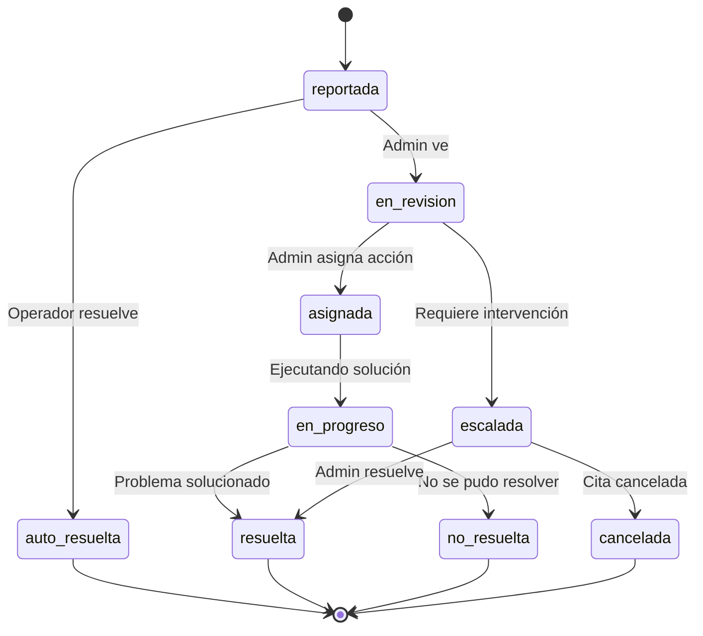

# 1.3.6.3.2 Flujo de Resolución

Máquina de estados para gestión de incidencias.

---

## FSM: Incidencia



---

## Estados

| Estado | Descripción | Tiempo Máximo |
|--------|-------------|---------------|
| `reportada` | Operador envió incidencia | — |
| `en_revision` | Admin está revisando | 30 min |
| `asignada` | Acción definida | 1 hora |
| `en_progreso` | Ejecutando solución | Variable |
| `escalada` | Requiere intervención Admin | 2 horas |
| `resuelta` | Problema solucionado | — |
| `no_resuelta` | No fue posible resolver | — |
| `auto_resuelta` | Operador resolvió solo | — |
| `cancelada` | Cita cancelada por incidencia | — |

---

## Acciones por Tipo

### Incidencia: Cliente No Disponible (CLI-001)

```
1. REPORTADA
   → Admin notificado
   → Operador espera en sitio

2. EN_REVISION (Admin)
   → Opción A: Intentar contactar cliente
   → Opción B: Reasignar tiempo
   → Opción C: Cancelar cita

3. ASIGNADA
   → Si A: Admin llama, operador espera
   → Si B: Operador se mueve a siguiente
   → Si C: Cita cancelada con registro

4. RESUELTA / NO_RESUELTA
   → Documentar resultado
   → Actualizar cita en sistema
```

### Incidencia: Portón Cerrado (ACC-001)

```
1. REPORTADA con foto
   → Alta prioridad automática
   → Notificación push a Admin

2. EN_REVISION
   → Admin contacta cliente
   → Si cliente responde: Dar instrucciones
   → Si no responde: Escalar

3. ESCALADA
   → Admin decide:
     - Esperar más tiempo
     - Reprogramar cita
     - Cancelar

4. RESUELTA
   → Operador entra o cita reprogramada
```

### Incidencia: Emergencia (EME-*)

```
1. REPORTADA
   → ESCALADA automática
   → Notificación URGENTE a Admin
   → Todas las citas del operador en pausa

2. ESCALADA
   → Admin contacta operador
   → Verifica bienestar
   → Reasigna citas pendientes

3. RESUELTA
   → Operador OK: Reactiva citas
   → Operador baja: Cubre otro operador
```

---

## Tiempos de Respuesta (SLA)

| Prioridad | Tiempo Primera Respuesta | Tiempo Resolución |
|-----------|-------------------------|-------------------|
| 🔴 Crítica | 5 minutos | 30 minutos |
| 🔴 Alta | 15 minutos | 1 hora |
| 🟡 Media | 30 minutos | 4 horas |
| 🟢 Baja | 2 horas | 24 horas |

---

## Transiciones Permitidas

| Estado Actual | Estados Posibles |
|---------------|-----------------|
| reportada | en_revision, auto_resuelta |
| en_revision | asignada, escalada |
| asignada | en_progreso |
| en_progreso | resuelta, no_resuelta |
| escalada | resuelta, cancelada |

---

## Notificaciones Automáticas

| Evento | A Quién | Canal |
|--------|---------|-------|
| Nueva incidencia | Admin | Push + In-app |
| Escalada | Admin | Push + Email |
| Resuelta | Operador | Chat |
| Cita afectada | Cliente | Push + Email |

---

## Navegación

| ⬆️ Padre             | [[Proyecto OnlyCarNLD/Datos/1.3.6.3 incidencias_reportes]]    |
| -------------------- | ----------------------------------- |
| ⬅️ Hermano anterior  | [[Proyecto OnlyCarNLD/Datos/1.3.6.3.1 tipos_incidencia]]      |
| ➡️ Hermano siguiente | [[Proyecto OnlyCarNLD/Datos/1.3.6.3.3 metricas_kpi]]          |

---
