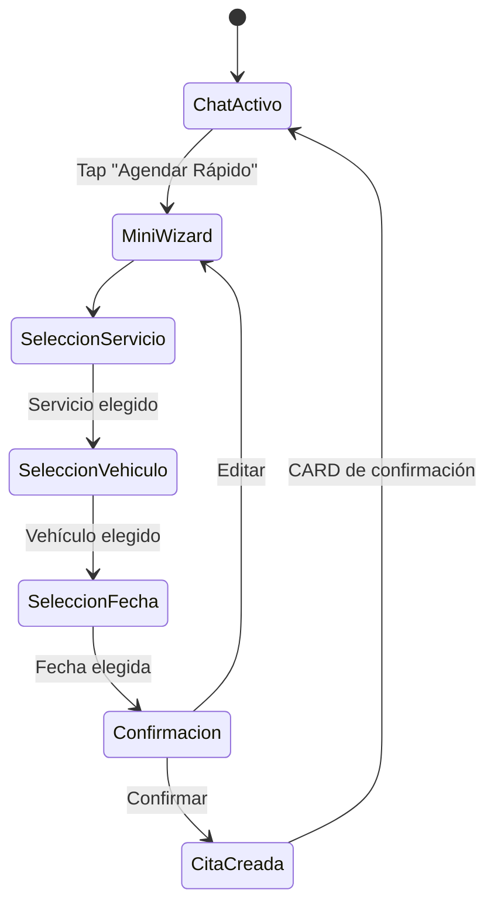

# 1.3.8.1 Solicitud Rápida

> **Propósito:** Reducir fricción en el proceso de agendamiento permitiendo al cliente B2C crear una cita directamente desde el chat.

---

## 1. Concepto UX

El cliente está conversando con el Admin o revisando su historial. En lugar de navegar a otra pantalla para agendar, puede hacerlo inline.

### Antes (Flujo Tradicional)
```
Chat → Salir → Menú → Nueva Cita → Formulario → Confirmar → Volver a Chat
(7 pasos, 5 cambios de pantalla)
```

### Después (Solicitud Rápida)
```
Chat → Botón "Agendar" → Mini-Wizard Inline → Confirmado
(3 pasos, 0 cambios de pantalla)
```

---

## 2. Componente Visual

```text
┌────────────────────────────────────────────────────────────────┐
│  💬 Chat con OnlyCar                                        │
├────────────────────────────────────────────────────────────────┤
│                                                                │
│  🤖 Sistema: "¿Listo para tu próximo lavado?"                  │
│                                                                │
│  ┌──────────────────────────────────────────────────────────┐  │
│  │  ⚡ AGENDAR RÁPIDO                                        │  │
│  │  ─────────────────────────────────────────────────────   │  │
│  │                                                          │  │
│  │  Servicio: [Lavado Express ▼]                            │  │
│  │  Vehículo: [Toyota Corolla - ABC123 ▼]                   │  │
│  │  Fecha:    [Mañana ▼]  [10:00 AM ▼]                      │  │
│  │  Ubicación: 📍 Usar mi ubicación actual                  │  │
│  │                                                          │  │
│  │  Total estimado: $299 MXN                                │  │
│  │                                                          │  │
│  │  ┌────────────────────────────────────────────────────┐  │  │
│  │  │              ✅ CONFIRMAR CITA                      │  │  │
│  │  └────────────────────────────────────────────────────┘  │  │
│  │                                                          │  │
│  └──────────────────────────────────────────────────────────┘  │
│                                                                │
├────────────────────────────────────────────────────────────────┤
│  📎  Aa  Escribe un mensaje...                        ➤       │
└────────────────────────────────────────────────────────────────┘
```

---

## 3. Flujo de Interacción



---

## 4. Datos Pre-llenados

Para reducir aún más los pasos, el sistema pre-llena:

| Campo | Origen | Fallback |
|-------|--------|----------|
| **Vehículo** | Último usado | Primer vehículo registrado |
| **Servicio** | Último contratado | Lavado Express (más popular) |
| **Ubicación** | GPS actual | Última dirección usada |
| **Fecha** | Mañana | Primera disponible |

El usuario solo revisa y confirma, o ajusta lo necesario.

---

## 5. Integración con [[Proyecto OnlyCarNLD/Datos/1.3.6.1 asignacion_citas]]

Una vez confirmada la solicitud:
1. Se crea registro en `solicitudes`.
2. Se dispara el proceso de matching ([[Proyecto OnlyCarNLD/Datos/1.3.6.1 asignacion_citas]]).
3. Se envía CARD de confirmación al chat.
4. Se notifica al cliente cuando se asigna operador.

---

## 6. Métricas de Conversión

| Métrica | Objetivo |
|---------|----------|
| **Tasa de inicio** | % usuarios que abren el wizard | 
| **Tasa de completado** | % que confirman cita |
| **Tiempo promedio** | < 30 segundos |
| **Drop-off por paso** | Identificar fricciones |

---

## Navegación

| Elemento | Enlace |
|----------|--------|
| ⬆️ Padre | [[Proyecto OnlyCarNLD/Datos/1.3.8 chat_cliente_b2c]] |
| 🔗 Relacionado | [[Proyecto OnlyCarNLD/Datos/1.3.6.1 asignacion_citas]] |
