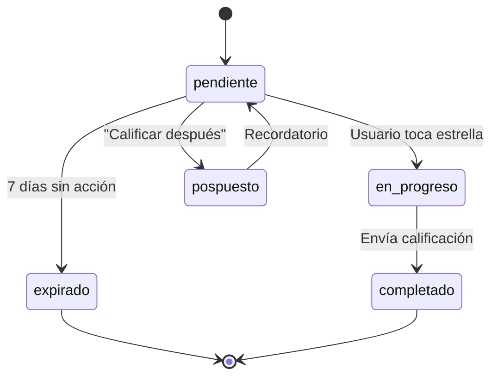

# 1.4.1.1 CARD de Calificación

> Componente interactivo que solicita calificación al cliente después de un servicio.

---

## Anatomía del CARD

```
┌─────────────────────────────────────────────────────────────────┐
│  ⭐ ¿CÓMO FUE TU EXPERIENCIA?                    [Estado: Pendiente]
├─────────────────────────────────────────────────────────────────┤
│                                                                 │
│  ┌─────────────────────────────────────────────────────────┐   │
│  │  Servicio: Lavado Express                               │   │
│  │  Operador: Carlos M.                                    │   │
│  │  Fecha: 15 Enero 2026                                   │   │
│  └─────────────────────────────────────────────────────────┘   │
│                                                                 │
│        ☆    ☆    ☆    ☆    ☆                                   │
│        1    2    3    4    5                                    │
│                                                                 │
│  ┌─────────────────────────────────────────────────────────┐   │
│  │  [ Calificar después ]                                  │   │
│  └─────────────────────────────────────────────────────────┘   │
│                                                                 │
└─────────────────────────────────────────────────────────────────┘
```

---

## Estados del CARD



| Estado | Color | Icono | Acción |
|--------|-------|-------|--------|
| `pendiente` | Azul | ⭐ | Esperando interacción |
| `en_progreso` | Amarillo | ⏳ | Usuario seleccionando |
| `completado` | Verde | ✅ | Calificación enviada |
| `pospuesto` | Gris | 🔔 | Recordar más tarde |
| `expirado` | Rojo tenue | ⏰ | Sin calificación |

---

## Componente Vue

```vue
<template>
  <MessageCard 
    :tipo="'solicitud_calificacion'"
    :estado="estado"
    :expandido="expandido"
  >
    <template #header>
      <div class="flex items-center gap-2">
        <Star class="text-yellow-500" />
        <span>¿Cómo fue tu experiencia?</span>
      </div>
    </template>
    
    <template #body>
      <div class="servicio-info">
        <p><strong>{{ data.servicio_nombre }}</strong></p>
        <p class="text-sm text-muted">
          con {{ data.operador_nombre }} • {{ formatDate(data.fecha_servicio) }}
        </p>
      </div>
      
      <StarRating 
        v-model="estrellas"
        :size="32"
        @change="onEstrellasChange"
      />
      
      <Button 
        v-if="!estrellas"
        variant="ghost"
        @click="posponer"
      >
        Calificar después
      </Button>
    </template>
  </MessageCard>
</template>

<script setup lang="ts">
interface CalificacionCardData {
  servicio_id: string;
  servicio_nombre: string;
  operador_nombre: string;
  fecha_servicio: string;
  ya_calificado: boolean;
}

const props = defineProps<{
  data: CalificacionCardData;
}>();

const estrellas = ref(0);
const estado = ref<'pendiente' | 'en_progreso' | 'completado'>('pendiente');

const onEstrellasChange = (value: number) => {
  estado.value = 'en_progreso';
  // Continuar al flujo de calificación
  emit('continuar', { estrellas: value });
};

const posponer = () => {
  emit('posponer');
};
</script>
```

---

## Animaciones

| Transición | Duración | Easing |
|------------|----------|--------|
| Aparición | 300ms | ease-out |
| Estrella hover | 150ms | ease-in-out |
| Estrella select | 200ms | bounce |
| Expandir comentario | 250ms | ease-out |
| Completado (checkmark) | 400ms | spring |

```css
.star-rating .star {
  transition: transform 150ms ease-in-out, color 150ms ease-in-out;
}

.star-rating .star:hover {
  transform: scale(1.2);
}

.star-rating .star.selected {
  animation: star-bounce 200ms ease-out;
  color: #fbbf24; /* yellow-400 */
}

@keyframes star-bounce {
  0%, 100% { transform: scale(1); }
  50% { transform: scale(1.3); }
}
```

---

## Variantes del CARD

| Variante | Cuándo | Diferencia Visual |
|----------|--------|-------------------|
| `default` | Normal | Estándar |
| `reminder` | Recordatorio | Badge "📢 Recordatorio" |
| `urgent` | Última oportunidad | Borde rojo, "⏰ Última oportunidad" |
| `incentive` | Con incentivo | "🎁 +10 puntos por calificar" |

---

## Modelo de Datos

```typescript
interface CalificacionCard extends BaseCard {
  tipo: 'solicitud_calificacion';
  data: {
    servicio_id: string;
    servicio_nombre: string;
    operador_id: string;
    operador_nombre: string;
    fecha_servicio: string;
    ya_calificado: boolean;
    variante: 'default' | 'reminder' | 'urgent' | 'incentive';
    incentivo_puntos?: number;
  };
  estado: 'pendiente' | 'en_progreso' | 'completado' | 'pospuesto' | 'expirado';
  acciones: ['calificar', 'posponer', 'omitir'];
}
```

---

## Navegación

| ⬆️ Padre | [[Proyecto OnlyCarNLD/Datos/1.4.1 flujo_calificacion]] |
|----------|------------------------------|
| ➡️ Hermano siguiente | [[Proyecto OnlyCarNLD/Datos/1.4.1.2 evaluacion_operador]] |

---
