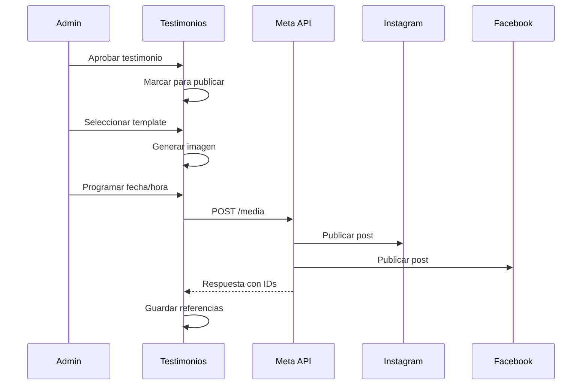

# 1.4.2.2 Publicación en Redes Sociales

> Sistema para publicar testimonios aprobados en Instagram y Facebook.

---

## Flujo de Publicación



---

## Templates de Publicación

### Instagram Story

```
┌────────────────────────────────┐
│                                │
│     ⭐⭐⭐⭐⭐                 │
│                                │
│   "Excelente servicio,         │
│    mi auto quedó como          │
│    nuevo."                     │
│                                │
│         — Juan G.              │
│                                │
│   ───────────────────          │
│                                │
│   🚗 OnlyCar                │
│   Limpieza vehicular           │
│   a domicilio                  │
│                                │
│   [Agenda tu servicio]         │
│                                │
└────────────────────────────────┘
```

### Instagram Feed

```
┌────────────────────────────────────────────┐
│                                            │
│  [Imagen del auto limpio o logo]           │
│                                            │
├────────────────────────────────────────────┤
│                                            │
│  "Excelente servicio, mi auto quedó        │
│   como nuevo. Carlos fue muy profesional   │
│   y puntual."                              │
│                                            │
│  ⭐⭐⭐⭐⭐ — Juan G.                       │
│                                            │
│  #OnlyCar #LimpiezaVehicular            │
│  #DetallsAutoLA gente                      │
│                                            │
└────────────────────────────────────────────┘
```

### Facebook Post

```
🌟 CLIENTE SATISFECHO 🌟

"Excelente servicio, mi auto quedó como nuevo. 
Carlos fue muy profesional y puntual."

⭐⭐⭐⭐⭐ — Juan G.

¿Quieres tu auto así de reluciente? 
👉 Agenda en onlycar.mx

#OnlyCar #LimpiezaVehicular #ClienteFeliz
```

---

## UI de Publicación

```
┌─────────────────────────────────────────────────────────────────┐
│  📱 PUBLICAR EN REDES                                           │
├─────────────────────────────────────────────────────────────────┤
│                                                                 │
│  TESTIMONIO                                                     │
│  ─────────────────────────────────────────────────              │
│  ⭐⭐⭐⭐⭐ Juan García                                          │
│  "Excelente servicio, mi auto quedó como nuevo..."              │
│                                                                 │
│  PLATAFORMAS                                                    │
│  ─────────────────────────────────────────────────              │
│  ☑ Instagram Feed                                               │
│  ☑ Instagram Story                                              │
│  ☑ Facebook                                                     │
│                                                                 │
│  TEMPLATE                                                       │
│  ─────────────────────────────────────────────────              │
│  ○ Minimalista   ● Con estrellas   ○ Con foto                   │
│                                                                 │
│  PREVIEW                                                        │
│  ─────────────────────────────────────────────────              │
│  [Vista previa del post generado]                               │
│                                                                 │
│  PROGRAMAR                                                      │
│  ─────────────────────────────────────────────────              │
│  Fecha: [15 Ene 2026]  Hora: [10:00]                            │
│                                                                 │
│  [ Cancelar ]  [ Publicar ahora ]  [ Programar ]                │
│                                                                 │
└─────────────────────────────────────────────────────────────────┘
```

---

## Integración Meta Business Suite

```typescript
// lib/meta-publishing.ts
import { Configuration, ContentPublishingApi } from 'meta-business-sdk';

const meta = new ContentPublishingApi(new Configuration({
  accessToken: process.env.META_ACCESS_TOKEN,
}));

export const publicarTestimonio = async (
  testimonio: Testimonio,
  opciones: PublicacionOpciones
) => {
  const { plataformas, template, programar } = opciones;
  
  // Generar imagen con template
  const imagenUrl = await generarImagen(testimonio, template);
  
  const resultados: PublicacionResultado[] = [];
  
  if (plataformas.instagramFeed) {
    const result = await meta.createMediaContainer({
      igUserId: process.env.IG_USER_ID,
      imageUrl: imagenUrl,
      caption: generarCaption(testimonio),
      scheduledPublishTime: programar?.getTime() / 1000,
    });
    resultados.push({ plataforma: 'instagram_feed', id: result.id });
  }
  
  if (plataformas.facebook) {
    const result = await meta.createPagePost({
      pageId: process.env.FB_PAGE_ID,
      message: generarPostFB(testimonio),
      link: 'https://onlycar.mx',
      scheduledPublishTime: programar?.getTime() / 1000,
    });
    resultados.push({ plataforma: 'facebook', id: result.id });
  }
  
  return resultados;
};
```

---

## Generación de Imagen

```typescript
// lib/image-generator.ts
import { createCanvas, loadImage } from 'canvas';

export const generarImagen = async (
  testimonio: Testimonio,
  template: 'minimal' | 'stars' | 'photo'
): Promise<string> => {
  const canvas = createCanvas(1080, 1080);
  const ctx = canvas.getContext('2d');
  
  // Fondo
  ctx.fillStyle = '#ffffff';
  ctx.fillRect(0, 0, 1080, 1080);
  
  // Estrellas
  ctx.font = '48px Arial';
  ctx.fillText('⭐'.repeat(testimonio.estrellas), 100, 200);
  
  // Texto
  ctx.font = '36px Georgia';
  ctx.fillStyle = '#333333';
  wrapText(ctx, `"${testimonio.texto}"`, 100, 300, 880, 50);
  
  // Autor
  ctx.font = '28px Arial';
  ctx.fillStyle = '#666666';
  ctx.fillText(`— ${testimonio.nombre_display}`, 100, 800);
  
  // Logo
  const logo = await loadImage('./assets/logo.png');
  ctx.drawImage(logo, 100, 900, 200, 80);
  
  // Subir a Cloudflare R2
  const buffer = canvas.toBuffer('image/png');
  const url = await uploadToR2(buffer, `testimonios/${testimonio.id}.png`);
  
  return url;
};
```

---

## Modelo de Datos

```sql
CREATE TABLE publicaciones_redes (
  id UUID PRIMARY KEY DEFAULT gen_random_uuid(),
  testimonio_id UUID REFERENCES testimonios(id),
  
  -- Plataforma
  plataforma VARCHAR(30), -- 'instagram_feed', 'instagram_story', 'facebook'
  external_id VARCHAR(100), -- ID de Meta
  
  -- Estado
  estado VARCHAR(20) DEFAULT 'pendiente',
  -- pendiente, programado, publicado, fallido
  
  -- Programación
  programado_para TIMESTAMPTZ,
  publicado_at TIMESTAMPTZ,
  
  -- Métricas (actualizadas por webhook)
  likes INTEGER DEFAULT 0,
  comentarios INTEGER DEFAULT 0,
  compartidos INTEGER DEFAULT 0,
  alcance INTEGER DEFAULT 0,
  
  created_at TIMESTAMPTZ DEFAULT now()
);
```

---

## Autorización del Cliente

> [!IMPORTANT]
> Antes de publicar en redes, verificar que el cliente autorizó uso en redes sociales.

```sql
-- En tabla testimonios
publicar_redes BOOLEAN DEFAULT false
```

---

## Navegación

| ⬆️ Padre | [[Proyecto OnlyCarNLD/Datos/1.4.2 testimonios_marketing]] |
|----------|---------------------------------|
| ⬅️ Hermano anterior | [[Proyecto OnlyCarNLD/Datos/1.4.2.1 widget_testimonios]] |

---
