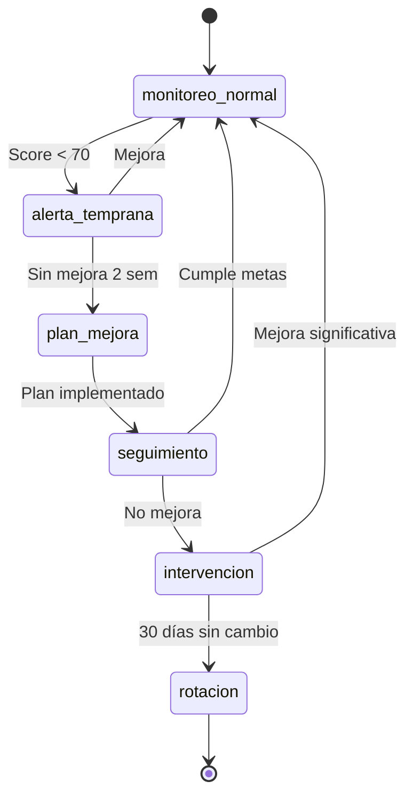

# 1.4.3.2 Diagnóstico de Rotación

Sistema para detectar necesidad de intervención, capacitación o rotación de personal.

---

## Matriz de Decisión

```
			            SCORE ACTUAL
	                    ┌─────────────────────────────┐
	                    │  Alto (75+)  │  Bajo (<60)  │
	        ┌───────────┼──────────────┼──────────────┤
TENDENCIA   │ Mejorando │  ✅ Mantener │ 🟡 Observar  │
	        ├───────────┼──────────────┼──────────────┤
	        │ Estable   │  ✅ Mantener │🟠 Plan Mejora│
	        ├───────────┼──────────────┼──────────────┤
	        │ Bajando   │ 🟡 Investigar│🔴 Intervenir │
	        └───────────┴──────────────┴──────────────┘
```

---

## Indicadores de Alerta Temprana

### 🔴 Señales Críticas (Requieren Acción Inmediata)

| Indicador | Umbral | Acción |
|-----------|--------|--------|
| Score < 40 por 2 semanas | Crítico | Reunión urgente |
| 5+ calificaciones ≤2 estrellas/mes | Crítico | Suspensión temporal |
| Incidencia grave (emergencia) | Único | Investigación |
| 3+ quejas del mismo cliente | Crítico | Cambio de operador |

### 🟠 Señales de Advertencia

| Indicador | Umbral | Acción |
|-----------|--------|--------|
| Score 40-60 estable | 1 mes | Plan de mejora |
| Tendencia negativa | 3 semanas | Conversación |
| Categoría negativa recurrente | 5+ menciones | Capacitación específica |
| Tasa calificación < 50% | 1 mes | Revisar interacción |

---

## Dashboard de Diagnóstico

```
┌─────────────────────────────────────────────────────────────────┐
│  🔍 DIAGNÓSTICO DE EQUIPO                        Diciembre 2025 │
├─────────────────────────────────────────────────────────────────┤
│                                                                 │
│  DISTRIBUCIÓN POR CLASIFICACIÓN                                 │
│  ─────────────────────────────────────────────────              │
│  ⭐ Excelente (90+)    ██████████ 2 operadores                  │
│  ✅ Bueno (75-89)      ████████████████████ 4 operadores        │
│  🟡 Regular (60-74)    ██████ 1 operador                        │
│  🔴 Crítico (<60)      ██ 0 operadores                          │
│                                                                 │
│  REQUIEREN ATENCIÓN                                             │
│  ─────────────────────────────────────────────────              │
│  🟡 María L.     Score: 62 → Tendencia ↓                        │
│     • 3 menciones negativas en "Comunicación"                   │
│     • Recomendación: Capacitación en trato al cliente           │
│     [ Ver perfil ] [ Crear plan ]                               │
│                                                                 │
│  MEJORES DESEMPEÑOS                                             │
│  ─────────────────────────────────────────────────              │
│  ⭐ Carlos M.    Score: 94 → Tendencia ↑                        │
│  ⭐ Pedro R.     Score: 91 → Tendencia estable                  │
│                                                                 │
└─────────────────────────────────────────────────────────────────┘
```

---

## Flujo de Intervención



---

## Tipos de Intervención

| Nivel | Acción | Responsable | Duración |
|-------|--------|-------------|----------|
| **1. Observación** | Monitoreo cercano | Sistema | 2 semanas |
| **2. Conversación** | Retroalimentación informal | Admin | 30 min |
| **3. Plan Mejora** | Metas específicas + seguimiento | Admin | 30 días |
| **4. Capacitación** | Curso/taller específico | Externo | Variable |
| **5. Última Oportunidad** | Contrato de desempeño | Admin | 15 días |
| **6. Rotación** | Cambio de rol o desvinculación | Admin | Inmediato |

---

## Análisis de Causas Raíz

```
┌─────────────────────────────────────────────────────────────────┐
│  📊 ANÁLISIS: María L.                                          │
├─────────────────────────────────────────────────────────────────┤
│                                                                 │
│  CATEGORÍAS NEGATIVAS (últimos 30 días)                         │
│  ─────────────────────────────────────────────────              │
│  Comunicación      ████████████████ 8 menciones                 │
│  Puntualidad       ████ 2 menciones                             │
│                                                                 │
│  COMENTARIOS REPRESENTATIVOS                                    │
│  ─────────────────────────────────────────────────              │
│  • "No explicó bien lo que iba a hacer"                         │
│  • "Parecía apurada y no respondió mis preguntas"               │
│  • "El trabajo estuvo bien pero faltó comunicación"             │
│                                                                 │
│  DIAGNÓSTICO SUGERIDO                                           │
│  ─────────────────────────────────────────────────              │
│  ⚠️ Déficit en habilidades de comunicación con cliente          │
│                                                                 │
│  RECOMENDACIÓN                                                  │
│  ─────────────────────────────────────────────────              │
│  Capacitación: "Comunicación efectiva con clientes"             │
│  Duración: 4 horas | Prioridad: Alta                            │
│                                                                 │
│  [ Asignar capacitación ] [ Crear plan personalizado ]          │
│                                                                 │
└─────────────────────────────────────────────────────────────────┘
```

---

## Modelo de Datos

```sql
CREATE TABLE diagnosticos_operador (
  id UUID PRIMARY KEY,
  operador_id UUID REFERENCES users(id),
  
  -- Clasificación
  nivel_alerta VARCHAR(20), -- normal, observacion, advertencia, critico
  tendencia VARCHAR(20), -- mejorando, estable, bajando
  
  -- Análisis
  categorias_negativas JSONB, -- [{categoria, count}]
  causa_raiz TEXT,
  recomendacion TEXT,
  
  -- Acciones
  accion_requerida VARCHAR(30),
  fecha_limite DATE,
  responsable_id UUID,
  
  created_at TIMESTAMPTZ DEFAULT now(),
  revisado_at TIMESTAMPTZ,
  revisado_por UUID
);
```

---

## Navegación

| ⬆️ Padre             | [[Proyecto OnlyCarNLD/Datos/1.4.3 analisis_mejora]]              |
| -------------------- | -------------------------------------- |
| ⬅️ Hermano anterior  | [[Proyecto OnlyCarNLD/Datos/1.4.3.1 rendimiento_operadores]]     |
| ➡️ Hermano siguiente | [[Proyecto OnlyCarNLD/Datos/1.4.3.3 historico_calificaciones]]   |

---
