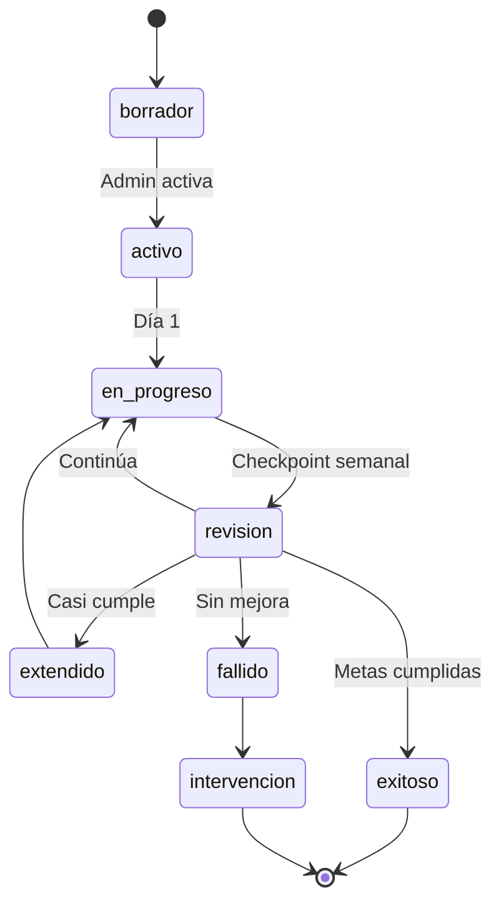

# 1.4.3.4 Plan de Acción

Workflow para crear y dar seguimiento a planes de mejora individuales.

---

## Tipos de Plan

| Tipo | Duración | Para Quién | Seguimiento |
|------|----------|------------|-------------|
| **Mejora rápida** | 7 días | Score 60-74 | Diario |
| **Desarrollo** | 30 días | Score 50-69 | Semanal |
| **Intensivo** | 15 días | Score <50 | Diario + reuniones |
| **Capacitación** | Variable | Déficit específico | Post-curso |

---

## Creación de Plan

```
┌─────────────────────────────────────────────────────────────────┐
│  📋 CREAR PLAN DE MEJORA                                        │
├─────────────────────────────────────────────────────────────────┤
│                                                                 │
│  Operador: María López                                          │
│  Score actual: 62 | Clasificación: 🟡 Regular                   │
│                                                                 │
│  ÁREAS A MEJORAR (detectadas automáticamente)                   │
│  ─────────────────────────────────────────────────              │
│  ☑ Comunicación        8 menciones negativas                    │
│  ☐ Puntualidad         2 menciones negativas                    │
│                                                                 │
│  TIPO DE PLAN                                                   │
│  ─────────────────────────────────────────────────              │
│  ○ Mejora rápida (7 días)                                       │
│  ● Desarrollo (30 días)                                         │
│  ○ Intensivo (15 días)                                          │
│  ○ Capacitación específica                                      │
│                                                                 │
│  METAS ESPECÍFICAS                                              │
│  ─────────────────────────────────────────────────              │
│  Meta 1: [ Subir score comunicación a 4.0/5          ]          │
│  Meta 2: [ Reducir menciones negativas a <2/mes      ]          │
│  Meta 3: [ Completar curso comunicación efectiva     ]          │
│                                                                 │
│  ACCIONES CONCRETAS                                             │
│  ─────────────────────────────────────────────────              │
│  ☑ Saludar y presentarse al inicio de cada servicio             │
│  ☑ Explicar proceso antes de comenzar                           │
│  ☑ Preguntar si hay dudas al finalizar                          │
│  ☑ Agradecer al cliente explícitamente                          │
│                                                                 │
│  FECHA INICIO: [ 24 Dic 2025 ]                                  │
│  FECHA FIN:    [ 23 Ene 2026 ]                                  │
│                                                                 │
│  [ Cancelar ]  [ Guardar borrador ]  [ Activar plan ]           │
│                                                                 │
└─────────────────────────────────────────────────────────────────┘
```

---

## Seguimiento del Plan

```
┌─────────────────────────────────────────────────────────────────┐
│  📊 SEGUIMIENTO: Plan María López                    Día 12/30  │
├─────────────────────────────────────────────────────────────────┤
│                                                                 │
│  PROGRESO GENERAL                                               │
│  ████████████████░░░░░░░░░░░░░░░░░░░░ 40% completado            │
│                                                                 │
│  METAS                                                          │
│  ─────────────────────────────────────────────────              │
│  ✅ Score comunicación: 3.4 → 3.8     Meta: 4.0    Progreso ↑   │
│  🟡 Menciones negativas: 2 este mes   Meta: <2     En riesgo    │
│  ⏳ Curso comunicación: Programado 28 Dic                       │
│                                                                 │
│  ACCIONES CHECKLIST                                             │
│  ─────────────────────────────────────────────────              │
│  ☑ Saludar y presentarse          85% cumplimiento              │
│  ☑ Explicar proceso               70% cumplimiento              │
│  ☐ Preguntar dudas al final       40% cumplimiento ⚠️           │
│  ☑ Agradecer al cliente           90% cumplimiento              │
│                                                                 │
│  ÚLTIMAS CALIFICACIONES                                         │
│  ─────────────────────────────────────────────────              │
│  ⭐⭐⭐⭐⭐  "Muy amable, explicó todo bien"                      │
│  ⭐⭐⭐⭐   "Buen trabajo"                                        │
│  ⭐⭐⭐     "No me dijo cuánto tardaría"         ← Atención      │
│                                                                 │
│  [ Agregar nota ] [ Agendar reunión ] [ Ver historial ]         │
│                                                                 │
└─────────────────────────────────────────────────────────────────┘
```

---

## Estado del Plan



---

## Reuniones de Seguimiento

| Tipo Plan | Frecuencia | Duración | Formato |
|-----------|------------|----------|---------|
| Mejora rápida | Día 1, 4, 7 | 15 min | Presencial |
| Desarrollo | Semanal | 30 min | Presencial/Virtual |
| Intensivo | Cada 3 días | 30 min | Presencial |
| Capacitación | Pre y Post | 45 min | Presencial |

### Template de Reunión

```
┌─────────────────────────────────────────────────────────────────┐
│  📝 NOTAS DE REUNIÓN                         28 Dic 2025        │
├─────────────────────────────────────────────────────────────────┤
│                                                                 │
│  Operador: María López                                          │
│  Plan: Desarrollo 30 días                                       │
│  Reunión #: 2 de 4                                              │
│                                                                 │
│  ¿QUÉ FUNCIONÓ?                                                 │
│  [Saludar y presentarse ya es hábito. Cliente lo nota.]         │
│                                                                 │
│  ¿QUÉ NO FUNCIONÓ?                                              │
│  [Aún olvida preguntar dudas. Se siente apurada.]               │
│                                                                 │
│  AJUSTES AL PLAN                                                │
│  [Agregar checklist físico para los primeros 2 semanas]         │
│                                                                 │
│  COMPROMISO PARA PRÓXIMA REUNIÓN                                │
│  [Usar checklist en 100% de servicios]                          │
│                                                                 │
│  [ Guardar notas ]                                              │
│                                                                 │
└─────────────────────────────────────────────────────────────────┘
```

---

## Modelo de Datos

```sql
CREATE TABLE planes_mejora (
  id UUID PRIMARY KEY,
  operador_id UUID REFERENCES users(id),
  
  -- Tipo y duración
  tipo VARCHAR(30), -- mejora_rapida, desarrollo, intensivo, capacitacion
  fecha_inicio DATE NOT NULL,
  fecha_fin DATE NOT NULL,
  
  -- Estado
  estado VARCHAR(20) DEFAULT 'borrador', 
  -- borrador, activo, en_progreso, exitoso, extendido, fallido
  
  -- Contexto
  score_inicial DECIMAL(5,2),
  areas_mejorar JSONB, -- [{area, menciones_negativas}]
  
  -- Metas
  metas JSONB, -- [{descripcion, valor_meta, valor_actual}]
  acciones_checklist JSONB, -- [{descripcion, cumplimiento_%}]
  
  -- Seguimiento
  notas_reuniones JSONB, -- [{fecha, contenido}]
  
  -- Resultado
  score_final DECIMAL(5,2),
  evaluacion TEXT,
  
  creado_por UUID REFERENCES users(id),
  created_at TIMESTAMPTZ DEFAULT now(),
  updated_at TIMESTAMPTZ DEFAULT now()
);

-- Historial de cambios
CREATE TABLE planes_mejora_historial (
  id UUID PRIMARY KEY,
  plan_id UUID REFERENCES planes_mejora(id),
  campo VARCHAR(50),
  valor_anterior TEXT,
  valor_nuevo TEXT,
  cambiado_por UUID REFERENCES users(id),
  created_at TIMESTAMPTZ DEFAULT now()
);
```

---

## Alertas del Plan

| Evento | Trigger | Notificación |
|--------|---------|--------------|
| Plan creado | Inmediato | Operador + Admin |
| Checkpoint | Semanal | Admin |
| Meta en riesgo | Automático | Admin |
| Plan por vencer | 3 días antes | Admin |
| Plan completado | Fecha fin | Todos |

---

## Navegación

| ⬆️ Padre             | [[Proyecto OnlyCarNLD/Datos/1.4.3 analisis_mejora]]              |
| -------------------- | -------------------------------------- |
| ⬅️ Hermano anterior  | [[Proyecto OnlyCarNLD/Datos/1.4.3.3 historico_calificaciones]]   |

---
