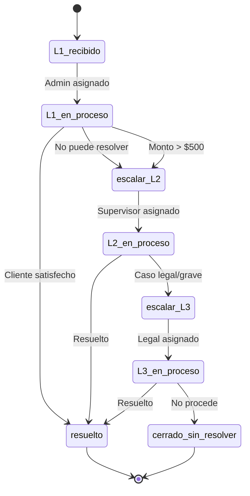

# 1.4.4.1 Escalamiento de Soporte

> Flujo de escalamiento cuando una queja no puede resolverse en primer nivel.

---

## Niveles de Soporte

| Nivel | Responsable | Casos | SLA |
|-------|-------------|-------|-----|
| **L1** | Admin General | Quejas estándar | 4 horas |
| **L2** | Supervisor | Quejas complejas, reembolsos >$500 | 24 horas |
| **L3** | Legal/Dirección | Amenazas legales, daños físicos | 48 horas |

---

## Flujo de Escalamiento



---

## Criterios de Escalamiento Automático

### A Nivel 2

| Criterio | Ejemplo |
|----------|---------|
| Monto compensación > $500 | Reembolso total |
| 3+ quejas del mismo cliente | Cliente problemático |
| Operador en plan de mejora | Requiere revisión |
| Sin respuesta en 4 horas | SLA vencido |

### A Nivel 3

| Criterio | Ejemplo |
|----------|---------|
| Mención de acciones legales | "Los voy a demandar" |
| Daño a propiedad reportado | "Rayaron mi auto" |
| Lesión o accidente | Cualquier mención |
| Medios de comunicación | "Voy a publicar en..." |

---

## UI de Escalamiento

```
┌─────────────────────────────────────────────────────────────────┐
│  ⚠️ ESCALAR CASO                                   #QJ-2026-047 │
├─────────────────────────────────────────────────────────────────┤
│                                                                 │
│  CASO ACTUAL                                                    │
│  ─────────────────────────────────────────────────              │
│  Cliente: María López                                           │
│  Queja: "El operador rayó mi auto durante el lavado"            │
│  Calificación: ⭐ (1 estrella)                                  │
│  Nivel actual: L1                                               │
│                                                                 │
│  MOTIVO DE ESCALAMIENTO                                         │
│  ─────────────────────────────────────────────────              │
│  ○ Monto supera mi autorización                                 │
│  ● Requiere investigación de daños                              │
│  ○ Cliente solicita hablar con supervisor                       │
│  ○ Posible caso legal                                           │
│  ○ Otro: [________________]                                     │
│                                                                 │
│  NIVEL DESTINO                                                  │
│  ─────────────────────────────────────────────────              │
│  ○ L2 - Supervisor                                              │
│  ● L3 - Legal (recomendado por daño a propiedad)               │
│                                                                 │
│  NOTAS PARA EL SIGUIENTE NIVEL                                  │
│  ─────────────────────────────────────────────────              │
│  [Cliente afirma que el operador Carlos M. rayó la puerta       │
│   trasera derecha. Solicita evidencia fotográfica del antes     │
│   y después que no tenemos registrada...]                       │
│                                                                 │
│  [ Cancelar ]                        [ Escalar caso ]           │
│                                                                 │
└─────────────────────────────────────────────────────────────────┘
```

---

## Notificaciones por Nivel

| Evento | L1 | L2 | L3 |
|--------|----|----|-----|
| Caso asignado | Push + Email | Push + Email + SMS | Push + Email + SMS + Llamada |
| SLA próximo a vencer | Push | Push + Email | Push + Email + SMS |
| SLA vencido | Email a L2 | Email a L3 | Email a Dirección |

---

## Modelo de Datos

```sql
CREATE TABLE escalamientos (
  id UUID PRIMARY KEY DEFAULT gen_random_uuid(),
  calificacion_id UUID REFERENCES calificaciones(id),
  
  -- Niveles
  nivel_origen VARCHAR(5), -- 'L1', 'L2'
  nivel_destino VARCHAR(5), -- 'L2', 'L3'
  
  -- Motivo
  motivo VARCHAR(100),
  notas TEXT,
  
  -- Asignación
  asignado_de UUID REFERENCES users(id), -- Quien escala
  asignado_a UUID REFERENCES users(id), -- Quien recibe
  
  -- Tiempos
  escalado_at TIMESTAMPTZ DEFAULT now(),
  aceptado_at TIMESTAMPTZ,
  sla_deadline TIMESTAMPTZ,
  
  -- Estado
  estado VARCHAR(20) DEFAULT 'pendiente',
  -- pendiente, en_proceso, resuelto, cerrado_sin_resolver
  
  resolucion TEXT,
  resuelto_at TIMESTAMPTZ
);

-- Vista para dashboard de escalamientos
CREATE VIEW escalamientos_activos AS
SELECT 
  e.*,
  c.comentario as queja,
  u.nombre as cliente_nombre,
  CASE 
    WHEN e.sla_deadline < now() THEN 'vencido'
    WHEN e.sla_deadline < now() + interval '1 hour' THEN 'critico'
    ELSE 'normal'
  END as urgencia
FROM escalamientos e
JOIN calificaciones c ON e.calificacion_id = c.id
JOIN users u ON c.cliente_id = u.id
WHERE e.estado NOT IN ('resuelto', 'cerrado_sin_resolver');
```

---

## SLA Timer

```typescript
// components/SLATimer.vue
<template>
  <div :class="['sla-timer', urgencia]">
    <Clock class="w-4 h-4" />
    <span v-if="tiempoRestante > 0">
      {{ formatTiempo(tiempoRestante) }} restantes
    </span>
    <span v-else class="text-red-600 font-bold">
      ⚠️ SLA VENCIDO hace {{ formatTiempo(Math.abs(tiempoRestante)) }}
    </span>
  </div>
</template>

<script setup lang="ts">
const props = defineProps<{ deadline: Date }>();

const tiempoRestante = computed(() => 
  differenceInMinutes(new Date(props.deadline), new Date())
);

const urgencia = computed(() => {
  if (tiempoRestante.value < 0) return 'vencido';
  if (tiempoRestante.value < 60) return 'critico';
  if (tiempoRestante.value < 240) return 'advertencia';
  return 'normal';
});
</script>
```

---

## Navegación

| ⬆️ Padre | [[Proyecto OnlyCarNLD/Datos/1.4.4 moderacion_respuestas]] |
|----------|----------------------------------|
| 🔗 Relacionado | [[Proyecto OnlyCarNLD/Datos/1.3.7 hub_chat_admin]] |

---
