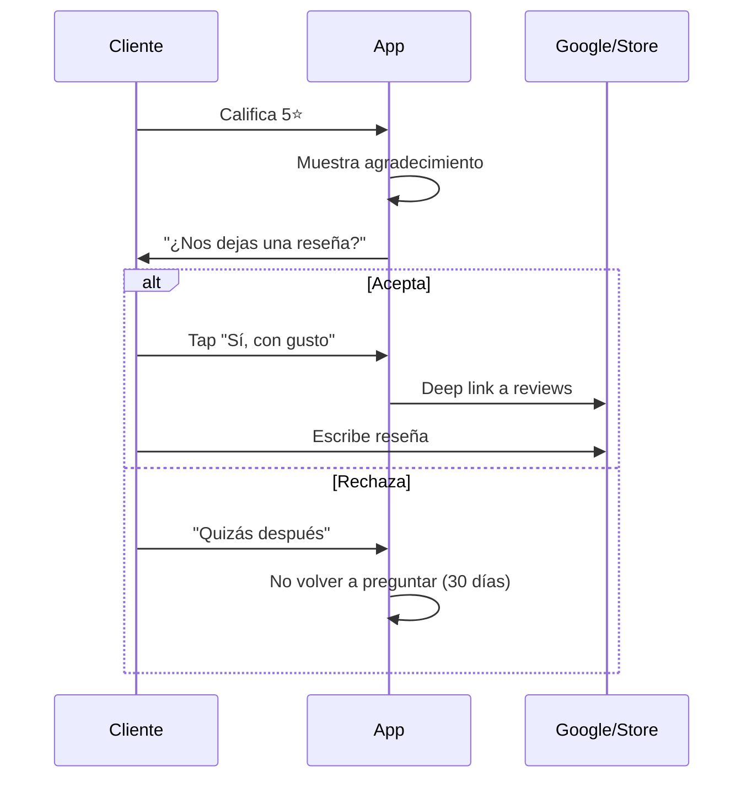
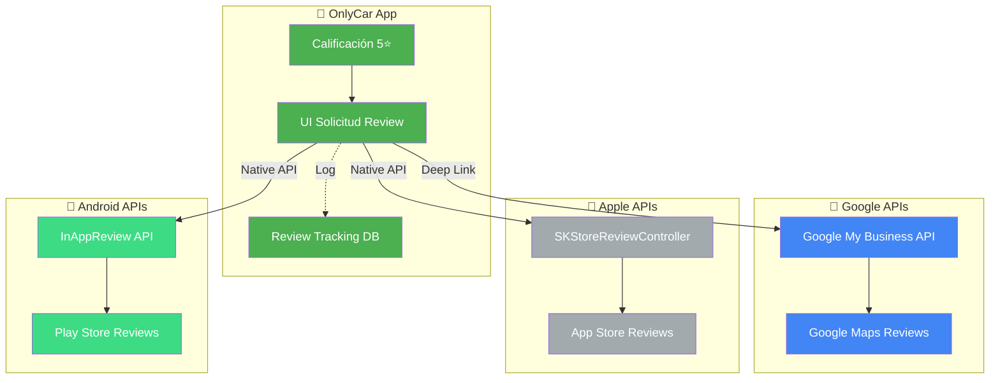

# 1.4.6 Integración con Reviews Externos

> 🔮 **MÓDULO FUTURO**: Integración con Google Reviews y tiendas de apps.

---

## Propósito

| Objetivo | Beneficio |
|----------|-----------|
| **SEO** | Mejorar posicionamiento en Google Maps |
| **Credibilidad** | Reviews visibles públicamente |
| **Descubrimiento** | Mejor ranking en App Store/Play Store |

---

## Flujo Propuesto



---

## UI Propuesta

```
┌─────────────────────────────────────────────────────────────────┐
│  ✅ ¡GRACIAS POR TU CALIFICACIÓN!                               │
├─────────────────────────────────────────────────────────────────┤
│                                                                 │
│  Tu opinión nos ayuda a mejorar ❤️                              │
│                                                                 │
│  ─────────────────────────────────────────────────              │
│                                                                 │
│  ¿Te gustaría compartir tu experiencia en Google?               │
│  Ayudarías a otros a descubrir OnlyCar.                      │
│                                                                 │
│  ┌─────────────────────────────────────────────────────────┐   │
│  │  [Google logo]  Dejar reseña en Google                  │   │
│  └─────────────────────────────────────────────────────────┘   │
│                                                                 │
│  ┌─────────────────────────────────────────────────────────┐   │
│  │  [App Store logo]  Calificar en App Store               │   │
│  └─────────────────────────────────────────────────────────┘   │
│                                                                 │
│  [ Quizás después ]                                             │
│                                                                 │
└─────────────────────────────────────────────────────────────────┘
```

---

## Deep Links

### Google Reviews

```typescript
const googleReviewUrl = (placeId: string) => 
  `https://search.google.com/local/writereview?placeid=${placeId}`;

// placeId de OnlyCar en Google Maps
const PLACE_ID = 'ChIJ...'; // TODO: Obtener al crear perfil business
```

### App Store (iOS)

```typescript
const appStoreReviewUrl = (appId: string) =>
  `https://apps.apple.com/app/id${appId}?action=write-review`;

// o usar SKStoreReviewController para in-app
import { SKStoreReviewController } from '@capacitor/app-review';

await SKStoreReviewController.requestReview();
```

### Play Store (Android)

```typescript
const playStoreReviewUrl = (packageName: string) =>
  `https://play.google.com/store/apps/details?id=${packageName}`;

// o usar in-app review API
import { InAppReview } from '@capacitor/in-app-review';

await InAppReview.requestReview();
```

---

## Estrategia de Solicitud

### Cuándo Pedir

| Condición | Acción |
|-----------|--------|
| Primera calificación 5⭐ | Pedir review |
| 3ra calificación 5⭐ consecutiva | Pedir con énfasis |
| Ya dejó review externo | No pedir |
| Rechazó en últimos 30 días | No pedir |

### Cuándo NO Pedir

| Condición | Razón |
|-----------|-------|
| Calificación ≤4⭐ | Riesgo de review negativo |
| Usuario nuevo (< 3 servicios) | Muestra insuficiente |
| Ya calificó este mes | Evitar spam |

---

## Tracking

```sql
CREATE TABLE review_requests (
  id UUID PRIMARY KEY DEFAULT gen_random_uuid(),
  cliente_id UUID REFERENCES users(id),
  
  plataforma VARCHAR(30), -- 'google', 'app_store', 'play_store'
  
  -- Interacción
  mostrado_at TIMESTAMPTZ DEFAULT now(),
  respuesta VARCHAR(20), -- 'aceptado', 'rechazado', 'ignorado'
  respondido_at TIMESTAMPTZ,
  
  -- Tracking (si es posible)
  review_confirmado BOOLEAN DEFAULT false,
  
  calificacion_id UUID REFERENCES calificaciones(id)
);

-- Evitar spam
CREATE UNIQUE INDEX idx_review_unique_30d ON review_requests(cliente_id, plataforma)
WHERE mostrado_at > now() - interval '30 days';
```

---

## Respuestas a Reviews Externos

### Google My Business API

```typescript
// Futuro: Responder a reviews desde el dashboard
const responderReviewGoogle = async (reviewId: string, respuesta: string) => {
  await fetch(
    `https://mybusiness.googleapis.com/v4/accounts/{account}/locations/{location}/reviews/${reviewId}/reply`,
    {
      method: 'PUT',
      headers: { Authorization: `Bearer ${token}` },
      body: JSON.stringify({ comment: respuesta }),
    }
  );
};
```

---

## Métricas de Éxito

| Métrica | Meta |
|---------|------|
| Tasa de aceptación | > 20% |
| Reviews externos/mes | > 10 |
| Rating promedio Google | > 4.5 |
| Rating promedio App Store | > 4.5 |

---

## Dependencias

| Servicio | Requisito |
|----------|-----------|
| Google My Business | Perfil verificado |
| App Store Connect | App publicada |
| Google Play Console | App publicada |

---

## Arquitectura de Integración



### Flujo Técnico

| Paso | iOS | Android | Web |
|------|-----|---------|-----|
| 1. Detectar | 5⭐ en calificación | 5⭐ en calificación | 5⭐ en calificación |
| 2. Mostrar | UI nativa | UI nativa | Modal HTML |
| 3. Review | SKStoreReviewController | InAppReview API | Deep link Google |
| 4. Tracking | review_requests tabla | review_requests tabla | review_requests tabla |

---

## Status

> 🔮 **ROADMAP FUTURO**
> 
> Este módulo está planificado para implementación posterior al lanzamiento.
> Requiere perfiles verificados en las plataformas externas.

---

## Navegación

| ⬆️ Padre | [[Proyecto OnlyCarNLD/Datos/1.4. sistema_calificacion_feedback]] |
|----------|----------------------------------------|
| ⬅️ Hermano anterior | [[Proyecto OnlyCarNLD/Datos/1.4.5 reportes_ejecutivos]] |

---
