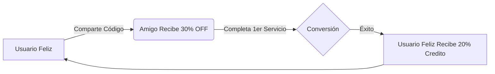

# 1.5.1 Estrategia de Crecimiento B2C

> Motor de adquisición para el mercado masivo individual.

---

## Viral Loops & Referidos

El crecimiento orgánico se basa en incentivar a los usuarios felices a traer nuevos usuarios.

### Mecánica "Invita y Gana"
*   **Referente:** Recibe 1 crédito de 20% OFF ([[Proyecto OnlyCarNLD/Datos/3.1.1.4 Sistema_Descuentos]]) por cada amigo que complete su primer servicio.
*   **Referido:** Recibe cupón `BIENVENIDA_REFERIDA` (30% OFF) en su primer servicio.
*   **Deep Dive:** Ver reglas de descuentos en [[Proyecto OnlyCarNLD/Datos/1.1.5 reglas_comerciales]].

---

## SEO Local

Dominar la intención de búsqueda transaccional en la zona operativa.

*   **Palabras Clave:** "lavado de autos a domicilio", "limpieza de tapicería", "autolavado cerca de mí".
*   **Estrategia:** Páginas de aterrizaje específicas por colonia/zona (Generadas programáticamente).
*   **Google My Business:** Optimización constante de fichas con fotos de "Antes/Después" ([[Proyecto OnlyCarNLD/Datos/1.4.1 flujo_calificacion]]).

---

## Retención B2C

*   **Recordatorios Amistosos:** Notificaciones automáticas basadas en la frecuencia de lavado ([[Proyecto OnlyCarNLD/Datos/1.3.13 recordatorios_amistosos]]).
*   **Programa de Lealtad:** Descuento progresivo cada 5 servicios (Futuro).

---

## Navegación

| ⬆️ Padre             | [[Proyecto OnlyCarNLD/Datos/1.5. estrategia_crecimiento]] |
| -------------------- | ------------------------------- |
| ➡️ Hermano siguiente | [[Proyecto OnlyCarNLD/Datos/1.5.2 estrategia_b2b]]        |

---
