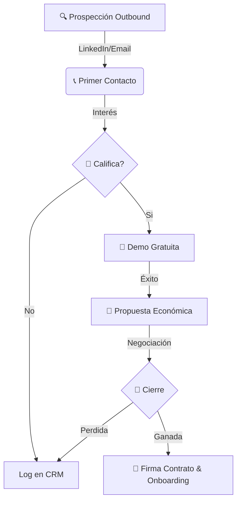

# 1.5.2 Estrategia de Crecimiento B2B

> Funnel de ventas consultivas para empresas y flotillas.

---

## Funnel de Ventas

El ciclo de venta B2B es más largo y requiere toque humano.

1.  **Prospección (Outbound):**
    *   Identificación de empresas con flotillas > 5 vehículos.
    *   Contacto vía LinkedIn Sales Navigator y Email Frío.
2.  **Demostración:**
    *   Servicio de prueba gratuito a un vehículo clave del tomador de decisiones.
3.  **Propuesta:**
    *   Presentación de ahorros y beneficios fiscales ([[Proyecto OnlyCarNLD/Datos/1.1.7 contratos_b2b]]).
4.  **Cierre:**
    *   Firma de contrato marco y alta en [[Proyecto OnlyCarNLD/Datos/1.2.4 cliente_b2b_perfil]].

---

## Alianzas Estratégicas

*   **Concesionarias:** Paquetes de lavado pre-entrega.
*   **Aseguradoras:** Lavado de cortesía post-reparación.
*   **Edificios Corporativos:** Activación del programa [[Proyecto OnlyCarNLD/Datos/1.1.8 programa_corporate_plus]] para empleados.

---

## Navegación

| ⬆️ Padre             | [[Proyecto OnlyCarNLD/Datos/1.5. estrategia_crecimiento]] |
| -------------------- | ------------------------------- |
| ⬅️ Hermano anterior  | [[Proyecto OnlyCarNLD/Datos/1.5.1 estrategia_b2c]]        |
| ➡️ Hermano siguiente | [[Proyecto OnlyCarNLD/Datos/1.5.3 canales_adquisicion]]   |

---
