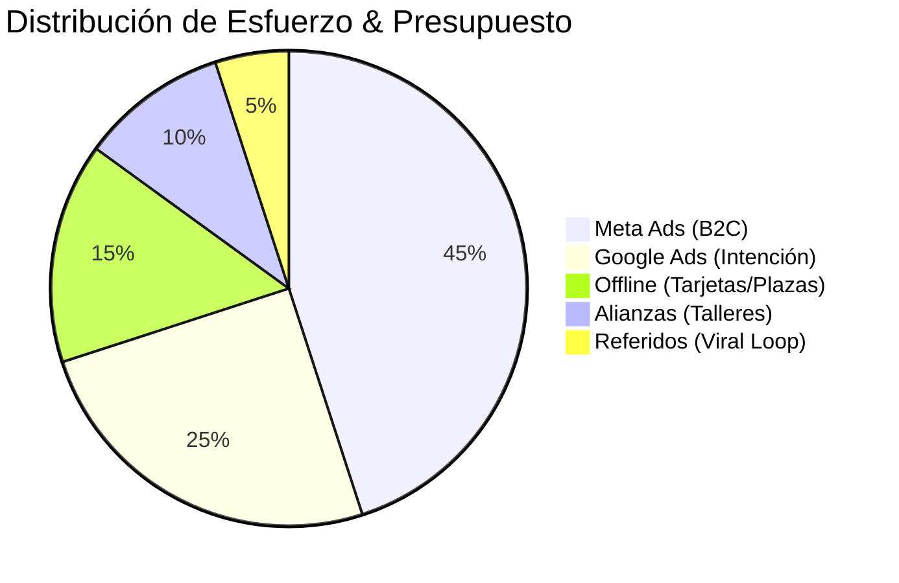

# 1.5.3 Canales de Adquisición

> Inventario y estrategia por canal de tráfico.

---

## Mix de Canales (Proyección)

## Canales Digitales (Paid Media)

*   **Meta Ads (Facebook/Instagram):**
    *   *Objetivo:* B2C Masivo.
    *   *Formato:* Video UGC (User Generated Content) mostrando el "Antes/Después".
    *   *Segmentación:* Geo-localizada + Intereses en autos.
*   **Google Ads (Search):**
    *   *Objetivo:* Captura de intención inmediata (B2B y B2C).
    *   *Keywords:* "Lavado de flotillas", "limpieza a domicilio".

## Canales Físicos (Offline)

*   **Tarjetas NFC "Parked Car":**
    *   Operadores dejan una tarjeta en autos sucios estacionados.
    *   Escaneo lleva a landing con descuento.
*   **Activaciones en Plazas:**
    *   Carpas temporales en estacionamientos de centros comerciales (Convenio).

## Partners

*   **Talleres Mecánicos:** Referencia cruzada (mecánica + limpieza).
*   **Gasolineras:** Publicidad en bombas de gasolina.

---

## Navegación

| ⬆️ Padre             | [[Proyecto OnlyCarNLD/Datos/1.5. estrategia_crecimiento]] |
| -------------------- | ------------------------------- |
| ⬅️ Hermano anterior  | [[Proyecto OnlyCarNLD/Datos/1.5.2 estrategia_b2b]]        |
| ➡️ Hermano siguiente | [[Proyecto OnlyCarNLD/Datos/1.5.4 estrategia_retencion]]  |

---
