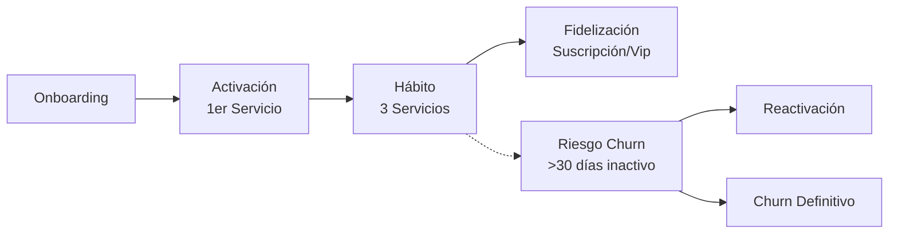

# 1.5.4 Estrategia de Retención (Lifecycle)

> "Adquirir un usuario es solo el principio; retenerlo es la rentabilidad."

> [!IMPORTANT]
> El éxito de OnlyCar no se mide en descargas, sino en **Servicios Recurrentes**.

---

## 1. Ciclo de Vida del Usuario (Lifecycle)

Gestión proactiva de cada etapa del usuario para evitar la fuga.

### 1.1 Definición de Estados

| Estado | Definición | Acción Estratégica |
| :--- | :--- | :--- |
| **Nuevo** | Registrado, 0 servicios. | **Activación:** Oferta de bienvenida (15% OFF). |
| **Activo** | 1 servicio en últimos 30 días. | **Nurturing:** Tips de cuidado automotriz. |
| **Recurrente** | >3 servicios en 90 días. | **Reward:** Acceso a beneficios Tier Plata. |
| **Dormido** | 45 días sin servicio. | **Reactivación:** "Te extrañamos" + Cupón. |
| **Churn** | >90 días sin servicio. | **Win-back:** Encuesta de salida + Oferta agresiva. |

---

## 2. Estrategias Anti-Churn

### 2.1 Detección Temprana (Early Warning)
El sistema monitorea señales de riesgo antes de que el usuario se vaya:
- **Señal:** Calificación < 3 estrellas en último servicio.
- **Acción:** Contacto inmediato de Soporte ([[Proyecto OnlyCarNLD/Datos/1.6.2 protocolos_soporte]]) + Garantía de satisfacción.
- **Señal:** Búsqueda de precios sin compra.
- **Acción:** Push notification con descuento flash (Vence en 2h).

### 2.2 Campañas de Win-Back
Para usuarios que ya han dejado la plataforma (Dormidos/Churn).

- **Canal:** Email + SMS (Costoso, usar con prudencia).
- **Mensaje:** No culpar, seducir. "Tu auto merece brillar de nuevo".
- **Oferta:** Descuento escalonado (10% -> 20% -> Crédito directo).

---

## 3. Programa de Lealtad (Loyalty Loops)

Gamificación ligera para incentivar la frecuencia sin quemar margen.

### 3.1 Badges y Reconocimiento
- **"Primeros Pasos":** 1er servicio completado.
- **"Impecable":** 5 servicios completados.
- **"Coleccionista":** Probó 3 tipos de servicios diferentes.

### 3.2 Beneficios por Frecuencia
No es un sistema de puntos complejo, sino hitos simples:
- **Hito 5:** Envío de cera premium gratis en el siguiente servicio.
- **Hito 10:** Servicio "Lavado Express" bonificado al 100%.

---

## 4. Retención B2B (Corporativa)

La retención B2B es relacional, no transaccional.

- **Account Manager:** Asignado a cuentas de >20 autos.
- **Reportes de Impacto:** Envío mensual de ahorro de agua y huella de carbono (para sus reportes ESG).
- **Renovación Anticipada:** Alertas 60 días antes de vencer contrato.

---

## Navegación

| ⬆️ Padre | [[Proyecto OnlyCarNLD/Datos/1.5. estrategia_crecimiento]] |
| :--- | :--- |
| ⬅️ Anterior | [[Proyecto OnlyCarNLD/Datos/1.5.3 canales_adquisicion]] |
| ➡️ Siguiente | [[Proyecto OnlyCarNLD/Datos/1.5.5 alianzas_estrategicas]] |
