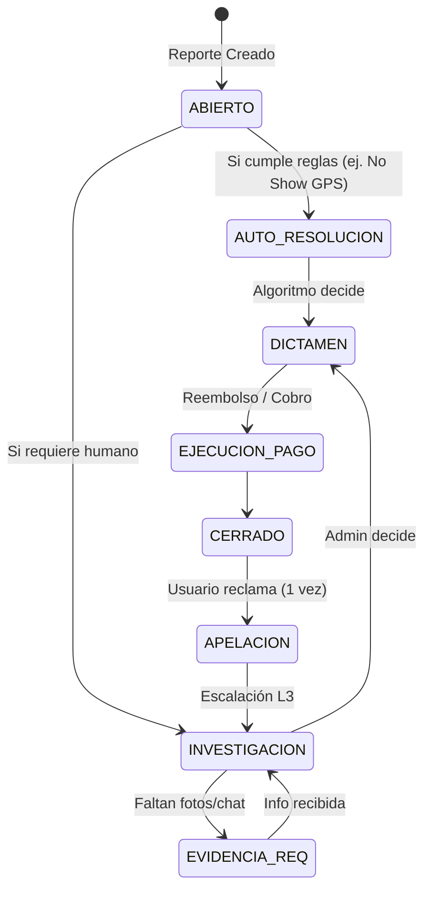

# 1.6.3.2 Flujos de Resolución de Disputas

> Lógica de estado para llevar una disconformidad desde el reporte hasta el cierre financiero.

---

## 1. Ciclo de Vida de la Disputa

---

## 2. Lógica de "Juicio Automático"

Para reducir carga operativa, ciertas incidencias se resuelven sin intervención humana si hay **Invariantes de Datos** claros.

### Caso: Operador No Show (`OP-NS-01`)
*   **Condición:** 
    1. Hora actual > Hora Cita + 15 min.
    2. GPS Operador > 1km del destino (ver [[Proyecto OnlyCarNLD/Datos/5.8. geolocalizacion]]).
    3. Operador no ha marcado "Llegué".
*   **Resolución Automática:**
    1. Cancelar cita.
    2. Reembolsar 100% a Cliente.
    3. Emitir Cupón Compensación 20%.
    4. Penalizar Operador (ver [[Proyecto OnlyCarNLD/Datos/3.1.8 sistema_remuneracion]]).

### Caso: Cancelación Tardía Cliente
*   **Condición:**
    1. Cliente cancela < 2 horas antes.
*   **Resolución Automática:**
    1. Cobrar "Cancellation Fee" ($50 MXN).
    2. Transferir fee a Operador como compensación.

---

## 3. Protocolo de Investigación Humana

Para casos subjetivos (ej. `CL-COM-01` Calidad Deficiente), el agente debe seguir este checklist:

1.  **Revisión Visual:** Comparar fotos "Antes" (ingreso) vs "Después" (evidencia cliente).
2.  **Revisión Chat:** Buscar señales de grosería o instrucciones ignoradas en [[Proyecto OnlyCarNLD/Datos/1.3.3 chat_operador_cliente]].
3.  **Historial:** ¿Es la primera queja de este cliente? ¿El operador tiene reincidencia?

---

## Navegación

| ⬆️ Padre             | [[Proyecto OnlyCarNLD/Datos/1.6.3 gestion_incidencias]] |
| -------------------- | ----------------------------- |
| ⬅️ Hermano anterior  | [[Proyecto OnlyCarNLD/Datos/1.6.3.1 matriz_tipificacion_incidencias]] |
| ➡️ Hermano siguiente | [[Proyecto OnlyCarNLD/Datos/1.6.3.3 politicas_compensacion]] |
