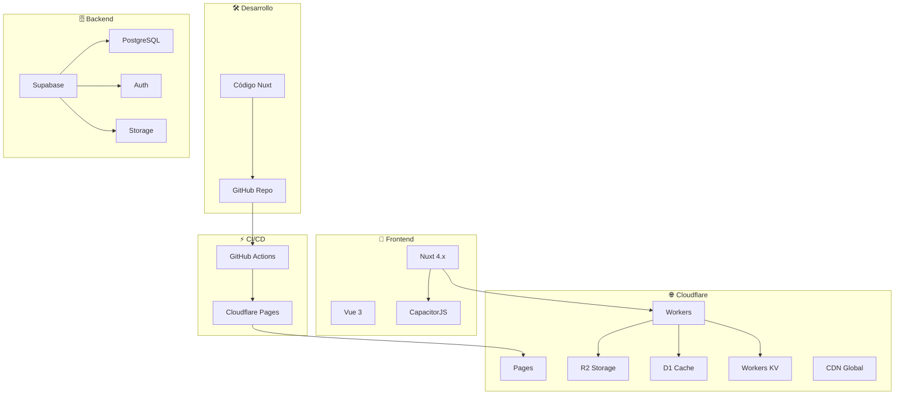

# 2.1 FullStack

> Stack tecnológico completo para el sistema OnlyCar.

---

## Estructura de Hijos (Deep Dive)

| ID | Nombre | Descripción | Estado |
|----|--------|-------------|--------|
| [[Proyecto OnlyCarNLD/Datos/2.1.1 Nuxt_Configuration\|2.1.1]] | Nuxt Configuration | Análisis de `nuxt.config.ts` | ✅ |
| [[Proyecto OnlyCarNLD/Datos/2.1.2 Capacitor_Bridge\|2.1.2]] | Capacitor Bridge | Comunicación JSI Nativa | ✅ |
| [[Proyecto OnlyCarNLD/Datos/2.1.3 Cloudflare_Architecture\|2.1.3]] | Cloudflare Architecture | Workers, R2, D1 Internals | ✅ |

---

## Arquitectura



---

## Stack Completo

| Capa | Tecnología | Uso |
|------|------------|-----|
| **Frontend** | Nuxt 4.x + Vue 3 | SSR, SPA, PWA |
| **Mobile** | CapacitorJS | iOS, Android, Desktop |
| **Deploy** | GitHub + CloudflarePages | CI/CD automático |
| **Edge** | Cloudflare Workers | Serverless, APIs |
| **Storage** | Cloudflare R2 | Imágenes WebP |
| **Cache** | Cloudflare D1 + KV | Metadata, sesiones |
| **Backend** | Supabase/PostgreSQL | Auth, datos, realtime |
| **CDN** | Cloudflare | Global, WAF, SSL |

---

## Flujo de Deployment

```
1. Developer hace commit → GitHub
       │
       ▼
2. GitHub Actions detecta push
       │
       ▼
3. Build Nuxt (npm run build)
       │
       ▼
4. Deploy a Cloudflare Pages
       │
       ▼
5. CDN global actualizada
       │
       ▼
6. Workers Edge Functions activas
```

---

## Configuración GitHub → CloudflarePages

```yaml
# .github/workflows/deploy.yml
name: Deploy to Cloudflare Pages

on:
  push:
    branches: [main]

jobs:
  deploy:
    runs-on: ubuntu-latest
    steps:
      - uses: actions/checkout@v4
      
      - name: Setup Node
        uses: actions/setup-node@v4
        with:
          node-version: 20
          
      - name: Install dependencies
        run: npm ci
        
      - name: Build
        run: npm run build
        env:
          NITRO_PRESET: cloudflare-pages
          
      - name: Deploy to Cloudflare Pages
        uses: cloudflare/pages-action@v1
        with:
          apiToken: ${{ secrets.CLOUDFLARE_API_TOKEN }}
          accountId: ${{ secrets.CLOUDFLARE_ACCOUNT_ID }}
          projectName: onlycar
          directory: .output/public
```

---

## Variables de Entorno

| Variable | Descripción |
|----------|-------------|
| `CLOUDFLARE_API_TOKEN` | Token API Cloudflare |
| `CLOUDFLARE_ACCOUNT_ID` | ID cuenta Cloudflare |
| `SUPABASE_URL` | URL proyecto Supabase |
| `SUPABASE_KEY` | Anon key Supabase |

---

## Navegación

| ⬆️ Padre             | [[Proyecto OnlyCarNLD/Datos/2.0. tecnologia]]        |
| -------------------- | -------------------------- |
| ➡️ Hermano siguiente | [[Proyecto OnlyCarNLD/Datos/2.2. Docs]]              |

---
