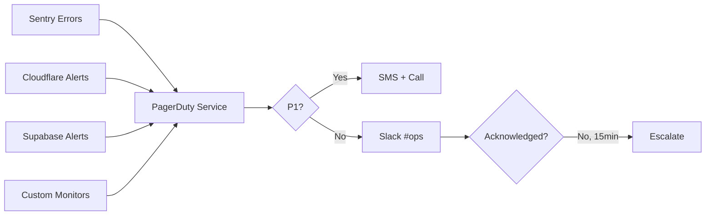

# 2.11.5 Alerting Strategy

> Las alertas deben ser accionables, no ruido.

---

## Principios de Alerting

1. **Accionable:** Cada alerta requiere intervención humana
2. **Urgente:** Si no es urgente, no es alerta (es log)
3. **Contextual:** Incluir link a runbook y datos relevantes
4. **Sin Fatiga:** < 5 alertas/día promedio

---

## Matriz de Severidad

| Severidad | Ejemplo | Canal | SLA Respuesta |
|-----------|---------|-------|---------------|
| **P1 Critical** | App Down, DB corrupto | PagerDuty + SMS | 5 min |
| **P2 High** | Error rate > 5%, Latency > 3s | PagerDuty + Slack | 15 min |
| **P3 Medium** | Disk > 80%, Cert expiring | Slack #ops | 4 horas |
| **P4 Low** | Warning patterns | Slack #dev | 24 horas |

---

## Stack de Alertas



---

## Configuración PagerDuty

### Escalation Policy

```yaml
# onlycar-critical-escalation
levels:
  - level: 1
    delay_minutes: 0
    targets:
      - type: user
        name: DevOps On-Call
  
  - level: 2
    delay_minutes: 15
    targets:
      - type: user
        name: Engineering Lead
  
  - level: 3
    delay_minutes: 30
    targets:
      - type: user
        name: CTO
```

### Slack Integration

```typescript
// server/utils/alert.ts
export async function sendAlert(
  severity: 'critical' | 'high' | 'medium' | 'low',
  title: string,
  details: Record<string, any>
) {
  const color = {
    critical: '#FF0000',
    high: '#FF6600',
    medium: '#FFCC00',
    low: '#00CC00'
  }[severity];

  await $fetch(process.env.SLACK_WEBHOOK!, {
    method: 'POST',
    body: {
      attachments: [{
        color,
        title: `[${severity.toUpperCase()}] ${title}`,
        fields: Object.entries(details).map(([k, v]) => ({
          title: k,
          value: String(v),
          short: true
        })),
        footer: 'OnlyCar Alerts',
        ts: Date.now() / 1000
      }]
    }
  });

  if (severity === 'critical' || severity === 'high') {
    await triggerPagerDuty(title, details);
  }
}
```

---

## Alertas Configuradas

### Sentry (Application Errors)

| Condición | Alerta |
|-----------|--------|
| New unhandled exception | P2 → Slack |
| Error rate > 1% (1h) | P2 → PagerDuty |
| Same error > 100 times (1h) | P3 → Slack |

### Cloudflare (Infrastructure)

| Condición | Alerta |
|-----------|--------|
| Origin down | P1 → PagerDuty + SMS |
| DDoS attack detected | P2 → PagerDuty |
| SSL cert < 14 days | P3 → Slack |

### Supabase (Database)

| Condición | Alerta |
|-----------|--------|
| Connection pool exhausted | P1 → PagerDuty |
| Query latency > 2s | P2 → Slack |
| Storage > 80% | P3 → Slack |

---

## Anti-Patterns a Evitar

❌ Alertar por cada 4xx (son esperados)
❌ Alertar por logs de debug
❌ Sin link a runbook
❌ Mensajes genéricos "Something went wrong"

---

## Relaciones

- Monitorea: [[Proyecto OnlyCarNLD/Datos/2.11.1 Logging_Strategy|Logs]]
- Trackea: [[Proyecto OnlyCarNLD/Datos/2.11.2 Error_Tracking|Errores Sentry]]
- Escala a: [[Proyecto OnlyCarNLD/Datos/2.19.2 Restore_Procedures|Procedimientos DR]]

---

## Navegación

| ⬆️ Padre             | [[Proyecto OnlyCarNLD/Datos/2.11. Observabilidad]]       |
| -------------------- | ------------------------------ |
| ⬅️ Hermano anterior  | [[Proyecto OnlyCarNLD/Datos/2.11.4 Metrics_Dashboards]] |
| ➡️ Hermano siguiente | <!-- 2.11.6 Tracing_Distributed (Pendiente) --> |

---
