# 2.17.4 Cache Strategy

> "La request más rápida es la que no se hace".

---

## Capas de Caché

```mermaid
flowchart TD
    App[📱 App] --> |1. Memory| MEM{Pinia}
    MEM --> |Hit| UI[Render]
    MEM --> |Miss| SW{Service Worker}
    
    SW --> |2. Disk/Offline| IDB[(IndexedDB)]
    SW --> |Miss - Network| CDN{3. Cloudflare Edge}
    
    CDN --> |Hit| SW
    CDN --> |Miss| API[Server Nitro]
    
    API --> |4. Redis/Internal| KV[(Redis)]
    API --> |5. Query| DB[(Supabase Postgres)]
```



---

## Estrategias por Tipo de Dato

| Tipo de Dato | Estrategia | TTL (Time To Live) | Herramienta |
|--------------|------------|--------------------|-------------|
| **Catálogo Servicios** | Stale-While-Revalidate | 24 horas | Workbox / Pinia |
| **Perfil Usuario** | Network First | 0 (Realtime) | Supabase Auth |
| **Feed Vehículos** | Cache First (con exp) | 1 hora | IndexedDB |
| **Imágenes Estáticas** | Cache Forever | 1 año (inmutable) | CDN |

---

## Configuración Nuxt (Nitro)

Para cachear respuestas de API en el Edge (Cloudflare):

```typescript
// server/api/servicios.ts
export default defineEventHandler(async (event) => {
  setResponseHeader(event, 'Cache-Control', 'public, max-age=3600, s-maxage=3600');
  
  // O usar storage layer de Nitro
  return await useStorage('cache').getItem('servicios') || fetchFromDB();
});
```

---

## Service Worker (Offline)

Usamos **Vite PWA Plugin** con estrategia Workbox.

```typescript
// nuxt.config.ts
pwa: {
  workbox: {
    runtimeCaching: [
      {
        urlPattern: /^https:\/\/api\.onlycar\.mx\/catalogo/,
        handler: 'StaleWhileRevalidate',
        options: {
          cacheName: 'api-catalogo',
          expiration: {
            maxEntries: 50,
            maxAgeSeconds: 86400 // 24h
          }
        }
      },
      {
        urlPattern: /^https:\/\/.*\.supabase\.co\/storage/,
        handler: 'CacheFirst',
        options: {
          cacheName: 'images',
          expiration: {
            maxEntries: 100,
            maxAgeSeconds: 7 * 86400 // 1 semana
          }
        }
      }
    ]
  }
}
```

---

## Invalidación de Caché

La parte más difícil. Usamos invalidación basada en tags o eventos.

1. **Admin actualiza precio:** Webhook → Cloudflare Purge Cache.
2. **Usuario edita perfil:** Optimistic UI update local + Request de fondo.

---

## Navegación

| ⬆️ Padre             | [[Proyecto OnlyCarNLD/Datos/2.17. Performance_Strategy]] |
| -------------------- | ------------------------------ |
| ⬅️ Hermano anterior  | [[Proyecto OnlyCarNLD/Datos/2.17.3 Image_Optimization]]  |
| ➡️ Hermano siguiente | *(Último hijo de 2.17)*        |

---
