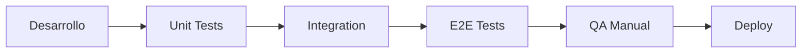

# 2.18.1 Estrategia de Testing

> Estrategia general de pruebas para OnlyCar.

---

## Niveles de Pruebas

| Nivel | Descripción | Herramientas |
|-------|-------------|--------------|
| **Unit** | Funciones individuales | Vitest |
| **Integration** | Componentes + API | Vitest + Nitro |
| **E2E** | Flujos completos | Playwright |
| **Manual** | UX, edge cases | Checklist |
| **Visual Regression** | Cambios visuales | Percy / Chromatic |

---

## Cobertura Objetivo

| Módulo | Cobertura mínima |
|--------|------------------|
| Auth | 90% |
| Pagos (Stripe) | 95% |
| Facturación (Gigstack) | 90% |
| Contratos (Mifiel) | 85% |
| API endpoints | 80% |
| Componentes UI | 75% |

---

## Ambientes

| Ambiente | Propósito | Tests |
|----------|-----------|-------|
| **Local** | Desarrollo | Unit, Component |
| **Staging** | Pre-producción | Integration, E2E, QA |
| **Production** | Live | Smoke tests, Monitoreo |

---

## Ciclo de Pruebas

---

## Navegación

| ⬆️ Padre             | [[Proyecto OnlyCarNLD/Datos/2.18. Testing_Infrastructure]] |
| -------------------- | -------------------------------- |
| ➡️ Hermano siguiente | [[Proyecto OnlyCarNLD/Datos/2.18.2 Tipos_Pruebas]]         |

---
