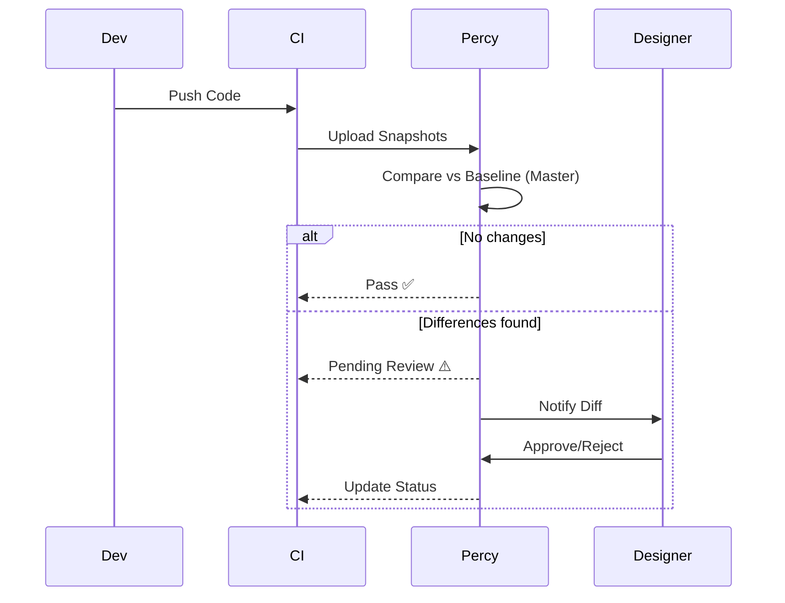

# 2.18.5 Visual Regression Testing

> Detección automática de cambios en píxeles. "Si se ve diferente, avisa".

---

## Herramientas

Utilizamos **Percy** (o Chromatic) integrado con Cypress/Playwright.

---

## Configuración Playwright + Percy

```typescript
// tests/e2e/visual.spec.ts
import { test, expect } from '@playwright/test';
import percySnapshot from '@percy/playwright';

test('Homepage visual regression', async ({ page }) => {
  await page.goto('/');
  await expect(page).toHaveTitle(/OnlyCar/);
  
  // Captura snapshot y envía a Percy Cloud
  await percySnapshot(page, 'Homepage - Desktop');
});

test('Mobile menu visual', async ({ page }) => {
  await page.setViewportSize({ width: 375, height: 812 }); // iPhone X
  await page.goto('/');
  await page.click('#menu-button');
  
  await percySnapshot(page, 'Mobile Menu - Open');
});
```

---

## Flujo de Aprobación



---

## Estrategia de Snapshots

No hacer snapshot de todo. Enfocarse en:

1. **Design System:** Botones, inputs, tarjetas (Storybook).
2. **Páginas Críticas:** Landing, Login, Dashboard Home.
3. **Estados Complejos:** Tablas con datos, Modales de confirmación.

---

## Manejo de Datos Dinámicos

Para evitar falsos positivos (ej. fechas, datos aleatorios), usar mocks o máscaras:

```typescript
await percySnapshot(page, 'Dashboard', {
  percyCSS: `
    .dynamic-date { visibility: hidden; }
    .user-avatar { opacity: 0; }
  `
});
```

---

## Navegación

| ⬆️ Padre             | [[Proyecto OnlyCarNLD/Datos/2.18. Testing_Infrastructure]] |
| -------------------- | -------------------------------- |
| ⬅️ Hermano anterior  | [[Proyecto OnlyCarNLD/Datos/2.18.4 Coverage_Reporting]]    |
| ➡️ Hermano siguiente | [[Proyecto OnlyCarNLD/Datos/2.18.6 Mobile_Testing]]        |

---
