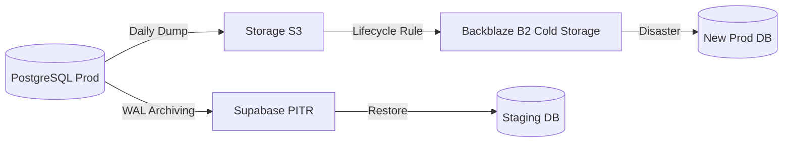

# 2.19.1 Backup Automation

> "El backup no existe hasta que el restore funciona". Automatización completa de respaldos.

---

## Estrategia de Backup 3-2-1

| Regla | Implementación |
|-------|----------------|
| **3 copias** | Original + Supabase PITR + Backblaze B2 |
| **2 medios** | PostgreSQL + Object Storage (R2) |
| **1 offsite** | Backblaze B2 (diferente proveedor) |

---

## Backup de Base de Datos

### Flujo de Respaldo 3-2-1



### Supabase PITR (Point-in-Time Recovery)

```bash
# Verificar estado de backups automáticos
supabase db remote status

# Backup manual antes de deploy grande
supabase db dump -f backup_$(date +%Y%m%d).sql
```

**Configuración:**
- Retención: 7 días (plan Pro)
- RPO: 5 minutos (WAL archiving)
- RTO objetivo: < 1 hora

---

## Backup de Storage (Fotos)

### Restic a Backblaze B2

```bash
#!/bin/bash
# /ops/scripts/backup-storage.sh

export RESTIC_REPOSITORY="b2:onlycar-backups"
export RESTIC_PASSWORD_FILE="/etc/restic/password"

# Sincronizar desde Supabase Storage
rclone sync supabase:onlycar-bucket /tmp/storage-sync

# Backup incremental
restic backup /tmp/storage-sync \
  --tag storage \
  --tag $(date +%Y-%m-%d)

# Cleanup (mantener 30 días)
restic forget --keep-daily 7 --keep-weekly 4 --keep-monthly 3

# Cleanup local
rm -rf /tmp/storage-sync
```

---

## Cron Jobs

```cron
# /etc/cron.d/onlycar-backups

# Backup diario de storage a las 3 AM UTC
0 3 * * * root /ops/scripts/backup-storage.sh >> /var/log/backup.log 2>&1

# Verificación semanal de integridad
0 4 * * 0 root restic check >> /var/log/restic-check.log 2>&1

# Alerta si backup falla
*/15 * * * * root /ops/scripts/check-backup-health.sh
```

---

## Verificación Automática

```bash
#!/bin/bash
# /ops/scripts/check-backup-health.sh

LAST_BACKUP=$(restic snapshots --latest 1 --json | jq -r '.[0].time')
HOURS_AGO=$(( ($(date +%s) - $(date -d "$LAST_BACKUP" +%s)) / 3600 ))

if [ $HOURS_AGO -gt 25 ]; then
  curl -X POST "$SLACK_WEBHOOK" \
    -d '{"text":"⚠️ ALERTA: Último backup hace '$HOURS_AGO' horas"}'
fi
```

---

## Métricas

| Métrica | Objetivo | Actual |
|---------|----------|--------|
| Backup success rate | 99.9% | Monitorear |
| Tiempo de backup | < 30 min | Monitorear |
| Storage usado | < 500 GB | Monitorear |

---

## Relaciones

- Implementa política de: [[Proyecto OnlyCarNLD/Datos/3.4.4 Disaster_Recovery|Plan DR]]
- Restaura en: [[Proyecto OnlyCarNLD/Datos/2.19.2 Restore_Procedures|Procedimientos de Restore]]
- Alerta via: [[Proyecto OnlyCarNLD/Datos/2.11.5 Alerting_Strategy|Sistema de Alertas]]

---

## Navegación

| ⬆️ Padre             | [[Proyecto OnlyCarNLD/Datos/2.19. Disaster_Recovery_Tech]] |
| -------------------- | -------------------------------- |
| ➡️ Hermano siguiente | [[Proyecto OnlyCarNLD/Datos/2.19.2 Restore_Procedures]]    |

---
