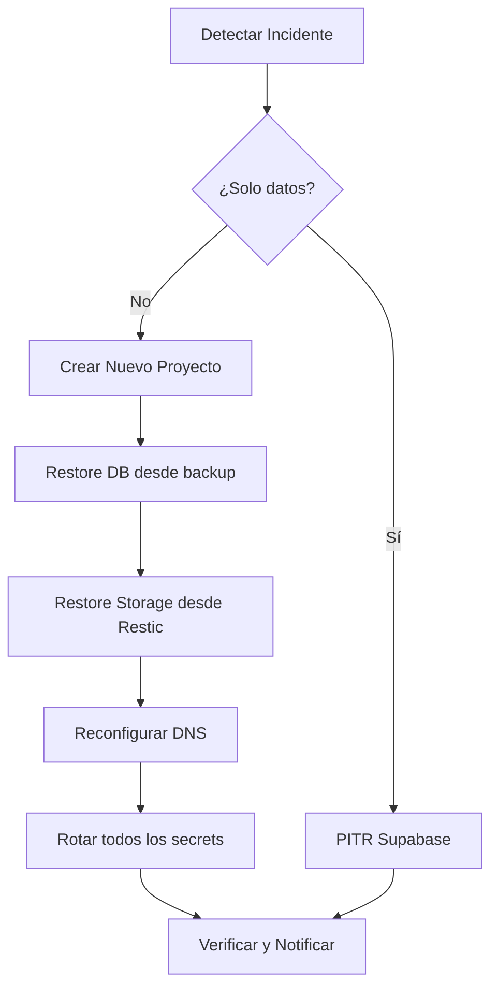

# 2.19.2 Restore Procedures

> Runbooks de recuperación ante desastre. Cada minuto cuenta.

---

## Escenarios de Recuperación

| Escenario | RTO | RPO | Procedimiento |
|-----------|-----|-----|---------------|
| Corrupción de datos | 1h | 5 min | PITR a punto específico |
| Borrado accidental | 2h | 24h | Restore de snapshot |
| Ransomware | 4h | 24h | Restore + rotación keys |
| Pérdida total datacenter | 8h | 24h | Restore a nuevo proyecto |

---

## Runbook: Restore de Base de Datos

### Paso 1: Evaluar Daño

```bash
# Verificar estado actual
supabase db remote status

# Identificar punto de corrupción (logs)
supabase logs --type db --since "2h ago"
```

### Paso 2: Restaurar PITR

```bash
# Listar puntos de restauración disponibles
supabase db restore list

# Restaurar a punto específico
supabase db restore --target-time "2026-01-22T20:00:00Z"

# Verificar integridad
supabase db remote execute "SELECT count(*) FROM users;"
```

### Paso 3: Validar Aplicación

```bash
# Correr tests de smoke
npm run test:smoke

# Verificar endpoints críticos
curl https://api.onlycar.mx/health
```

---

## Runbook: Restore de Storage

### Desde Restic (Backblaze B2)

```bash
# Listar snapshots disponibles
restic snapshots

# Restaurar snapshot específico
restic restore abc123 --target /tmp/restore-storage

# Sincronizar a Supabase Storage
rclone sync /tmp/restore-storage supabase:onlycar-bucket
```

---

## Runbook: Restore Completo (Worst Case)



### Comandos de Nuevo Proyecto

```bash
# 1. Crear proyecto Supabase nuevo
supabase projects create onlycar-recovery --region us-east-1

# 2. Restaurar esquema
supabase db push

# 3. Importar datos desde backup
psql $NEW_DB_URL < backup_20260122.sql

# 4. Actualizar DNS en Cloudflare
# (Manual via dashboard o API)

# 5. Actualizar secrets
doppler secrets set SUPABASE_URL=$NEW_URL --config prd
```

---

## Contactos de Emergencia

| Rol | Contacto | Disponibilidad |
|-----|----------|----------------|
| DevOps Lead | [REDACTED] | 24/7 |
| Supabase Support | support@supabase.io | Business hours |
| Cloudflare Support | Enterprise ticket | 24/7 |

---

## Post-Mortem Template

Después de cada incidente, documentar:

1. **Timeline:** ¿Qué pasó y cuándo?
2. **Impact:** ¿Cuántos usuarios afectados?
3. **Root Cause:** ¿Por qué pasó?
4. **Action Items:** ¿Cómo prevenir?

---

## Relaciones

- Ejecuta backups de: [[Proyecto OnlyCarNLD/Datos/2.19.1 Backup_Automation|Automatización]]
- Notifica via: [[Proyecto OnlyCarNLD/Datos/2.11.5 Alerting_Strategy|Sistema de Alertas]]
- Sigue política de: [[Proyecto OnlyCarNLD/Datos/3.4.4 Disaster_Recovery|Plan DR]]

---

## Navegación

| ⬆️ Padre             | [[Proyecto OnlyCarNLD/Datos/2.19. Disaster_Recovery_Tech]] |
| -------------------- | -------------------------------- |
| ⬅️ Hermano anterior  | [[Proyecto OnlyCarNLD/Datos/2.19.1 Backup_Automation]]     |
| ➡️ Hermano siguiente | [[Proyecto OnlyCarNLD/Datos/2.19.3 Failover_DNS]]          |

---
