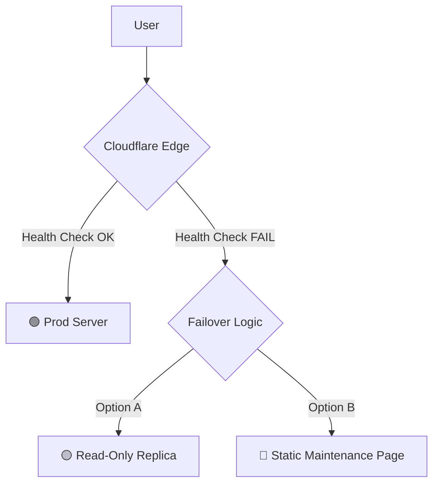

# 2.19.3 Failover DNS

> Cuando el servidor primario cae, el tráfico debe fluir a un lugar seguro.

---

## Arquitectura de Failover

Utilizamos **Cloudflare Load Balancing** para monitorear la salud del origen.



---

## Configuración de Health Checks

Cloudflare pingeando al origen cada 60s.

- **Path:** `/api/_health`
- **Expected Code:** `200`
- **Timeout:** `5s`
- **Retries:** `2`

Si falla 2 veces consecutivas → **Marcar como Unhealthy**.

---

## Página de Mantenimiento (Netlify)

En caso de fallo catastrófico total (ej. caída de región AWS), redirigimos a una página estática hosteada en Netlify/Vercel (fuera de nuestra infra principal).

**Contenido:**
- "Estamos en mantenimiento"
- Estado del incidente (iframe de status page)
- Link a soporte WhatsApp

**Switch Manual:**
```bash
./ops/emergency/switch-dns.sh maintenance
```

---

## Recuperación (Failback)

Automatizado. Cuando `/api/_health` retorna 200 consistentemente por 5 minutos, Cloudflare re-enruta el tráfico al origen primario.

---

## Navegación

| ⬆️ Padre             | [[Proyecto OnlyCarNLD/Datos/2.19. Disaster_Recovery_Tech]] |
| -------------------- | -------------------------------- |
| ⬅️ Hermano anterior  | [[Proyecto OnlyCarNLD/Datos/2.19.2 Restore_Procedures]]    |
| ➡️ Hermano siguiente | *(Último hijo de 2.19)*          |

---
