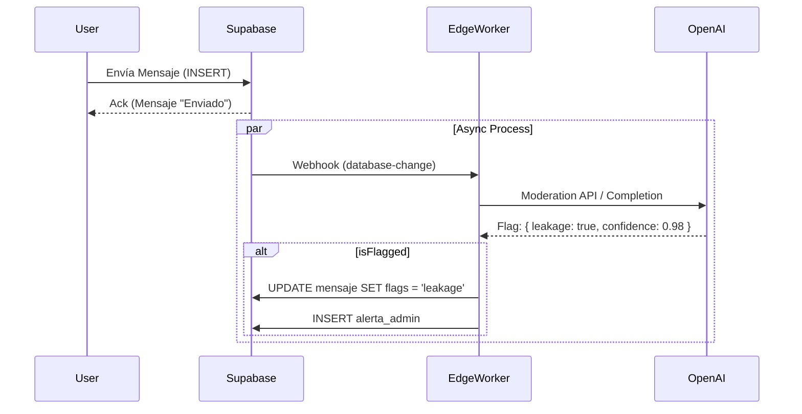

# 2.20.3 LLM Moderación Chat

> **[FUTURO]** Guardianes conversacionales automatizados para proteger el negocio y a los usuarios.

---

## Objetivos de Moderación

El chat entre Cliente y Operador es un vector de riesgo. La IA monitorea en busca de:

1.  **Disintermediación (Leakage):** "Pásame tu WhatsApp", "Te pago por fuera", "Cancela y nos arreglamos".
2.  **Toxicidad:** Insultos, acoso, lenguaje inapropiado.
3.  **Seguridad:** Intercambio de datos sensibles no necesarios.

---

## Arquitectura de Procesamiento

Para no añadir latencia al envío de mensajes (UX), la moderación es **Asíncrona**.

---

## Lógica de Negocio

### Reacción ante "Leakage"
*   **Primer aviso:** Mensaje automático del sistema en el chat: *"Por tu seguridad, mantén los pagos y comunicación dentro de OnlyCar."*
*   **Reincidencia:** Shadowban temporal o bloqueo de chat.

### Reacción ante Toxicidad
*   **Alta Confianza:** Ocultar mensaje automáticamente (Blur) con botón "Mostrar mensaje potencialmente ofensivo".
*   **Notificación:** Alerta inmediata al equipo de Soporte ([[Proyecto OnlyCarNLD/Datos/1.6.3 gestion_incidencias]]).

---

## Navegación

| ⬆️ Padre             | [[Proyecto OnlyCarNLD/Datos/2.20. Arquitectura_IA_Biometria]] |
| -------------------- | ----------------------------------- |
| ⬅️ Hermano anterior  | [[Proyecto OnlyCarNLD/Datos/2.20.2 AI_Vision_Vehicular]]      |
| ➡️ Hermano siguiente | [[Proyecto OnlyCarNLD/Datos/2.20.4 Edge_AI_Processing]]       |

---
