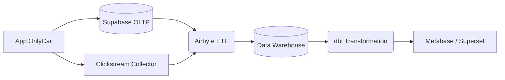

# 2.21 Data Pipeline & Analytics

> **[FUTURO]** La infraestructura necesaria para convertir datos crudos en decisiones de negocio estratégicas.

---

## Visión General

Supabase (PostgreSQL) es excelente para la operación transaccional (OLTP), pero no para análisis masivo (OLAP). Este módulo define cómo moveremos los datos a un entorno analítico dedicado.

**Objetivo:** Permitir queries complejos ("¿Cuál es el LTV de usuarios que llegaron por Facebook en Monterrey?") sin alentar la app.

---

## Estructura de Hijos

| ID | Nombre | Descripción | Estado |
|----|--------|-------------|--------|
| [[Proyecto OnlyCarNLD/Datos/2.21.1 Estructura_Data_Warehouse\|2.21.1]] | Estructura Data Warehouse | Modelado dimensional (Star Schema) | 🔮 |
| [[Proyecto OnlyCarNLD/Datos/2.21.2 Pipeline_Ingesta_Eventos\|2.21.2]] | Pipeline Ingesta Eventos | Clickstream y ETL desde Supabase | 🔮 |
| [[Proyecto OnlyCarNLD/Datos/2.21.3 Privacidad_Anonimizacion\|2.21.3]] | Privacidad y Anonimización | Hashing de PII y cumplimiento legal | 🔮 |
| [[Proyecto OnlyCarNLD/Datos/2.21.4 KPIs_Predictivos\|2.21.4]] | KPIs Predictivos | Churn, LTV y Demand Forecasting | 🔮 |

---

## Arquitectura ELT (Extract, Load, Transform)

---

## Navegación

| ⬆️ Padre             | [[Proyecto OnlyCarNLD/Datos/2.0. tecnologia]]          |
| -------------------- | ---------------------------- |
| ⬅️ Hermano anterior  | [[Proyecto OnlyCarNLD/Datos/2.20. Arquitectura_IA_Biometria]] |
| ➡️ Hermano siguiente | *No tiene* |

---
