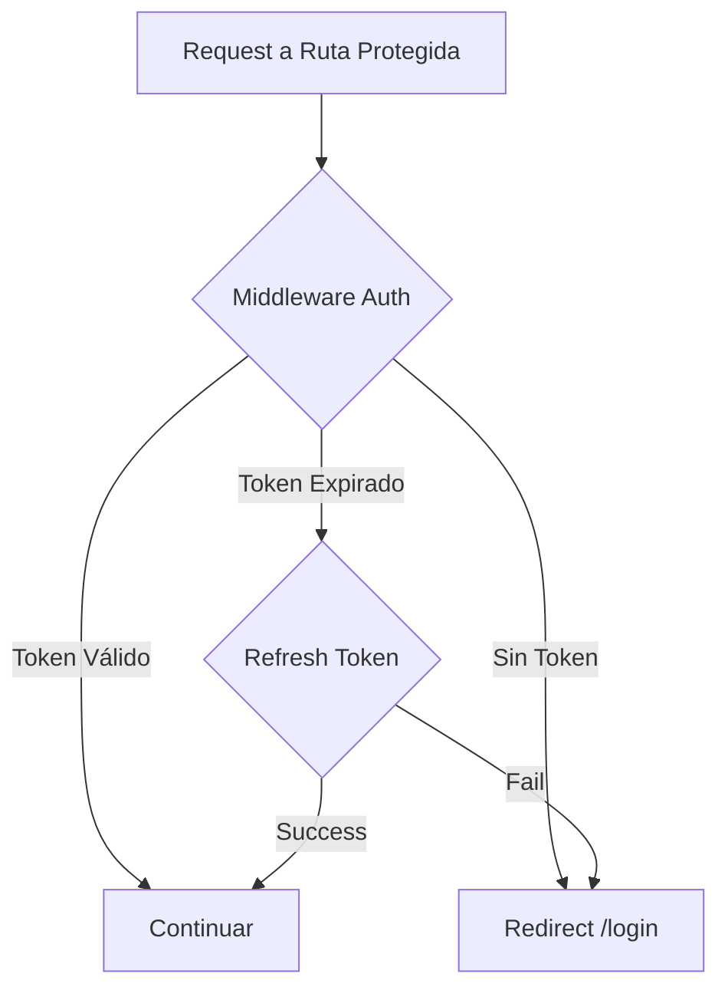

# 2.5.3.1 Auth Guards

> Protección de rutas que requieren usuario autenticado.

---

## Estrategia de Protección



---

## Implementación Middleware

```typescript
// middleware/auth.ts
export default defineNuxtRouteMiddleware(async (to, from) => {
  const user = useSupabaseUser();
  const session = useSupabaseSession();
  
  // Si no hay usuario, redirigir a login
  if (!user.value) {
    return navigateTo({
      path: '/login',
      query: { redirect: to.fullPath }
    });
  }
  
  // Verificar si la sesión está por expirar (< 5 min)
  if (session.value?.expires_at) {
    const expiresAt = new Date(session.value.expires_at * 1000);
    const now = new Date();
    const minutesRemaining = (expiresAt.getTime() - now.getTime()) / 60000;
    
    if (minutesRemaining < 5) {
      // Intentar refresh silencioso
      const { error } = await useSupabaseClient().auth.refreshSession();
      if (error) {
        return navigateTo('/login?session=expired');
      }
    }
  }
});
```

---

## Aplicación en Páginas

### Protección Individual

```vue
<!-- pages/dashboard.vue -->
<script setup>
definePageMeta({
  middleware: 'auth'
});
</script>
```

### Protección de Directorio Completo

```typescript
// middleware/auth.global.ts
export default defineNuxtRouteMiddleware((to) => {
  const protectedPaths = ['/dashboard', '/profile', '/orders'];
  
  if (protectedPaths.some(path => to.path.startsWith(path))) {
    // Lógica de auth aquí
  }
});
```

---

## Manejo de Sesión Expirada

```typescript
// plugins/session-watcher.client.ts
export default defineNuxtPlugin(() => {
  const client = useSupabaseClient();
  
  client.auth.onAuthStateChange((event, session) => {
    if (event === 'TOKEN_REFRESHED') {
      console.log('Session refreshed');
    }
    
    if (event === 'SIGNED_OUT') {
      navigateTo('/login');
    }
  });
});
```

---

## Página de Login con Redirect

```vue
<!-- pages/login.vue -->
<script setup>
const route = useRoute();
const redirectPath = computed(() => route.query.redirect || '/dashboard');

async function handleLogin(credentials) {
  const { error } = await supabase.auth.signInWithPassword(credentials);
  
  if (!error) {
    await navigateTo(redirectPath.value);
  }
}
</script>
```

---

## Relaciones

- Complementa: [[Proyecto OnlyCarNLD/Datos/2.5.3.2 Role_Guards|Guards de Rol]]
- Usa: [[Proyecto OnlyCarNLD/Datos/5.6. autenticacion|Sistema Auth]]
- Configura: [[Proyecto OnlyCarNLD/Datos/2.5.3 Middleware_Routing|Middleware General]]

---

## Navegación

| ⬆️ Padre             | [[Proyecto OnlyCarNLD/Datos/2.5.3 Middleware_Routing]]  |
| -------------------- | ----------------------------- |
| ➡️ Hermano siguiente | [[Proyecto OnlyCarNLD/Datos/2.5.3.2 Role_Guards]]       |

---
