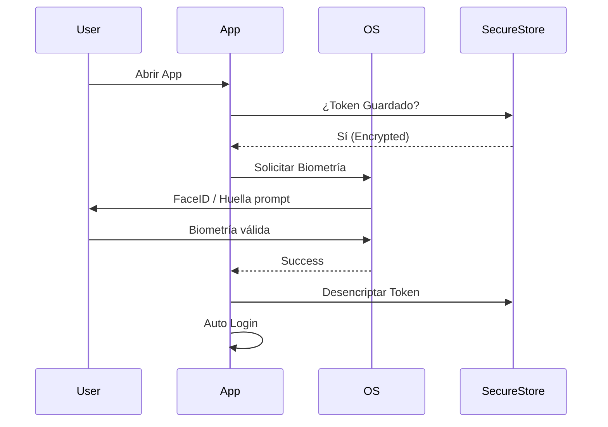

# 2.6.1.4 Biometric Auth

> Acceso rápido y seguro usando el hardware del dispositivo.

---

## Plugin Capacitor

Usamos `@capacitor-community/native-biometric` (o la API oficial `@capacitor/preferences` + lógica custom). Recomendamos el plugin oficial si está disponible, o el comunitario verificado.

**Librería:** `@capacitor-community/native-biometric`

```bash
npm install @capacitor-community/native-biometric
npx cap sync
```

---

## Flujo de Implementación



---

## Código de Ejemplo

```typescript
// composables/useBiometrics.ts
import { NativeBiometric } from '@capacitor-community/native-biometric';

export function useBiometrics() {
  const isAvailable = ref(false);

  async function checkAvailability() {
    const result = await NativeBiometric.isAvailable();
    isAvailable.value = result.isAvailable;
  }

  async function biometricLogin(): Promise<string | null> {
    if (!isAvailable.value) return null;

    try {
      const verified = await NativeBiometric.verifyIdentity({
        reason: "Ingresa a OnlyCar",
        title: "Autenticación Biométrica",
        subtitle: "Usa FaceID o Huella",
        description: "Confirma tu identidad para acceder"
      });

      if (verified) {
        // Recuperar credenciales del Secure Storage
        return await SecureStorage.get('session_token');
      }
    } catch (error) {
      console.error('Biometric failed', error);
    }
    return null;
  }

  return { isAvailable, biometricLogin, checkAvailability };
}
```

---

## Fallback

Si la biometría falla o no está configurada, **siempre** debe existir el fallback a PIN o Contraseña.

---

## Navegación

| ⬆️ Padre             | [[Proyecto OnlyCarNLD/Datos/2.6.1 Plugins_Nativos]] |
| -------------------- | ------------------------- |
| ⬅️ Hermano anterior  | [[Proyecto OnlyCarNLD/Datos/2.6.1.3 Push_Notifications]] |
| ➡️ Hermano siguiente | *(Último hijo de 2.6.1)*  |

---
